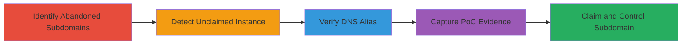

---
tags:
  - subdomain-takeover
  - zendesk
  - dns-cname
  - misconfiguration
type: attack_chain
tools:
  - '[[tools/Grabilla]]'
tactics:
  - '[[Reconnaissance]]'
  - '[[Initial Access]]'
verified: false
platforms:
  - Web
submitted: true
complexity: low
created_at: '2023-10-01T00:00:00Z'
procedures:
  - '[[procedures/Identify-Abandoned-Subdomains-Post-Acquisition]]'
  - '[[procedures/Detect-Unclaimed-Zendesk-Instance]]'
  - '[[procedures/Verify-DNS-Alias-for-Takeover-Potential]]'
  - '[[procedures/Capture-Proof-of-Concept-Screenshots]]'
step_count: 4
techniques:
  - '[[Gather Victim Host Information]]'
  - '[[Exploit Public-Facing Application]]'
updated_at: '2025-12-14T05:32:23.322Z'
description: >-
  A reconnaissance-driven attack chain exploiting an abandoned subdomain CNAME
  record pointing to an unclaimed Zendesk instance, allowing full control over
  Twitter-associated domain traffic.
skill_level: beginner
impact_level: high
id: 549a80a3-83bb-4356-b179-3fae98ef7e78
validated: true
mitre_tactics:
  - '[[Reconnaissance]]'
  - '[[Initial Access]]'
mitre_techniques:
  - '[[Gather Victim Host Information]]'
  - '[[Exploit Public-Facing Application]]'
---
# Subdomain Takeover of Unclaimed Zendesk Instance on support.trendrr.tv

Multi-stage attack chain demonstrating reconnaissance and verification of a subdomain takeover vulnerability on support.trendrr.tv, a remnant of Twitter's acquisition of Trendrr.tv. The chain identifies an active subdomain pointing to an unclaimed Zendesk instance, allowing an attacker to claim it and control traffic under the Twitter domain for phishing or redirection.

## Chain Metrics Dashboard

| Metric | Value |
|--------|-------|
| Chain Status | Unverified |
| Total Steps | 4 |
| Execution Time | ~5 minutes |
| Skill Level | Beginner |
| Complexity | Low |
| Impact Level | High |

## Attack Flow Visualization

## Prerequisites & Requirements

### Required Tools

- [[tools/Grabilla]]

### Target Environment

- Web platform
- DNS resolution access
- No specific services or ports required beyond HTTP/HTTPS

### Initial Access Requirements

- Public internet access
- No credentials needed for reconnaissance
- Awareness of target acquisition history (e.g., Twitter's purchase of Trendrr.tv)

## Detailed Attack Procedures

### Step 1: Identify Abandoned Subdomains Post-Acquisition
procedure: [[procedures/Identify-Abandoned-Subdomains-Post-Acquisition]]

**Objective**: Scan for active subdomains of a defunct or acquired domain to identify potential takeover targets.

**Instructions**: Research the target's domain history, such as Twitter's acquisition of Trendrr.tv, and manually check subdomain status by visiting or querying known subdomains like support.trendrr.tv. Note any that remain active while the main domain shuts down.

**Expected Output**: Confirmation that support.trendrr.tv is active and aliases to trendrr.zendesk.com.

**Success Indicators**:
- Subdomain resolves and loads a page
- Evidence of non-decommissioned service

### Step 2: Detect Unclaimed Zendesk Instance
procedure: [[procedures/Detect-Unclaimed-Zendesk-Instance]]

**Objective**: Visit the subdomain to confirm it points to an unclaimed third-party service like Zendesk.

**Instructions**: Navigate to support.trendrr.tv in a web browser and observe the page content for indicators of an available help desk.

**Expected Output**: Zendesk message stating 'No help desk at support.trendrr.tv. There is no help desk configured at this address. This means that the address is available and that you can claim it at www.zendesk.com/signup'.

**Success Indicators**:
- Page displays claim availability
- No active content or redirection to parent domain

### Step 3: Verify DNS Alias for Takeover Potential
procedure: [[procedures/Verify-DNS-Alias-for-Takeover-Potential]]

**Objective**: Confirm the DNS configuration that enables takeover, such as a CNAME to an unowned instance.

**Instructions**: Use browser developer tools or online DNS lookup to verify that support.trendrr.tv CNAME points to trendrr.zendesk.com. Assess the risk of claiming via Zendesk signup.

**Expected Output**: DNS records showing alias to inactive Zendesk; potential for redirection or malicious hosting post-claim.

**Success Indicators**:
- CNAME confirmed
- No ownership barriers detected

### Step 4: Capture Proof-of-Concept Screenshots
procedure: [[procedures/Capture-Proof-of-Concept-Screenshots]]

**Objective**: Document the vulnerability for reporting or exploitation proof.

**Instructions**: Use a screenshot tool to capture the unclaimed page and DNS details.

**Expected Output**: Images showing the Zendesk claim message and DNS alias.

**Success Indicators**:
- Clear visual evidence of vulnerability
- Screenshots timestamped and annotated

## Attack Chain Summary

### Key Achievements

1. Identified overlooked subdomain post-acquisition shutdown
2. Confirmed unclaimed status for easy takeover
3. Verified DNS misconfiguration enabling control
4. Provided PoC for high-impact demonstration

## Technique & Tactic Coverage

### MITRE ATT&CK Techniques

- [[Gather Victim Host Information]] Gather Victim Host Information
- [[Exploit Public-Facing Application]] Exploit Public-Facing Application

### MITRE ATT&CK Tactics

- [[Reconnaissance]] Reconnaissance
- [[Initial Access]] Initial Access

---
*Last updated: 2023-10-01T00:00:00Z*
