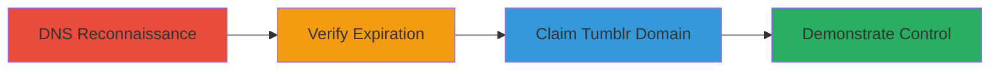

# Subdomain Takeover of blog.snapchat.com via Expired Tumblr CNAME

Multi-stage attack chain demonstrating a complete subdomain takeover workflow exploiting a misconfigured DNS record.

## Chain Metrics Dashboard

| Metric | Value |
|--------|-------|
| Chain Status | Unverified |
| Total Steps | 4 |
| Execution Time | ~15 minutes |
| Skill Level | Intermediate |
| Complexity | Medium |
| Impact Level | High |

## Attack Flow Visualization

## Prerequisites & Requirements

### Required Tools

- Web browser for accessing Tumblr and DNS lookup tools
- DNS lookup service (e.g., manual dig or online tools)

### Target Environment

- Public DNS records
- Tumblr platform for custom domain claiming
- No special ports required; operates over standard HTTP/HTTPS

### Initial Access Requirements

- Internet access
- No prior credentials needed for reconnaissance
- Ability to create a free Tumblr account

## Detailed Attack Procedures

### Step 1: DNS Reconnaissance
procedure: [[procedures/Identify-DNS-Configuration-for-Subdomain-Takeover]]

**Objective**: Identify the DNS configuration of the target subdomain to detect potential takeover vectors.

**Instructions**: Query the DNS records for blog.snapchat.com using a DNS lookup tool or command-line utility like dig to examine the ANAME record.

**Expected Output**: Confirmation that the ANAME points to snapchat-blog.com, which is configured with a CNAME to Tumblr's infrastructure.

**Success Indicators**:
- ANAME record identified pointing to an external domain
- CNAME chain to a third-party service like Tumblr detected

### Step 2: Verify Expiration
procedure: [[procedures/Verify-Unclaimed-Tumblr-Blog-for-Takeover]]

**Objective**: Confirm that the external domain's claim on the third-party service has expired, leaving it vulnerable to takeover.

**Instructions**: Check the status of snapchat-blog.com on Tumblr by attempting to access it and reviewing cached versions via Google Cache to see recent activity.

**Expected Output**: Evidence that the Tumblr blog is unclaimed, such as a default Tumblr page or cache showing prior Snapchat content.

**Success Indicators**:
- Tumblr blog appears unclaimed
- Cached content confirms recent expiration

### Step 3: Domain Claiming
procedure: [[procedures/Claim-Subdomain-with-New-Tumblr-Account]]

**Objective**: Register a new account on the third-party service and claim the dangling domain to gain control.

**Instructions**: Create a new Tumblr account (e.g., under username 'jreynoldsdev') and add 'snapchat-blog.com' as a custom domain in the account settings.

**Expected Output**: Successful addition of the custom domain, with Tumblr confirming control over the blog.

**Success Indicators**:
- Custom domain added without errors
- Blog content now editable via the new account

### Step 4: Takeover Demonstration
procedure: [[procedures/Demonstrate-Subdomain-Takeover-by-Hosting-Content]]

**Objective**: Validate control by hosting and displaying custom content on the taken-over subdomain.

**Instructions**: Update the Tumblr blog with custom content, such as a title like 'Hello Snapchat - Jake Reynolds', and visit http://blog.snapchat.com/ to confirm it loads the new content.

**Expected Output**: The subdomain resolves to and displays the attacker's Tumblr blog content.

**Success Indicators**:
- Subdomain loads attacker-controlled page
- Original Snapchat content replaced

## Attack Chain Summary

### Key Achievements

1. Detected dangling DNS record via reconnaissance
2. Confirmed expiration of third-party claim
3. Successfully claimed and controlled the subdomain
4. Demonstrated potential for phishing or misinformation

## Technique & Tactic Coverage

### MITRE ATT&CK Techniques

- [[Exploit Public-Facing Application]]

### MITRE ATT&CK Tactics

- [[Initial Access]]

---
*Last updated: 2023-10-01T12:00:00Z*
