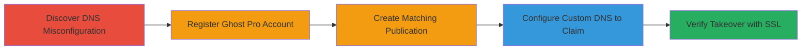

---
tags:
  - subdomain-takeover
  - dns
  - cname
  - ghost.io
  - impersonation
  - phishing
type: attack_chain
tools:
  - '[[tools/host-DNS-Lookup]]'
tactics:
  - '[[Reconnaissance]]'
  - '[[Initial Access]]'
commands:
  - '[[commands/host-dns-lookup]]'
verified: false
platforms:
  - Web
  - DNS
submitted: true
complexity: medium
created_at: '2023-10-01T00:00:00Z'
procedures:
  - '[[procedures/Discover-Subdomain-Takeover-Opportunity-via-DNS-Lookup]]'
  - '[[procedures/Register-Ghost-Pro-Account-for-Custom-Domains]]'
  - '[[procedures/Create-Matching-Ghost-Publication]]'
  - '[[procedures/Claim-Subdomain-with-Custom-DNS-Configuration]]'
  - '[[procedures/Verify-Subdomain-Takeover-and-SSL-Activation]]'
step_count: 5
techniques:
  - '[[Hardware]]'
  - '[[Exploit Public-Facing Application]]'
updated_at: '2025-12-14T04:51:26.552Z'
description: >-
  A multi-step subdomain takeover exploiting an inactive CNAME record pointing
  to Ghost.io, allowing full control of the subdomain for impersonation and
  phishing.
skill_level: intermediate
impact_level: high
id: 48025dc3-af73-411b-a171-4c9de6cca570
validated: true
mitre_tactics:
  - '[[Reconnaissance]]'
  - '[[Initial Access]]'
mitre_techniques:
  - '[[Hardware]]'
  - '[[Exploit Public-Facing Application]]'
---
# Subdomain Takeover of engineering.udemy.com via Inactive Ghost.io CNAME

Multi-stage attack chain demonstrating a subdomain takeover by exploiting an unclaimed CNAME record on Ghost.io, leading to full control of the target subdomain with valid SSL for potential phishing or brand compromise.

## Chain Metrics Dashboard

| Metric | Value |
|--------|-------|
| Chain Status | Unverified |
| Total Steps | 5 |
| Execution Time | ~30 minutes |
| Skill Level | Intermediate |
| Complexity | Medium |
| Impact Level | High |

## Attack Flow Visualization



## Prerequisites & Requirements

### Required Tools

- [[tools/host-DNS-Lookup]]

### Target Environment

- Web platform with DNS resolution
- Access to Ghost.org for registration
- No special credentials needed beyond payment for Ghost Pro ($20/month)

### Initial Access Requirements

- Public DNS access to query target subdomains
- Internet connection for registration and verification
- No prior access to target infrastructure required

## Detailed Attack Procedures

### Step 1: Discover DNS Misconfiguration
procedure: [[procedures/Discover-Subdomain-Takeover-Opportunity-via-DNS-Lookup]]

**Objective**: Identify vulnerable CNAME records pointing to inactive third-party services like Ghost.io.

**Instructions**: Perform a DNS lookup on the target subdomain using [[commands/host-dns-lookup]] to reveal the CNAME alias and check if it resolves to inactive IPs.

```bash
host engineering.udemy.com
```

**Expected Output**: Confirmation of CNAME to an unclaimed subdomain, e.g., "engineering.udemy.com is an alias for udemy-engineering-blog.ghost.io." followed by IP addresses indicating inactivity.

**Success Indicators**:
- CNAME points to a third-party service like Ghost.io
- Subdomain appears unclaimed or inactive

### Step 2: Register Ghost Pro Account
procedure: [[procedures/Register-Ghost-Pro-Account-for-Custom-Domains]]

**Objective**: Gain access to custom domain features required for claiming abandoned subdomains.

**Instructions**: Sign up for a Ghost Pro account on ghost.org, providing payment details for the $20/month plan to unlock custom DNS configuration.

No command-line tools are used here; perform via web browser on ghost.org.

**Expected Output**: Successful account creation with access to the dashboard for publications and DNS settings.

**Success Indicators**:
- Account activated
- Custom domain features available

### Step 3: Create Matching Ghost Publication
procedure: [[procedures/Create-Matching-Ghost-Publication]]

**Objective**: Set up a new publication that matches the abandoned subdomain name to prepare for takeover.

**Instructions**: In the Ghost dashboard, create a new publication named exactly 'udemy-engineering-blog' to align with the inactive CNAME target.

No command-line tools; use the Ghost Pro interface.

**Expected Output**: Publication created and ready for domain configuration.

**Success Indicators**:
- Publication name matches the target subdomain
- Dashboard shows the new site

### Step 4: Configure Custom DNS Record
procedure: [[procedures/Claim-Subdomain-with-Custom-DNS-Configuration]]

**Objective**: Leverage the existing CNAME to validate and claim the subdomain, obtaining a valid SSL certificate.

**Instructions**: In the Ghost publication settings, add the custom domain 'engineering.udemy.com' and configure the DNS record, allowing Ghost's validation to pass due to the pre-existing CNAME.

No command-line tools; configure via Ghost dashboard.

**Expected Output**: Validation succeeds, and Ghost provisions SSL for the subdomain.

**Success Indicators**:
- DNS validation passes
- SSL certificate issued for the subdomain

### Step 5: Verify Takeover by Serving Content
procedure: [[procedures/Verify-Subdomain-Takeover-and-SSL-Activation]]

**Objective**: Confirm control by accessing the subdomain and ensuring it serves attacker-controlled content with SSL.

**Instructions**: Navigate to https://engineering.udemy.com in a browser to load content from the Ghost publication.

No command-line tools; use web browser for verification.

**Expected Output**: The page loads content from the attacker's Ghost site with a valid SSL certificate.

**Success Indicators**:
- Subdomain resolves to attacker content
- HTTPS works without certificate errors

## Attack Chain Summary

### Key Achievements

1. Identified inactive CNAME for subdomain takeover opportunity
2. Claimed full control of engineering.udemy.com via Ghost Pro
3. Enabled serving arbitrary content with valid SSL for impersonation

## Technique & Tactic Coverage

### MITRE ATT&CK Techniques

- [[Hardware]] Gather Victim Host Information: DNS
- [[Exploit Public-Facing Application]] Exploit Public-Facing Application

### MITRE ATT&CK Tactics

- [[Reconnaissance]] Reconnaissance
- [[Initial Access]] Initial Access

---
*Last updated: 2023-10-01T00:00:00Z*
