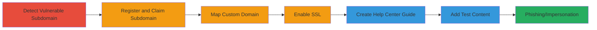

---
tags:
  - subdomain-takeover
  - dns
  - zendesk
  - phishing
  - brand-impersonation
type: attack_chain
tools:
  - '[[tools/dig]]'
tactics:
  - '[[Initial Access]]'
commands:
  - '[[commands/dig-dns-lookup-for-cname]]'
verified: false
platforms:
  - Web
submitted: true
complexity: low
created_at: '2023-10-01T00:00:00Z'
procedures:
  - '[[procedures/Detect-Subdomain-Takeover-Vulnerability-with-DNS-Lookup]]'
  - '[[procedures/Register-Zendesk-Trial-Account-and-Claim-Subdomain]]'
  - '[[procedures/Map-Custom-Domain-in-Zendesk]]'
  - '[[procedures/Enable-SSL-for-Custom-Domain-in-Zendesk]]'
  - '[[procedures/Create-Unpublished-Help-Center-Guide-in-Zendesk]]'
  - '[[procedures/Add-Unpublished-Test-Article-to-Demonstrate-Control]]'
step_count: 6
techniques:
  - '[[Exploit Public-Facing Application]]'
updated_at: '2025-12-14T05:32:23.621Z'
description: >-
  Exploits a dangling CNAME record in help.tictail.com pointing to an unclaimed
  Zendesk subdomain after Shopify's acquisition of Tictail, allowing takeover
  for phishing and brand impersonation.
skill_level: intermediate
impact_level: high
id: 4fc851f4-c03b-48fe-8d53-0379a2b78f19
validated: true
mitre_tactics:
  - '[[Initial Access]]'
mitre_techniques:
  - '[[Exploit Public-Facing Application]]'
---
# Subdomain Takeover of help.tictail.com via Unclaimed Zendesk CNAME

Multi-stage attack chain demonstrating a subdomain takeover vulnerability in help.tictail.com, where a dangling CNAME points to tictail.zendesk.com after Shopify acquired Tictail. The attacker claims the subdomain on Zendesk to host phishing content mimicking Shopify support, potentially stealing credentials and damaging reputation.

## Chain Metrics Dashboard

| Metric | Value |
|--------|-------|
| Chain Status | Unverified |
| Total Steps | 6 |
| Execution Time | ~15 minutes |
| Skill Level | Intermediate |
| Complexity | Low |
| Impact Level | High |

## Attack Flow Visualization



## Prerequisites & Requirements

### Required Tools

- [[tools/dig]]

### Target Environment

- Web platform with DNS resolution
- Access to Zendesk signup (no credentials needed for trial)
- Internet connectivity for DNS queries and web interactions

### Initial Access Requirements

- No prior credentials or network position required
- Public DNS access
- Ability to create free Zendesk trial accounts

## Detailed Attack Procedures

### Step 1: Detect Vulnerable Subdomain
procedure: [[procedures/Detect-Subdomain-Takeover-Vulnerability-with-DNS-Lookup]]

**Objective**: Identify dangling CNAME records pointing to unclaimed services like Zendesk.

**Instructions**: Perform a DNS lookup on the target subdomain to reveal the unclaimed CNAME, then verify availability during Zendesk signup.

Execute [[commands/dig-dns-lookup-for-cname]] to query the DNS records:

```bash
dig help.tictail.com
```

Navigate to Zendesk signup and test the subdomain availability by entering 'tictail' as the subdomain.

**Expected Output**: DNS response showing CNAME to tictail.zendesk.com; green availability indicator on Zendesk signup.

**Success Indicators**:
- CNAME points to a claimable service
- Subdomain shows as available on the service provider

### Step 2: Register and Claim Subdomain
procedure: [[procedures/Register-Zendesk-Trial-Account-and-Claim-Subdomain]]

**Objective**: Create a free account on Zendesk and claim the vulnerable subdomain.

**Instructions**: Sign up for a Zendesk trial and select the available subdomain during registration.

Go to Zendesk signup page, enter email, and when prompted for subdomain, input 'tictail' to claim tictail.zendesk.com.

**Expected Output**: Successful account creation with the subdomain assigned.

**Success Indicators**:
- Account dashboard accessible at the claimed subdomain
- No errors during subdomain selection

### Step 3: Map Custom Domain
procedure: [[procedures/Map-Custom-Domain-in-Zendesk]]

**Objective**: Associate the vulnerable external subdomain with the Zendesk instance.

**Instructions**: In the Zendesk admin settings, add the custom domain mapping.

Log in to Zendesk admin, navigate to Settings > Account > Host mapping, and add 'help.tictail.com' as the custom domain.

**Expected Output**: Domain added successfully without validation errors.

**Success Indicators**:
- Custom domain listed in host mapping settings
- No DNS verification failures

### Step 4: Enable SSL
procedure: [[procedures/Enable-SSL-for-Custom-Domain-in-Zendesk]]

**Objective**: Secure the mapped domain to avoid redirects and enable HTTPS hosting.

**Instructions**: Configure SSL for the custom domain in Zendesk security settings.

In Zendesk, go to Settings > Security > Custom domains, and enable SSL for 'help.tictail.com'.

**Expected Output**: SSL certificate provisioned and active for the domain.

**Success Indicators**:
- HTTPS access to the subdomain without certificate warnings
- No automatic redirects to default Zendesk domain

### Step 5: Create Help Center Guide
procedure: [[procedures/Create-Unpublished-Help-Center-Guide-in-Zendesk]]

**Objective**: Set up a Help Center to host content under the taken-over subdomain.

**Instructions**: Create a new unpublished guide in the Zendesk Help Center.

In Zendesk admin, navigate to Help Center > Guides, and create a new guide section without publishing it.

**Expected Output**: Guide created and visible in draft state.

**Success Indicators**:
- Draft guide appears in Help Center management
- Content editable under the custom domain

### Step 6: Add Test Article
procedure: [[procedures/Add-Unpublished-Test-Article-to-Demonstrate-Control]]

**Objective**: Add proof-of-control content to verify subdomain ownership.

**Instructions**: Insert an unpublished article titled 'POC' in the Help Center.

In the Help Center, add a new article under the guide, title it 'POC', add test content, and keep it unpublished.

**Expected Output**: Article draft saved and accessible via admin.

**Success Indicators**:
- 'POC' article visible in drafts
- Subdomain resolves to Zendesk with custom content potential

## Attack Chain Summary

### Key Achievements

1. Identified and claimed unclaimed subdomain via DNS misconfiguration
2. Mapped and secured the domain for full control
3. Demonstrated potential for phishing by adding controlled content

## Technique & Tactic Coverage

### MITRE ATT&CK Techniques

- [[Exploit Public-Facing Application]]

### MITRE ATT&CK Tactics

- [[Initial Access]]

---
*Last updated: 2023-10-01T00:00:00Z*
