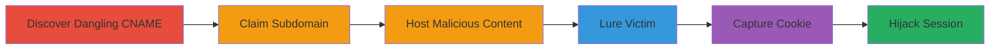

# Subdomain Takeover of ping.ubnt.com Leading to SSO Session Hijacking

Multi-stage attack chain demonstrating a complete workflow for subdomain takeover and session hijacking via cookie leakage on Ubiquiti's SSO system.

## Chain Metrics Dashboard

| Metric | Value |
|--------|-------|
| Chain Status | Unverified |
| Total Steps | 6 |
| Execution Time | ~30 minutes |
| Skill Level | Intermediate |
| Complexity | Medium |
| Impact Level | High |

## Attack Flow Visualization



## Prerequisites & Requirements

### Required Tools

- [[tools/nslookup]]
- [[tools/AWS-Cloudfront]]
- [[tools/Burp-Suite]]
- [[tools/Certbot]]

### Target Environment

- Web platform with DNS records pointing to AWS Cloudfront
- SSO system using domain-wide cookies (e.g., .ubnt.com)
- Required services: DNS resolution, AWS Cloudfront, HTTP/HTTPS hosting
- Network access: Public internet for DNS queries and subdomain access

### Initial Access Requirements

- AWS account for claiming Cloudfront distribution
- Attacker-controlled server for hosting malicious content
- No prior credentials needed; exploits public-facing misconfiguration

## Detailed Attack Procedures

### Step 1: Discover Dangling CNAME
procedure: [[procedures/Discover-Dangling-CNAME-for-Subdomain-Takeover]]

**Objective**: Identify vulnerable subdomains with dangling DNS records pointing to unclaimed cloud services.

**Instructions**: Perform a DNS lookup on the target subdomain to reveal the CNAME chain using [[commands/nslookup-dns-query-for-subdomain]]:

```bash
nslookup ping.ubnt.com 8.8.8.8
```

Verify the resolution leads to an unclaimed AWS Cloudfront distribution by accessing the endpoint and checking for error pages.

**Expected Output**: CNAME chain showing ping.ubnt.com -> dl.ubnt.com -> d2cnv2pop2xy4v.cloudfront.net, with an error indicating the hostname is unregistered.

**Success Indicators**:
- CNAME points to unclaimed Cloudfront
- Access to the subdomain returns a Cloudfront error page

### Step 2: Claim Subdomain
procedure: [[procedures/Claim-Subdomain-via-AWS-Cloudfront]]

**Objective**: Take control of the subdomain by registering the dangling hostname in an attacker-controlled Cloudfront distribution.

**Instructions**: Log into AWS Console, create a new Cloudfront distribution linked to your origin server, and add 'ping.ubnt.com' as an alternate domain name (CNAME). Use [[tools/AWS-Cloudfront]] configuration to validate the claim by accessing https://ping.ubnt.com.

**Expected Output**: Successful resolution of ping.ubnt.com to your controlled content; no more Cloudfront error.

**Success Indicators**:
- Subdomain resolves to attacker content
- DNS propagation confirms control (use [[commands/nslookup-dns-query-for-subdomain]] to verify)

### Step 3: Host Malicious Content
procedure: [[procedures/Host-Malicious-Content-on-Taken-Over-Subdomain]]

**Objective**: Deploy scripts to capture cookies from incoming requests on the taken-over subdomain.

**Instructions**: Set up an HTTP/HTTPS server on your origin (e.g., Apache on Ubuntu). Use [[tools/Certbot]] to obtain SSL certificates:

```bash
certbot --apache -d ping.ubnt.com
```

Upload a PHP script like imagefetch.php to log requests and cookies, and a PoC HTML file at /34902385023958329058235.html.

**Expected Output**: Server logs incoming requests; HTTPS access without certificate errors.

**Success Indicators**:
- Malicious scripts accessible via https://ping.ubnt.com
- SSL certificate valid for the subdomain

### Step 4: Lure Victim
procedure: [[procedures/Lure-Victim-to-Access-Malicious-Subdomain]]

**Objective**: Trick the victim into making a request to the malicious subdomain, triggering automatic cookie inclusion.

**Instructions**: Post on community.ubnt.com with a hidden IMG tag: . Alternatively, use email or ads. The browser sends UBIC_AUTH cookie due to .ubnt.com domain scope.

**Expected Output**: Victim's browser fetches the image, sending the session cookie in the request headers.

**Success Indicators**:
- Server logs show request from victim's IP with UBIC_AUTH cookie
- No user interaction required beyond accessing the lure

### Step 5: Capture Cookie
procedure: [[procedures/Capture-Leaked-Session-Cookie]]

**Objective**: Log the leaked SSO cookie and validate its usability.

**Instructions**: Monitor traffic with [[tools/Burp-Suite]] as an intercepting proxy. The imagefetch.php script captures the cookie in logs (e.g., HTML comments) and tests it by requesting https://sso.ubnt.com/api/sso/v1/user/self with the stolen cookie.

**Expected Output**: Logged cookie value; API response with victim user data confirming validity.

**Success Indicators**:
- Cookie captured and stored
- API call succeeds, returning victim info

### Step 6: Hijack Session
procedure: [[procedures/Hijack-Victims-SSO-Session]]

**Objective**: Use the stolen cookie to impersonate the victim across services.

**Instructions**: Import the UBIC_AUTH cookie into your browser using a cookie editor extension. Access sso.ubnt.com/api/sso/v1/user/self to set the cookie via Set-Cookie response, then navigate to account.ubnt.com, store.ubnt.com, etc.

**Expected Output**: Full access to victim's account, even post-logout; ability to manage devices and community.

**Success Indicators**:
- Successful login to multiple .ubnt.com services
- Impersonation persists across sessions

## Attack Chain Summary

### Key Achievements

1. Full control of ping.ubnt.com via unclaimed Cloudfront
2. Leakage of UBIC_AUTH SSO cookie from victims
3. Authentication bypass and hijacking across Ubiquiti ecosystem

## Technique & Tactic Coverage

### MITRE ATT&CK Techniques

- [[Exploit Public-Facing Application]]
- [[Steal Web Session Cookie]]
- [[Valid Accounts]]

### MITRE ATT&CK Tactics

- [[Initial Access]]
- [[Credential Access]]
- [[Lateral Movement]]

---

*Last updated: 2023-10-01T00:00:00Z*
