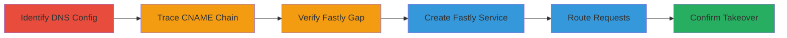

---
tags:
  - subdomain-takeover
  - dns
  - fastly
  - npm
  - cd n
type: attack_chain
tools: []
tactics:
  - '[[Reconnaissance]]'
  - '[[Initial Access]]'
verified: false
platforms:
  - Web
  - DNS
submitted: true
complexity: medium
created_at: '2024-10-01T00:00:00Z'
procedures:
  - '[[procedures/Identify-DNS-CNAME-Chain]]'
  - '[[procedures/Trace-CNAME-to-Fastly]]'
  - '[[procedures/Verify-Fastly-Configuration-Gap]]'
  - '[[procedures/Create-Fastly-Service-for-Takeover]]'
  - '[[procedures/Route-Requests-to-Attacker-Service]]'
  - '[[procedures/Confirm-Subdomain-Takeover]]'
step_count: 6
techniques:
  - '[[Gather Victim Host Information]]'
  - '[[Exploit Public-Facing Application]]'
updated_at: '2025-12-14T04:51:26.672Z'
description: >-
  A multi-step attack exploiting an abandoned DNS CNAME record pointing to
  Fastly infrastructure, allowing takeover of the subdomain to intercept npm
  registry traffic.
skill_level: intermediate
impact_level: high
id: 73e11725-f483-444e-ad2f-307a0b7d9be6
validated: true
mitre_tactics:
  - '[[Reconnaissance]]'
  - '[[Initial Access]]'
mitre_techniques:
  - '[[Gather Victim Host Information]]'
  - '[[Exploit Public-Facing Application]]'
---
# Subdomain Takeover of registry.nodejs.org via Fastly CNAME Misconfiguration

Multi-stage attack chain demonstrating a subdomain takeover exploiting an overlooked DNS configuration in the Node.js ecosystem, allowing interception of traffic intended for the npm registry.

## Chain Metrics Dashboard

| Metric | Value |
|--------|-------|
| Chain Status | Unverified |
| Total Steps | 6 |
| Execution Time | ~30 minutes |
| Skill Level | Intermediate |
| Complexity | Medium |
| Impact Level | High |

## Attack Flow Visualization



## Prerequisites & Requirements

### Required Tools

- DNS lookup tools like [[commands/dig-dns-query]]
- Web browser for verification
- Fastly account (free tier sufficient for testing)

### Target Environment

- Public DNS resolution
- Fastly CDN infrastructure
- No ownership of target DNS required

### Initial Access Requirements

- Internet access
- Ability to create a Fastly account
- No prior credentials or network position needed

## Detailed Attack Procedures

### Step 1: Identify DNS Configuration
procedure: [[procedures/Identify-DNS-CNAME-Chain]]

**Objective**: Discover the DNS records for the target subdomain to identify potential misconfigurations.

**Instructions**: Query the DNS for registry.nodejs.org to reveal its CNAME record.

Use [[commands/dig-dns-query]] to perform the lookup:

```bash
dig registry.nodejs.org CNAME
```

**Expected Output**: Response showing CNAME to registry.npmjs.org.

**Success Indicators**:
- CNAME record confirmed pointing to another domain
- No A record directly resolving the subdomain

### Step 2: Trace CNAME Chain
procedure: [[procedures/Trace-CNAME-to-Fastly]]

**Objective**: Follow the CNAME chain to identify the underlying infrastructure provider.

**Instructions**: Query the next hop in the chain for registry.npmjs.org.

Execute [[commands/dig-dns-query]] again:

```bash
dig registry.npmjs.org CNAME
```

**Expected Output**: CNAME pointing to a.sni.fastly.net, indicating Fastly CDN usage.

**Success Indicators**:
- Chain traced to Fastly infrastructure
- Potential for service-specific configuration gaps identified

### Step 3: Verify Fastly Configuration Gap
procedure: [[procedures/Verify-Fastly-Configuration-Gap]]

**Objective**: Check if the official Fastly service includes the target subdomain in its domains list.

**Instructions**: Access Fastly's domain verification or use public tools to inspect configurations (note: this may require manual review or API access if available).

Manually verify by attempting to access the subdomain and checking headers, or use browser dev tools to inspect responses.

**Expected Output**: Confirmation that registry.nodejs.org is not listed in the official Fastly service's domains.

**Success Indicators**:
- Gap confirmed: subdomain not protected by official service
- Opportunity for takeover exists

### Step 4: Create Fastly Service for Takeover
procedure: [[procedures/Create-Fastly-Service-for-Takeover]]

**Objective**: Register a new Fastly service that claims the unconfigured subdomain.

**Instructions**: Log into a Fastly account and create a new service, adding registry.nodejs.org to the domains field without DNS verification.

Follow Fastly dashboard: Create Service > Add Domain > Enter registry.nodejs.org > Configure basic VCL to serve custom content.

**Expected Output**: Service created successfully, domain added without error.

**Success Indicators**:
- New service active and listening for the subdomain
- No ownership proof required

### Step 5: Route Requests to Attacker Service
procedure: [[procedures/Route-Requests-to-Attacker-Service]]

**Objective**: Leverage DNS resolution to direct traffic to the attacker's Fastly service.

**Instructions**: Due to the CNAME chain, requests to registry.nodejs.org will now hit the attacker's service as Fastly routes based on SNI without strict DNS checks.

Monitor logs in Fastly dashboard for incoming requests.

**Expected Output**: Traffic interception begins; logs show requests for npm packages.

**Success Indicators**:
- Requests routed to attacker-controlled service
- Over 300 package requests observed in logs

### Step 6: Confirm Takeover
procedure: [[procedures/Confirm-Subdomain-Takeover]]

**Objective**: Validate control by serving and observing custom content.

**Instructions**: Configure the Fastly service to serve a simple page with a custom HTML comment, then access the subdomain in a browser.

Visit https://registry.nodejs.org and inspect source.

**Expected Output**: Page loads with attacker's custom content, e.g., '<!--You probably meant registry.npmjs.org-->'.

**Success Indicators**:
- Custom content visible
- Full traffic interception confirmed

## Attack Chain Summary

### Key Achievements

1. Identified overlooked DNS CNAME leading to Fastly
2. Exploited configuration gap to claim subdomain without DNS control
3. Intercepted real user traffic for npm packages, enabling potential malicious package delivery

## Technique & Tactic Coverage

### MITRE ATT&CK Techniques

- [[Gather Victim Host Information]] Gather Victim Host Information
- [[Exploit Public-Facing Application]] Exploit Public-Facing Application

### MITRE ATT&CK Tactics

- [[Reconnaissance]] Reconnaissance
- [[Initial Access]] Initial Access

---

*Last updated: 2024-10-01T00:00:00Z*
