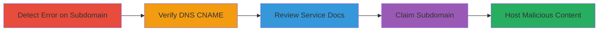

---
tags:
  - subdomain-takeover
  - dns
  - uberflip
  - phishing
  - defacement
type: attack_chain
tools: []
tactics:
  - '[[Initial Access]]'
  - '[[Collection]]'
verified: false
platforms:
  - Web
  - DNS
submitted: true
complexity: medium
created_at: '2023-10-01T00:00:00Z'
procedures:
  - '[[procedures/Detect-Unclaimed-Subdomain]]'
  - '[[procedures/Verify-DNS-CNAME-to-Uberflip]]'
  - '[[procedures/Review-Uberflip-Documentation]]'
  - '[[procedures/Attempt-Subdomain-Claim-on-Uberflip]]'
  - '[[procedures/Exploit-Takeover-for-Malicious-Content]]'
step_count: 5
techniques:
  - '[[Exploit Public-Facing Application]]'
  - '[[Defacement]]'
updated_at: '2025-12-14T04:38:49.541Z'
description: >-
  Multi-stage attack demonstrating subdomain takeover by claiming an
  unconfigured CNAME pointing to Uberflip, enabling hosting of arbitrary
  malicious content on a trusted domain.
skill_level: intermediate
impact_level: high
id: d8b7f5ab-154b-4b23-86ab-85191de62434
validated: true
mitre_tactics:
  - '[[Initial Access]]'
  - '[[Collection]]'
mitre_techniques:
  - '[[Exploit Public-Facing Application]]'
  - '[[Defacement]]'
---
# Subdomain Takeover of resources.hackerone.com via Uberflip Misconfiguration

Multi-stage attack chain demonstrating a complete subdomain takeover workflow, where an unclaimed CNAME record allows an attacker to register and control a trusted subdomain for hosting malicious content.

## Chain Metrics Dashboard

| Metric | Value |
|--------|-------|
| Chain Status | Unverified |
| Total Steps | 5 |
| Execution Time | ~15 minutes |
| Skill Level | Intermediate |
| Complexity | Medium |
| Impact Level | High |

## Attack Flow Visualization



## Prerequisites & Requirements

### Required Tools

- None specific; uses standard browser and DNS tools like [[commands/dig-dns-lookup]] and [[commands/curl-access-url]]

### Target Environment

- Web platform with DNS resolution
- Access to Uberflip service for signup
- No special ports required; standard HTTP/HTTPS

### Initial Access Requirements

- Public internet access
- No credentials needed initially; attacker can sign up for Uberflip
- Ability to resolve DNS and access web URLs

## Detailed Attack Procedures

### Step 1: Detect Unclaimed Subdomain
procedure: [[procedures/Detect-Unclaimed-Subdomain]]

**Objective**: Identify if the target subdomain is misconfigured and unclaimed by accessing it directly.

**Instructions**: Use [[commands/curl-access-url]] to visit the subdomain and observe the response:

```bash
curl -i https://resources.hackerone.com/
```

**Expected Output**: HTTP response indicating an error like 'Non-hub domain, The URL you've accessed does not provide a hub. Please check the URL and try again.' This suggests the subdomain is pointed to a service but not activated.

**Success Indicators**:
- Error message confirming non-hub domain
- No legitimate content served

### Step 2: Verify DNS CNAME to Uberflip
procedure: [[procedures/Verify-DNS-CNAME-to-Uberflip]]

**Objective**: Confirm the DNS configuration points to a third-party service vulnerable to takeover.

**Instructions**: Perform a DNS lookup using [[commands/dig-dns-lookup]] to check the CNAME record:

```bash
dig CNAME resources.hackerone.com
```

**Expected Output**: CNAME record showing 'resources.hackerone.com is an alias for read.uberflip.com.'

**Success Indicators**:
- CNAME points to read.uberflip.com
- No A/AAAA records overriding the alias

### Step 3: Review Uberflip Documentation
procedure: [[procedures/Review-Uberflip-Documentation]]

**Objective**: Understand the service's subdomain claiming process to confirm vulnerability.

**Instructions**: Access the Uberflip help documentation in a browser or via [[commands/curl-access-url]]:

```bash
curl https://help.uberflip.com/hc/en-us/articles/360018786372-Custom-Domain-Set-up-Your-Hub-on-a-Subdomain
```

Review the content stating that after setting a CNAME to read.uberflip.com, the subdomain must be added to an Uberflip account; unclaimed ones can be registered by anyone.

**Expected Output**: Documentation confirming that unconfigured subdomains are claimable by any user.

**Success Indicators**:
- Docs describe open claiming process
- No restrictions on subdomain registration mentioned

### Step 4: Attempt Subdomain Claim on Uberflip
procedure: [[procedures/Attempt-Subdomain-Claim-on-Uberflip]]

**Objective**: Sign up for Uberflip and attempt to claim the unowned subdomain.

**Instructions**: Navigate to Uberflip signup in a browser (manual step; automate if API available). During hub setup, enter 'resources.hackerone.com' as the custom domain. If successful, the service activates control.

**Expected Output**: Successful claim allowing configuration of a hub on the subdomain.

**Success Indicators**:
- Subdomain added to attacker's Uberflip account
- No ownership conflict errors

### Step 5: Exploit Takeover for Malicious Content
procedure: [[procedures/Exploit-Takeover-for-Malicious-Content]]

**Objective**: Host arbitrary content on the taken-over subdomain to enable phishing, defacement, or social engineering.

**Instructions**: In the Uberflip dashboard, create a new hub, add pages with custom content (e.g., phishing form), embed iframes via HTML:

```html
<iframe src="https://malicious-site.com"></iframe>
```

Publish the hub to activate on resources.hackerone.com.

**Expected Output**: Custom content served at https://resources.hackerone.com/, such as a phishing page or survey.

**Success Indicators**:
- Arbitrary content loads on the subdomain
- Visitors see attacker-controlled page exploiting domain trust

## Attack Chain Summary

### Key Achievements

1. Identified unclaimed subdomain via error detection
2. Verified DNS misconfiguration pointing to claimable service
3. Confirmed takeover feasibility through documentation
4. Demonstrated potential for hosting phishing or defacement content
5. Highlighted social engineering risks from trusted domain abuse

## Technique & Tactic Coverage

### MITRE ATT&CK Techniques

- [[Exploit Public-Facing Application]] Exploit Public-Facing Application
- [[Defacement]] Deface Public-Facing Webpage

### MITRE ATT&CK Tactics

- [[Initial Access]] Initial Access
- [[Collection]] Collection

---

*Last updated: 2023-10-01T00:00:00Z*
