# Subdomain Takeover of saostatic.uber.com Leading to Authentication Bypass via Shared SSO Cookie Theft

Multi-stage attack chain demonstrating a complete attack workflow exploiting subdomain takeover combined with SSO cookie leakage for authentication bypass.

## Chain Metrics Dashboard

| Metric | Value |
|--------|-------|
| Chain Status | Unverified |
| Total Steps | 7 |
| Execution Time | ~30 minutes |
| Skill Level | Intermediate |
| Complexity | Medium |
| Impact Level | High |

## Attack Flow Visualization

```mermaid
graph LR
    A[Reconnaissance: DNS Lookup] --> B[Initial Access: Claim CloudFront]
    B --> C[Execution: Host Malicious Content]
    C --> D[Credential Access: Steal SSO Cookies]
    D --> E[Lateral Movement: Intercept Requests]
    E --> F[Impact: Inject Cookies and Impersonate]
    F --> G[Persistence: Access Uber Services]

    style A fill:#e74c3c
    style B fill:#f39c12
    style C fill:#f39c12
    style D fill:#e67e22
    style E fill:#3498db
    style F fill:#27ae60
    style G fill:#27ae60
```



## Prerequisites & Requirements

### Required Tools

- [[tools/nslookup]]
- [[tools/Burp-Suite]]

### Target Environment

- Web platform with DNS records pointing to AWS CloudFront
- Required services/ports: DNS (port 53), HTTPS (port 443)
- AWS account for claiming distributions

### Initial Access Requirements

- No prior credentials needed for discovery
- Attacker must have AWS access to create CloudFront distributions
- Network access to public DNS and Uber subdomains

## Detailed Attack Procedures

### Step 1: Discover Subdomain Takeover Vulnerability
procedure: [[procedures/Perform-DNS-Lookup-for-Subdomain-Takeover-Discovery]]

**Objective**: Identify dangling CNAME records pointing to unclaimed cloud services like AWS CloudFront.

**Instructions**: Use [[commands/nslookup-dns-lookup-for-subdomain-takeover]] to query the target subdomain:

```bash
# nslookup saostatic.uber.com 8.8.8.8
```

**Expected Output**: Reveals CNAME to an unclaimed hostname like d3i4yxtzktqr9n.cloudfront.net, showing a CloudFront error page indicating it's available for claim.

**Success Indicators**:
- CNAME points to unclaimed resource
- Error page confirms takeover potential

### Step 2: Claim the Unclaimed CloudFront Hostname
procedure: [[procedures/Claim-Unclaimed-AWS-CloudFront-Distribution]]

**Objective**: Take control of the dangling subdomain by associating it with an attacker-controlled CloudFront distribution.

**Instructions**: In the AWS Console, create a new CloudFront distribution, set the origin to an attacker-controlled server (e.g., EC2 or S3), and add saostatic.uber.com as an alternate domain name (CNAME).

**Expected Output**: CloudFront distribution active, subdomain now resolves to attacker content instead of error page.

**Success Indicators**:
- DNS propagation confirms control
- Accessing saostatic.uber.com loads attacker server

### Step 3: Host Malicious Content on the Taken-Over Subdomain
procedure: [[procedures/Host-Malicious-Phishing-Content-on-Taken-Over-Subdomain]]

**Objective**: Serve phishing or cookie-capturing scripts on the legitimate-looking subdomain to exploit SSO redirects.

**Instructions**: Configure the origin server to handle HTTP/HTTPS traffic. Upload a PHP script like prepareuberattack.php to initiate login flows and capture cookies. Obtain SSL certificate using Let's Encrypt for saostatic.uber.com to enable HTTPS phishing.

**Expected Output**: Page at https://saostatic.uber.com/subdomaintakeoverbyarneswinnen.html loads successfully; /prepareuberattack.php outputs captured state and cookie data.

**Success Indicators**:
- Valid SSL certificate issued
- Malicious page accessible via HTTPS

### Step 4: Trigger Victim Authentication and Cookie Capture
procedure: [[procedures/Capture-SSO-Cookies-via-Malicious-Redirect-on-Taken-Over-Subdomain]]

**Objective**: Lure victim to the malicious subdomain during Uber login to steal shared _csid and state cookies.

**Instructions**: Victim visits https://riders.uber.com, redirects to auth.uber.com for SSO login, setting _csid cookie (domain=.uber.com). Stealthily load https://saostatic.uber.com/prepareuberattack.php (e.g., via iframe or link), which captures state=CSRFTOKEN, state cookie, and _csid during redirect, outputting URL, Cookie, and Set-Cookie strings.

**Expected Output**: Captured values like _csid=abc123; state=xyz789 for replay.

**Success Indicators**:
- Cookies extracted from victim session
- No visible alert to victim

### Step 5: Intercept Attacker's Authentication Request
procedure: [[procedures/Intercept-and-Replay-Authentication-Flow-with-Stolen-Cookies]]

**Objective**: Use stolen cookies to bypass authentication in attacker's browser session.

**Instructions**: In attacker's browser, navigate to the captured URL from prepareuberattack.php. Use [[tools/Burp-Suite]] to intercept the request to auth.uber.com, add the captured Cookie header (e.g., Cookie: _csid=abc123; state=xyz789), and forward.

**Expected Output**: Request authenticated with victim's session.

**Success Indicators**:
- Proxy shows modified request accepted
- No auth challenge

### Step 6: Inject Stolen Cookies into Response
procedure: [[procedures/Intercept-and-Replay-Authentication-Flow-with-Stolen-Cookies]]

**Objective**: Modify the SSO response to inject cookies into attacker's browser for session hijacking.

**Instructions**: Intercept the response (redirect to https://riders.uber.com/trips) with [[tools/Burp-Suite]], add captured Set-Cookie headers (e.g., Set-Cookie: _csid=abc123; domain=.uber.com), and forward to complete login.

**Expected Output**: Attacker's browser receives cookies, redirects to victim's dashboard.

**Success Indicators**:
- Cookies set in attacker's session
- Access to victim's Uber account

### Step 7: Impersonate Victim Across Uber Services
procedure: [[procedures/Intercept-and-Replay-Authentication-Flow-with-Stolen-Cookies]]

**Objective**: Use hijacked session to access multiple Uber services without further interaction.

**Instructions**: With injected cookies, browse to partners.uber.com or developer.uber.com; shared .uber.com scope allows seamless impersonation.

**Expected Output**: Full access to victim's trips, partner portals, etc.

**Success Indicators**:
- Successful navigation to restricted areas
- Victim data visible

## Attack Chain Summary

### Key Achievements

1. Identified and claimed unclaimed AWS CloudFront via subdomain takeover
2. Hosted malicious content with valid SSL to steal SSO cookies undetected
3. Bypassed Uber's authentication for complete account takeover

## Technique & Tactic Coverage

### MITRE ATT&CK Techniques

- [[Hardware]] Gather Victim Host Information: Domains
- [[Exploit Public-Facing Application]] Exploit Public-Facing Application
- [[Steal Web Session Cookie]] Steal Web Session Cookie
- [[T1078.004]] Valid Accounts: Cloud Accounts

### MITRE ATT&CK Tactics

- [[Reconnaissance]] Reconnaissance
- [[Initial Access]] Initial Access
- [[Credential Access]] Credential Access

---

*Last updated: 2023-10-01T00:00:00Z*
