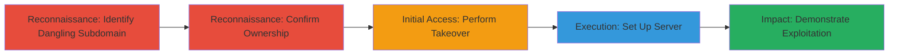

---
tags:
  - subdomain-takeover
  - dns
  - cdn
  - fastly
  - snapchat
type: attack_chain
tools:
  - '[[tools/Censys]]'
  - '[[tools/Fastly]]'
  - '[[tools/Apache]]'
tactics:
  - '[[Reconnaissance]]'
  - '[[Initial Access]]'
verified: false
platforms:
  - Web
  - CDN
submitted: true
complexity: medium
created_at: '2023-10-01T00:00:00Z'
procedures:
  - '[[procedures/Identify-Dangling-Subdomain-for-Takeover]]'
  - '[[procedures/Confirm-Domain-Ownership-with-Censys]]'
  - '[[procedures/Perform-Subdomain-Takeover-with-Fastly]]'
  - '[[procedures/Set-Up-Apache-Server-on-Taken-Over-Subdomain]]'
  - '[[procedures/Demonstrate-Exploitation-by-Serving-Content]]'
step_count: 5
techniques:
  - '[[Hardware]]'
  - '[[Exploit Public-Facing Application]]'
updated_at: '2025-12-14T04:38:49.756Z'
description: >-
  A multi-stage attack exploiting a dangling DNS record on Snapchat's Fastly CDN
  subdomain to take over the domain, host arbitrary content, and serve it to
  affected Snapchat clients on outdated app versions.
skill_level: intermediate
impact_level: high
id: 491f2e79-3163-4411-8e2c-54fa6bbd3f8c
validated: true
mitre_tactics:
  - '[[Reconnaissance]]'
  - '[[Initial Access]]'
mitre_techniques:
  - '[[Hardware]]'
  - '[[Exploit Public-Facing Application]]'
---
# Subdomain Takeover on Snapchat CDN via Dangling Fastly DNS Record

Multi-stage attack chain demonstrating a complete subdomain takeover workflow on a CDN domain, allowing an attacker to serve arbitrary content to Snapchat clients.

## Chain Metrics Dashboard

| Metric | Value |
|--------|-------|
| Chain Status | Unverified |
| Total Steps | 5 |
| Execution Time | ~30 minutes |
| Skill Level | Intermediate |
| Complexity | Medium |
| Impact Level | High |

## Attack Flow Visualization



## Prerequisites & Requirements

### Required Tools

- [[tools/Censys]]
- [[tools/Fastly]]
- [[tools/Apache]]

### Target Environment

- Web/CDN platform with DNS records
- Access to Fastly service for claiming dangling records
- Apache server setup on a controllable host

### Initial Access Requirements

- No prior credentials needed for reconnaissance
- Fastly account for takeover
- Public internet access for verification

## Detailed Attack Procedures

### Step 1: Identify Dangling Subdomain
procedure: [[procedures/Identify-Dangling-Subdomain-for-Takeover]]

**Objective**: Discover unused subdomains associated with the target's CDN that have dangling DNS records vulnerable to takeover.

**Instructions**: Manually or via reconnaissance tools, identify subdomains like fastly.sc-cdn.net linked to Snapchat's CDN. Check for signs of a cancelled Fastly test instance where the DNS record persists without active backing.

**Expected Output**: Identification of the vulnerable subdomain fastly.sc-cdn.net.

**Success Indicators**:
- Subdomain resolves but points to no active service
- Historical records indicate past Fastly usage

### Step 2: Confirm Domain Ownership
procedure: [[procedures/Confirm-Domain-Ownership-with-Censys]]

**Objective**: Verify that the dangling subdomain belongs to the target organization (Snapchat) to ensure legitimacy of the takeover.

**Instructions**: Use [[tools/Censys]] to search for SSL/TLS certificates associated with the subdomain. Query for certificate details linking it to Snapchat.

**Expected Output**: Certificate records confirming Snapchat ownership, e.g., via issuer or subject details.

**Success Indicators**:
- Certificates explicitly tied to Snapchat
- No conflicting ownership claims

### Step 3: Perform Subdomain Takeover
procedure: [[procedures/Perform-Subdomain-Takeover-with-Fastly]]

**Objective**: Claim control of the dangling DNS record by creating a new Fastly service instance.

**Instructions**: Sign up or use an existing Fastly account to create a new service. Configure it to point to the dangling record for fastly.sc-cdn.net, effectively taking ownership.

**Expected Output**: DNS propagation confirming control of the subdomain.

**Success Indicators**:
- Subdomain now resolves to attacker's Fastly instance
- No errors in Fastly dashboard

### Step 4: Set Up Apache Server
procedure: [[procedures/Set-Up-Apache-Server-on-Taken-Over-Subdomain]]

**Objective**: Host arbitrary content on the taken-over subdomain and monitor incoming traffic from target clients.

**Instructions**: Configure an Apache server backend in the Fastly instance. Create a demonstration page like /takeover.html. Use [[commands/analyze-apache-logs-for-snapchat-requests]] to filter logs:

```bash
cat /var/log/apache2/access.log | grep -v server-status | grep snapchat -i
```

**Expected Output**: Log entries showing requests from Snapchat apps.

**Success Indicators**:
- /takeover.html accessible via the subdomain
- Logs capture client hits

### Step 5: Demonstrate Exploitation
procedure: [[procedures/Demonstrate-Exploitation-by-Serving-Content]]

**Objective**: Serve malicious or proof-of-concept content to verify impact on Snapchat clients using outdated configurations.

**Instructions**: Visit http://fastly.sc-cdn.net/takeover.html to confirm control. Monitor logs for requests to paths like /bq/story_blob or /discover/dsnaps, which return 404s but confirm client access.

**Expected Output**: Logs with Snapchat user-agent strings hitting the subdomain.

**Success Indicators**:
- Client requests observed in logs
- Arbitrary content served briefly to affected clients

## Attack Chain Summary

### Key Achievements

1. Successful identification and confirmation of a dangling CDN subdomain.
2. Takeover of the subdomain without authentication.
3. Serving arbitrary content to a subset of Snapchat clients, demonstrating potential for malicious media delivery.

## Technique & Tactic Coverage

### MITRE ATT&CK Techniques

- [[Hardware]] Gather Victim Host Information: Domains
- [[Exploit Public-Facing Application]] Exploit Public-Facing Application

### MITRE ATT&CK Tactics

- [[Reconnaissance]] Reconnaissance
- [[Initial Access]] Initial Access

---
*Last updated: 2023-10-01T00:00:00Z*
