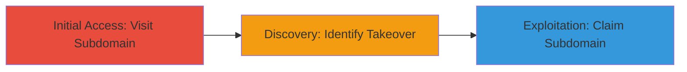

# Subdomain Takeover on Zendesk via Dangling DNS Record for Urban Dictionary Support

Multi-stage attack chain demonstrating a complete attack workflow for exploiting a subdomain takeover vulnerability.

## Chain Metrics Dashboard

| Metric | Value |
|--------|-------|
| Chain Status | Unverified |
| Total Steps | 2 |
| Execution Time | ~5 minutes |
| Skill Level | Beginner |
| Complexity | Low |
| Impact Level | High |

## Attack Flow Visualization

## Prerequisites & Requirements

### Required Tools

- Web browser (e.g., Chrome or Firefox)

### Target Environment

- Web platform with DNS resolution
- Access to public internet
- No authentication required

### Initial Access Requirements

- Public network access
- No prior credentials or access needed

## Detailed Attack Procedures

### Step 1: Initial Access
procedure: [[procedures/Visit-and-Inspect-Subdomain-for-Takeover]]

**Objective**: Access the target subdomain to observe indicators of an unclaimed service.

**Instructions**: Open a web browser and navigate to the subdomain URL. Inspect the page content for messages indicating an unconfigured or claimable service.

**Expected Output**: A webpage displaying a message like 'No help desk at support.urbandictionary.com' with a link to claim the subdomain on the service provider's signup page.

**Success Indicators**:
- Page loads without standard site content
- Presence of a claim or signup prompt from the third-party service

### Step 2: Discovery and Exploitation
procedure: [[procedures/Verify-and-Claim-Subdomain-Takeover-on-Zendesk]]

**Objective**: Confirm the subdomain takeover vulnerability and demonstrate potential exploitation by claiming the subdomain.

**Instructions**: Analyze the page for the specific service (e.g., Zendesk) and verify the DNS points to an unclaimed instance. Register an account on the service provider's platform and attempt to claim the subdomain during signup.

**Expected Output**: Successful claim of the subdomain, allowing control over the hosted content on the subdomain.

**Success Indicators**:
- DNS record matches the service's unclaimed template
- Ability to complete signup and associate the subdomain

## Attack Chain Summary

### Key Achievements

1. Detection of dangling DNS record pointing to unclaimed Zendesk
2. Verification of takeover feasibility without authentication
3. Potential for hosting malicious content or phishing under the trusted subdomain

## Technique & Tactic Coverage

### MITRE ATT&CK Techniques

- [[Exploit Public-Facing Application]]

### MITRE ATT&CK Tactics

- [[Initial Access]]

---

*Last updated: 2023-10-01T00:00:00Z*
