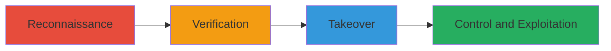

# Subdomain Takeover on kiosk.owox.com via DNS Misconfiguration

Multi-stage attack chain demonstrating a subdomain takeover vulnerability discovered on OWOX's kiosk.owox.com, where DNS misconfiguration and improper authentication allowed an attacker to claim control of the subdomain and potentially host malicious content or conduct phishing attacks. The vulnerability was identified through reconnaissance by reporter hax0rgb and reported via HackerOne, leading to prompt resolution by OWOX, Inc. to mitigate critical risks.

## Chain Metrics Dashboard

| Metric | Value |
|--------|-------|
| Chain Status | Unverified |
| Total Steps | 3 |
| Execution Time | ~15 minutes |
| Skill Level | Intermediate |
| Complexity | Medium |
| Impact Level | High |

## Attack Flow Visualization



## Prerequisites & Requirements

### Required Tools

- None specified; standard DNS tools like dig or nslookup suffice.

### Target Environment

- Web platform with DNS records pointing to cloud services (e.g., AWS, GitHub).
- Required services/ports: DNS (port 53).
- Network access requirements: Public internet access to query DNS.

### Initial Access Requirements

- No credentials required initially.
- Network position: External attacker with internet access.
- Prior access needed: None.

## Detailed Attack Procedures

### Step 1: Reconnaissance for Subdomains
procedure: [[procedures/Reconnaissance-for-Subdomain-Takeover]]

**Objective**: Identify subdomains of the target domain to uncover potential takeover opportunities.

**Instructions**: Use DNS enumeration to list subdomains associated with owox.com, focusing on kiosk.owox.com. Start with a basic DNS lookup using [[commands/dig-dns-lookup]]:

```bash
dig kiosk.owox.com
```

Follow up with broader subdomain enumeration if needed, such as querying common subdomains.

**Expected Output**: DNS records showing the subdomain points to an unclaimed or misconfigured service (e.g., a dangling CNAME to a third-party provider).

**Success Indicators**:
- Subdomain identified (e.g., kiosk.owox.com).
- DNS response reveals misconfiguration (e.g., points to reclaimable resource).

### Step 2: Verify DNS Misconfiguration
procedure: [[procedures/Verify-DNS-Misconfiguration]]

**Objective**: Confirm the subdomain is vulnerable to takeover by checking for dangling DNS records or improper authentication on the pointed service.

**Instructions**: Query the specific DNS record for kiosk.owox.com to verify it points to a service like an unused AWS S3 bucket or GitHub page. Use [[commands/nslookup-query]]:

```bash
nslookup kiosk.owox.com
```

Inspect the output for indicators of takeover feasibility, such as a CNAME to a provider without active authentication.

**Expected Output**: Resolution showing the subdomain aliases to a claimable resource without active ownership.

**Success Indicators**:
- CNAME or NS record points to unclaimed third-party service.
- No active authentication blocks claiming the resource.

### Step 3: Claim and Control Subdomain
procedure: [[procedures/Claim-and-Control-Subdomain]]

**Objective**: Take control of the subdomain by claiming the underlying resource and redirecting it to attacker-controlled content.

**Instructions**: Access the third-party provider's dashboard (inferred from DNS, e.g., AWS console) and claim the dangling resource. Once claimed, update DNS or service settings to point to malicious hosting. No specific command here; manual browser-based claiming after verification.

**Expected Output**: Successful claim confirmation from the provider, with the ability to upload and serve content on kiosk.owox.com.

**Success Indicators**:
- Subdomain now resolves to attacker-controlled IP or content.
- Ability to host phishing or malicious pages verified via browser access.

## Attack Chain Summary

### Key Achievements

1. Identified vulnerable subdomain through DNS reconnaissance.
2. Verified misconfiguration allowing unauthorized claim.
3. Gained control to host malicious content, enabling phishing or further attacks.

## Technique & Tactic Coverage

### MITRE ATT&CK Techniques

- [[Gather Victim Host Information]] Gather Victim Host Information
- [[Exploit Public-Facing Application]] Exploit Public-Facing Application

### MITRE ATT&CK Tactics

- [[Reconnaissance]] Reconnaissance
- [[Initial Access]] Initial Access

---
*Last updated: 2023-10-01T00:00:00Z*
