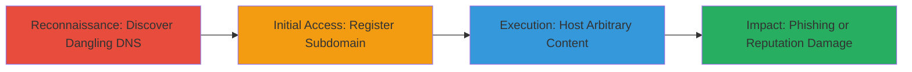

# Subdomain Takeover on mozaws.net via Dangling DNS Record

Multi-stage attack chain demonstrating a complete subdomain takeover workflow by exploiting a dangling DNS record.

## Chain Metrics Dashboard

| Metric | Value |
|--------|-------|
| Chain Status | Unverified |
| Total Steps | 3 |
| Execution Time | ~30 minutes |
| Skill Level | Intermediate |
| Complexity | Medium |
| Impact Level | High |

## Attack Flow Visualization



## Prerequisites & Requirements

### Required Tools

- [[Tool-Dig]]
- [[Tool-Subjack]]

### Target Environment

- Target Platform: Web, Cloud (DNS services)
- Required Services/Ports: DNS (port 53)
- Network Access Requirements: Public internet access to query DNS records

### Initial Access Requirements

- No credentials required initially
- Public DNS resolution access
- Ability to register domains/services (e.g., AWS S3, Heroku)

## Detailed Attack Procedures

### Step 1: Discover Dangling DNS Record
procedure: [[procedures/Discover-Dangling-DNS-Records]]

**Objective**: Identify misconfigured or dangling DNS records pointing to unused services on the target domain.

**Instructions**: Start by enumerating subdomains of mozaws.net using passive reconnaissance tools, then query DNS records to check for dangling entries. Use [[commands/dig-query-dns]] to verify the CNAME or A record:

```bash
dig subdomain.mozaws.net
```

Follow up with [[commands/subjack-scan]] to detect takeover candidates:

```bash
subjack -w subdomains.txt -t 100 -timeout 30 -o results.txt -ssl -v
```

**Expected Output**: DNS response showing a CNAME to an unregistered service (e.g., expired AWS S3 bucket).

**Success Indicators**:
- Dangling record identified (e.g., points to claimable service like GitHub Pages or Heroku)
- No active response from the pointed service

### Step 2: Register the Dangling DNS Record
procedure: [[procedures/Register-and-Claim-Taken-Over-Subdomain]]

**Objective**: Claim control of the subdomain by registering the pointed-to service.

**Instructions**: Once the dangling record is confirmed (e.g., pointing to an unused Heroku app), register an account on that service and create a new app/project with the matching name. Update the service's DNS settings to point back if needed. Verify control using [[commands/curl-check-subdomain]]:

```bash
curl -I https://subdomain.mozaws.net
```

**Expected Output**: HTTP response from your controlled service (e.g., 200 OK with custom content).

**Success Indicators**:
- Subdomain resolves to your registered service
- You can access and modify content on the subdomain

### Step 3: Host Content Under the Subdomain
procedure: [[procedures/Host-Arbitrary-Content-on-Taken-Over-Subdomain]]

**Objective**: Upload and serve malicious or arbitrary content to enable phishing or other attacks.

**Instructions**: Use the service's dashboard (e.g., Heroku CLI or AWS console) to deploy content. For example, with Heroku, push a simple HTML file:

```bash
git init
 echo '<h1>Phishing Page</h1>' > index.html
git add .
git commit -m "deploy"
git push heroku main
```

Verify by accessing the subdomain in a browser or using [[commands/curl-fetch-content]]:

```bash
curl https://subdomain.mozaws.net
```

**Expected Output**: Your uploaded content is served from the Mozilla-owned subdomain.

**Success Indicators**:
- Arbitrary content loads on the subdomain
- Potential for phishing (e.g., fake login page) or defacement

## Attack Chain Summary

### Key Achievements

1. Identified and exploited a dangling DNS record on mozaws.net subdomain.
2. Gained full control of the subdomain without authentication.
3. Enabled hosting of phishing or malicious content, damaging Mozilla's reputation.

## Technique & Tactic Coverage

### MITRE ATT&CK Techniques

- [[Active Scanning]] Active Scanning
- [[Exploit Public-Facing Application]] Exploit Public-Facing Application

### MITRE ATT&CK Tactics

- [[Reconnaissance]] Reconnaissance
- [[Initial Access]] Initial Access

---
*Last updated: 2023-10-01T12:00:00Z*
