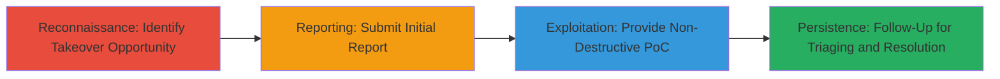

# Subdomain Takeover on openapi.starbucks.com via Approval Process Flaw

Multi-stage attack chain demonstrating the discovery, reporting, and proof-of-concept exploitation of a subdomain takeover vulnerability on openapi.starbucks.com, stemming from a flawed human-approval process for domain space usage. This allowed serving arbitrary content from unused URLs, potentially leading to phishing or brand damage, though no actual harm occurred. The chain highlights reconnaissance, reporting, PoC demonstration, and resolution follow-up.

## Chain Metrics Dashboard

| Metric | Value |
|--------|-------|
| Chain Status | Unverified |
| Total Steps | 4 |
| Execution Time | ~1 day |
| Skill Level | Intermediate |
| Complexity | Medium |
| Impact Level | High |

## Attack Flow Visualization



## Prerequisites & Requirements

### Required Tools

- None specific; relies on manual investigation and reporting tools like web browsers or DNS query utilities.

### Target Environment

- Web platform with DNS-configured subdomains (e.g., openapi.starbucks.com).
- Access to vulnerability reporting platforms like HackerOne.
- No special services/ports required beyond standard HTTP/HTTPS (ports 80/443).

### Initial Access Requirements

- Public internet access to query DNS records.
- No credentials needed; focuses on public-facing misconfigurations.
- Prior knowledge of similar reports for context.

## Detailed Attack Procedures

### Step 1: Detect Subdomain Takeover Opportunity
procedure: [[procedures/Detect-Subdomain-Takeover-Opportunity]]

**Objective**: Identify potential subdomain takeover by investigating domain configuration and usage patterns, building on prior suspicions.

**Instructions**: Review historical reports and manually inspect the subdomain's DNS records for dangling or unused configurations. Use standard DNS lookup tools to check CNAME records pointing to third-party services that may be unclaimed.

For example, query DNS for openapi.starbucks.com:

```bash
nslookup openapi.starbucks.com
# or
 dig CNAME openapi.starbucks.com
```

Look for indicators like unresolved CNAMEs to services (e.g., AWS S3, GitHub Pages) that allow claiming.

**Expected Output**: DNS resolution showing potential dangling records, confirming takeover feasibility.

**Success Indicators**:
- Identification of unused URLs or approval process gaps.
- No active services responding on probed paths.

### Step 2: Submit Initial Vulnerability Report
procedure: [[procedures/Submit-Initial-Vulnerability-Report]]

**Objective**: Formally report the suspected vulnerability to the target's security team via a bug bounty platform.

**Instructions**: Prepare a report detailing the subdomain and suspected takeover risk, referencing prior similar reports. Submit through HackerOne or equivalent platform.

Example submission process (manual via web interface):

1. Log into HackerOne.
2. Create new report for Starbucks program.
3. Describe: "Potential subdomain takeover on openapi.starbucks.com due to unused domain space."

**Expected Output**: Report acknowledgment with ID (e.g., #241503).

**Success Indicators**:
- Report submitted successfully.
- Initial triage response, even if closed.

### Step 3: Demonstrate Non-Destructive PoC for Takeover
procedure: [[procedures/Demonstrate-Non-Destructive-PoC-for-Takeover]]

**Objective**: Provide evidence of takeover capability without causing harm, exploiting the approval process flaw.

**Instructions**: After initial closure, comment on the report with a non-destructive PoC. Create custom content (e.g., a benign HTML page) and demonstrate serving it from an unused URL on the subdomain by leveraging the inconsistent human-approval mechanism.

For PoC setup (inferred for demonstration):

1. Identify an unused path (e.g., /test-poc).
2. If applicable, claim the dangling resource (e.g., via third-party dashboard) and host content.
3. Share screenshot or link showing content served from openapi.starbucks.com/test-poc.

**Expected Output**: Proof that arbitrary content loads under the subdomain, visible in browser.

**Success Indicators**:
- PoC content accessible via the subdomain.
- Report comments confirming demonstration.

### Step 4: Follow-Up for Report Triaging and Resolution
procedure: [[procedures/Follow-Up-for-Report-Triaging-and-Resolution]]

**Objective**: Ensure the vulnerability is acknowledged, triaged, and fixed through persistent communication.

**Instructions**: Respond to triage feedback with additional details or repro steps. Monitor report status until resolution.

Example follow-up (via HackerOne comments):

"Attached repro steps: 1. Navigate to /unused-url. 2. Observe custom content served. This exploits approval flaw."

**Expected Output**: Report reopened, triaged, and marked resolved with fixes applied.

**Success Indicators**:
- Report status changes to 'Triaged' and 'Resolved'.
- Confirmation of operational and code changes.

## Attack Chain Summary

### Key Achievements

1. Confirmed long-suspected subdomain takeover on openapi.starbucks.com.
2. Provided irrefutable non-destructive PoC, leading to report reopening.
3. Highlighted process flaws, resulting in fixes on July 14, 2017.
4. Demonstrated potential for phishing/reputation damage without real-world impact.

## Technique & Tactic Coverage

### MITRE ATT&CK Techniques

- [[Software]] Domain Properties
- [[Exploit Public-Facing Application]] Exploit Public-Facing Application

### MITRE ATT&CK Tactics

- [[Reconnaissance]] Reconnaissance
- [[Initial Access]] Initial Access

---
*Last updated: 2023-10-01T00:00:00Z*
