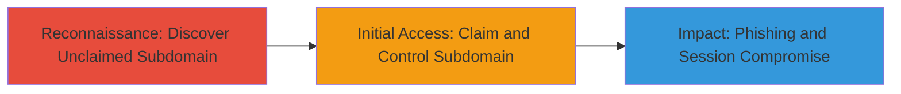

# Subdomain Takeover on status.vimeo.com via Unclaimed Statuspage.io

Multi-stage attack chain demonstrating a subdomain takeover vulnerability, where an unclaimed DNS CNAME record allows an attacker to hijack a trusted subdomain for malicious purposes such as phishing and cookie theft.

## Chain Metrics Dashboard

| Metric | Value |
|--------|-------|
| Chain Status | Unverified |
| Total Steps | 2 |
| Execution Time | ~5 minutes |
| Skill Level | Intermediate |
| Complexity | Medium |
| Impact Level | High |

## Attack Flow Visualization



## Prerequisites & Requirements

### Required Tools

- Web browser for accessing pages
- DNS lookup tool (e.g., dig or nslookup)

### Target Environment

- Public DNS resolution
- Access to statuspage.io service
- No authentication required for discovery

### Initial Access Requirements

- Internet access
- No prior credentials needed
- Ability to register a free account on statuspage.io

## Detailed Attack Procedures

### Step 1: Discover Unclaimed Subdomain
procedure: [[procedures/Discover-Unclaimed-Subdomain]]

**Objective**: Identify subdomains with DNS records pointing to external services that are unclaimed, exposing takeover risks.

**Instructions**: Start by performing a DNS lookup on the target subdomain to check its CNAME record using [[commands/dig-cname-lookup]]:

```bash
dig status.vimeo.com CNAME
```

This reveals if it points to hosted.statuspage.io. Then, access the subdomain URL in a browser or with curl to verify if it's unclaimed:

```bash
curl -I http://status.vimeo.com
```

Look for indicators like a default statuspage.io claim page.

**Expected Output**: DNS response showing CNAME to hosted.statuspage.io; HTTP response indicating an unclaimed page.

**Success Indicators**:
- CNAME points to external service without active configuration
- Page shows "claim this page" prompt on statuspage.io

### Step 2: Claim Subdomain for Takeover
procedure: [[procedures/Claim-Subdomain-for-Takeover]]

**Objective**: Register and claim the unclaimed subdomain to gain full control, enabling deployment of malicious content.

**Instructions**: Navigate to statuspage.io and create a free account. During setup, enter the subdomain (status.vimeo.com) to claim it. Once claimed, customize the page with phishing forms or scripts to exploit same-origin policy and steal cookies.

For verification, access the now-controlled subdomain:

```bash
curl http://status.vimeo.com
```

**Expected Output**: Successful claim confirmation; custom content loads under the subdomain.

**Success Indicators**:
- Control panel on statuspage.io shows the subdomain as active
- Malicious page (e.g., fake login) is accessible via the subdomain
- Potential for cookie theft via JavaScript under vimeo.com domain

## Attack Chain Summary

### Key Achievements

1. Identified unclaimed DNS CNAME for status.vimeo.com pointing to statuspage.io
2. Demonstrated ability to claim and control the subdomain without authentication
3. Highlighted risks of phishing, same-origin exploitation, and session hijacking impacting Vimeo users

## Technique & Tactic Coverage

### MITRE ATT&CK Techniques

- [[Exploit Public-Facing Application]] Exploit Public-Facing Application
- [[Gather Victim Host Information]] Gather Victim Host Information

### MITRE ATT&CK Tactics

- [[Initial Access]] Initial Access
- [[Reconnaissance]] Reconnaissance

---
*Last updated: 2023-10-01T12:00:00Z*
