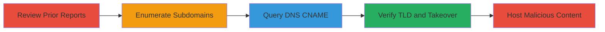

# Subdomain Takeover via CNAME to Unregistered TLD

Multi-stage attack chain demonstrating a complete subdomain takeover workflow by exploiting a DNS CNAME record pointing to an unregistered TLD.

## Chain Metrics Dashboard

| Metric | Value |
|--------|-------|
| Chain Status | Unverified |
| Total Steps | 4 |
| Execution Time | ~15 minutes |
| Skill Level | Intermediate |
| Complexity | Medium |
| Impact Level | High |

## Attack Flow Visualization



## Prerequisites & Requirements

### Required Tools

- [[tools/dig]]

### Target Environment

- DNS infrastructure with public-facing subdomains
- Access to domain registrars for TLD purchase
- Required services/ports: DNS (port 53)
- Network access requirements: Internet connectivity for DNS queries and domain registration

### Initial Access Requirements

- No credentials required initially
- Public network position
- No prior access needed; relies on public DNS records

## Detailed Attack Procedures

### Step 1: Review Prior Reports for Inspiration
procedure: [[procedures/Review-Prior-Reports-for-Inspiration]]

**Objective**: Identify potential subdomain takeover vulnerabilities by learning from similar past issues on the target's assets.

**Instructions**: Examine disclosed vulnerability reports related to the target domain to inspire enumeration targets.

**Expected Output**: List of subdomains or patterns from prior reports to test.

**Success Indicators**:
- Relevant subdomains identified for testing
- Patterns of DNS misconfigurations noted

### Step 2: Enumerate and Test Subdomains for Takeover
procedure: [[procedures/Enumerate-and-Test-Subdomains-for-Takeover]]

**Objective**: Discover subdomains of the target domain and check for potential takeover vulnerabilities.

**Instructions**: Use manual or automated methods to list subdomains and inspect their DNS configurations for dangling records.

**Expected Output**: Subdomains with suspicious DNS entries.

**Success Indicators**:
- Subdomains enumerated
- Potential takeover candidates flagged

### Step 3: Query DNS for CNAME Records
procedure: [[procedures/Query-DNS-for-CNAME-Records]]

**Objective**: Retrieve DNS records for a specific subdomain to identify if it points to an exploitable CNAME.

**Instructions**: Execute [[commands/dig-query-cname]] to query the A record of the subdomain:

```bash
dig subdomain.example.com
```

Analyze the response for CNAME targets.

**Expected Output**: CNAME record pointing to a domain with an unregistered TLD, e.g., NXDOMAIN for the target.

**Success Indicators**:
- CNAME revealed
- Unregistered TLD identified

### Step 4: Verify TLD Registration and Fix
procedure: [[procedures/Verify-TLD-Registration-and-Fix]]

**Objective**: Confirm the TLD is available for registration and verify resolution after potential fix.

**Instructions**: Check IANA TLD list manually, then register the domain if available. Post-takeover, host content. For verification, use [[commands/dig-verify-fix]]:

```bash
dig subdomain.example.com
```

**Expected Output**: A record resolution to legitimate IP post-fix, e.g., NOERROR with A record.

**Success Indicators**:
- TLD confirmed unregistered
- Takeover successful (malicious content hosted)
- Fix verified by changed DNS response

## Attack Chain Summary

### Key Achievements

1. Discovered dangling CNAME via subdomain enumeration
2. Identified and registered unregistered TLD for takeover
3. Enabled phishing by hosting malicious content on legitimate-looking subdomain
4. Demonstrated high-impact risk to user trust and sensitive data exposure

## Technique & Tactic Coverage

### MITRE ATT&CK Techniques

- [[Software]] Gather Victim Host Information: DNS
- [[Exploit Public-Facing Application]] Exploit Public-Facing Application

### MITRE ATT&CK Tactics

- [[Reconnaissance]] Reconnaissance
- [[Initial Access]] Initial Access

---

*Last updated: 2023-10-01T00:00:00Z*
