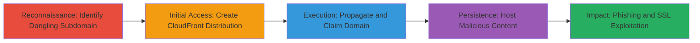

# Subdomain Takeover via Dangling AWS CloudFront CNAME Records

Multi-stage attack chain demonstrating subdomain hijacking by claiming unowned AWS CloudFront distributions through dangling DNS records, leading to phishing and impersonation of legitimate services like Ubiquiti's partners.ubnt.com.

## Chain Metrics Dashboard

| Metric | Value |
|--------|-------|
| Chain Status | Unverified |
| Total Steps | 5 |
| Execution Time | ~30 minutes |
| Skill Level | Intermediate |
| Complexity | Medium |
| Impact Level | High |

## Attack Flow Visualization



## Prerequisites & Requirements

### Required Tools

- [[tools/AWS-CloudFront-Console]]
- [[tools/AWS-S3]]
- [[tools/Lets-Encrypt]]

### Target Environment

- AWS Cloud (CloudFront and S3 services)
- DNS resolution for target subdomains (e.g., partners.ubnt.com)
- No prior AWS credentials needed beyond a standard account

### Initial Access Requirements

- AWS account with permissions to create CloudFront distributions and S3 buckets
- Ability to resolve and query public DNS records
- No specific credentials for the target; exploits public misconfiguration

## Detailed Attack Procedures

### Step 1: Identify Dangling Subdomain
procedure: [[procedures/Identify-Dangling-Subdomain-via-DNS-Enumeration]]

**Objective**: Discover subdomains with dangling CNAME records pointing to unclaimed AWS CloudFront distributions.

**Instructions**: Query DNS records for target subdomains like partners.ubnt.com using standard DNS tools to identify CNAMEs resolving to CloudFront endpoints (e.g., d123456789.cloudfront.net) without active origins.

For example, use dig to check:

```bash
dig CNAME partners.ubnt.com
```

Verify the resolution points to an inactive CloudFront distribution by attempting to access it directly.

**Expected Output**: DNS response showing CNAME to a CloudFront ARN that returns no content or errors.

**Success Indicators**:
- CNAME record found pointing to CloudFront
- Direct access to the CloudFront URL shows no active configuration

### Step 2: Create New CloudFront Distribution
procedure: [[procedures/Create-New-CloudFront-Distribution]]

**Objective**: Set up a new AWS CloudFront distribution to claim the dangling subdomain.

**Instructions**: Log into the [[tools/AWS-CloudFront-Console]] and create a new distribution. Configure an origin (e.g., an S3 bucket) and add the target subdomain (partners.ubnt.com) as an Alternate Domain Name (CNAME).

No specific command needed; use the web console to select web distribution, set origin domain to your S3 bucket, and add the CNAME in the alternate domain names field.

**Expected Output**: Distribution created with status 'In Progress', pending deployment.

**Success Indicators**:
- Distribution ID generated
- Target subdomain added successfully without validation errors

### Step 3: Wait for Propagation and Claim Domain
procedure: [[procedures/Wait-for-CNAME-Propagation-and-Claim-Domain]]

**Objective**: Allow AWS to propagate the configuration and route traffic to the attacker's distribution.

**Instructions**: After adding the CNAME, monitor the distribution status in the [[tools/AWS-CloudFront-Console]]. Wait approximately 15 minutes for global propagation. Then, test by resolving the subdomain DNS and accessing it via browser.

Use dig to verify propagation:

```bash
dig partners.ubnt.com
```

**Expected Output**: DNS now points to the attacker's CloudFront distribution; traffic routes to custom origin.

**Success Indicators**:
- Distribution status changes to 'Deployed'
- Visiting http://partners.ubnt.com loads attacker's content

### Step 4: Host Proof-of-Concept Content
procedure: [[procedures/Host-Proof-of-Concept-Content-on-S3-Origin]]

**Objective**: Upload and serve malicious content, such as a fake login page, via the claimed subdomain.

**Instructions**: In the [[tools/AWS-S3]] console, create a bucket and upload an HTML file for a fake login page (e.g., index.html at /login). Ensure the bucket is set as public and configured as the origin in CloudFront. Test by accessing http://partners.ubnt.com/login.

Upload via console or AWS CLI if available:

```bash
aws s3 cp login.html s3://attacker-bucket/login.html
```

**Expected Output**: Fake login page displays when visiting the subdomain path.

**Success Indicators**:
- Content loads from S3 via CloudFront
- No errors in CloudFront logs for the path

### Step 5: Demonstrate Phishing and SSL Exploitation
procedure: [[procedures/Demonstrate-Phishing-and-SSL-Certificate-Exploitation]]

**Objective**: Show potential for advanced attacks like phishing and secure cookie theft using free SSL certificates.

**Instructions**: Use [[tools/Lets-Encrypt]] to obtain an SSL certificate for the hijacked domain via HTTP-01 challenge (place verification file in S3). Configure CloudFront for HTTPS. Demonstrate phishing by capturing form data on the fake /login page, enabling theft of httpOnly cookies.

For certificate issuance (using certbot example):

```bash
certbot certonly --manual --preferred-challenges http -d partners.ubnt.com
```

**Expected Output**: Valid SSL cert issued; site serves over HTTPS with phishing form.

**Success Indicators**:
- HTTPS access without warnings
- Ability to intercept and steal session cookies

## Attack Chain Summary

### Key Achievements

1. Identified and claimed dangling subdomains (partners.ubnt.com and ping.ubnt.com)
2. Served arbitrary phishing content indistinguishable from legitimate Ubiquiti pages
3. Enabled secure impersonation via free SSL certificates for cookie theft

## Technique & Tactic Coverage

### MITRE ATT&CK Techniques

- [[Gather Victim Host Information]] Gather Victim Host Information
- [[Exploit Public-Facing Application]] Exploit Public-Facing Application

### MITRE ATT&CK Tactics

- [[Reconnaissance]] Reconnaissance
- [[Initial Access]] Initial Access

---
*Last updated: 2023-10-01T00:00:00Z*
