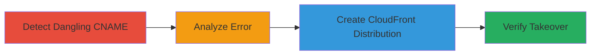

# Subdomain Takeover via Dangling AWS CloudFront CNAME

Multi-stage attack chain demonstrating a subdomain takeover on a target like rider.uber.com by exploiting a dangling CNAME record pointing to an unconfigured AWS CloudFront distribution. The attacker discovers the misconfiguration through error messages, claims the subdomain by creating a new CloudFront distribution, and verifies control by hosting proof-of-concept content. This allows serving arbitrary content on the victim's domain, potentially for phishing or defacement.

## Chain Metrics Dashboard

| Metric | Value |
|--------|-------|
| Chain Status | Unverified |
| Total Steps | 4 |
| Execution Time | ~30 minutes |
| Skill Level | Intermediate |
| Complexity | Medium |
| Impact Level | High |

## Attack Flow Visualization

## Prerequisites & Requirements

### Required Tools

- [[tools/AWS-CloudFront]]
- Web browser for initial access and verification

### Target Environment

- AWS Cloud environment with DNS records
- Access to a subdomain like rider.example.com
- No special ports required; uses standard HTTP/HTTPS (80/443)

### Initial Access Requirements

- Public internet access to the target subdomain
- AWS account credentials for exploitation (attacker's own account)
- No prior credentials on target needed

## Detailed Attack Procedures

### Step 1: Access Subdomain and Observe Error
procedure: [[procedures/Detect-Dangling-CNAME-Subdomain]]

**Objective**: Identify a potentially vulnerable subdomain by accessing it and noting the response.

**Instructions**: Use a web browser to visit the target subdomain over both HTTP and HTTPS. Look for error messages indicating a misconfigured service.

**Expected Output**: A CloudFront error page stating no distribution is configured for the requested CNAME.

**Success Indicators**:
- Error message from AWS CloudFront appears
- No valid content loads on the subdomain

### Step 2: Analyze Error for Takeover Potential
procedure: [[procedures/Analyze-AWS-CloudFront-Error]]

**Objective**: Confirm the error indicates a dangling CNAME vulnerable to takeover by referencing known AWS behaviors.

**Instructions**: Review the error message and cross-reference with documentation on AWS subdomain takeovers. Note the CNAME points to a CloudFront endpoint without an active distribution.

**Expected Output**: Identification of the dangling CNAME as a takeover vector, supported by external references like blog posts on AWS misconfigurations.

**Success Indicators**:
- Error matches known patterns for non-existent CloudFront distributions
- CNAME record verified via DNS lookup tools (e.g., dig or nslookup)

### Step 3: Create Proof-of-Concept CloudFront Distribution
procedure: [[procedures/Create-CloudFront-Distribution-for-Takeover]]

**Objective**: Claim control of the subdomain by setting up a new AWS CloudFront distribution that matches the dangling CNAME.

**Instructions**: In the AWS Console, create a new CloudFront distribution. Add an alternate domain name (CNAME) for the target subdomain (e.g., rider.uber.com). Configure it to point to an S3 bucket or custom origin hosting PoC content, such as a login page mockup. Do not claim the apex domain.

**Expected Output**: CloudFront distribution created and active, with the CNAME associated.

**Success Indicators**:
- Distribution status changes to "Deployed"
- CNAME configuration accepted without errors

### Step 4: Verify the Takeover
procedure: [[procedures/Verify-Subdomain-Takeover]]

**Objective**: Confirm attacker control by accessing hosted PoC content on the subdomain.

**Instructions**: Once the distribution is deployed, visit a path on the subdomain like http://rider.uber.com/login-poc. The PoC content from the attacker's distribution should load instead of an error.

**Expected Output**: Custom PoC page (e.g., a screenshot-confirmed login mockup) served from the attacker's CloudFront.

**Success Indicators**:
- Arbitrary content loads on the subdomain
- Original error is replaced by attacker-controlled page
- Verified via browser or curl request

## Attack Chain Summary

### Key Achievements

1. Discovered and confirmed a dangling CNAME vulnerability on rider.uber.com
2. Successfully took over the subdomain using a new CloudFront distribution
3. Demonstrated impact by hosting PoC content, enabling potential phishing or defacement
4. Highlighted risks of unmaintained DNS records in AWS environments

## Technique & Tactic Coverage

### MITRE ATT&CK Techniques

- [[Exploit Public-Facing Application]]

### MITRE ATT&CK Tactics

- [[Initial Access]]

---
*Last updated: 2023-10-01T00:00:00Z*
