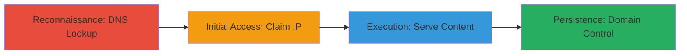

# Subdomain Takeover via Dangling AWS EC2 IP

Multi-stage attack chain demonstrating a subdomain takeover by exploiting a dangling DNS record to an unused AWS EC2 IP, allowing control over the domain for serving malicious content, obtaining TLS certificates, and potentially compromising trusting services like OAuth or cookies.

## Chain Metrics Dashboard

| Metric | Value |
|--------|-------|
| Chain Status | Unverified |
| Total Steps | 3 |
| Execution Time | ~30 minutes |
| Skill Level | Intermediate |
| Complexity | Medium |
| Impact Level | High |

## Attack Flow Visualization



## Prerequisites & Requirements

### Required Tools

- AWS CLI (for launching EC2 instance)
- Standard DNS tools like dig

### Target Environment

- AWS Cloud platform
- DNS services
- EC2 instances

### Initial Access Requirements

- AWS account access to launch EC2 instances
- No prior credentials on target; exploits public DNS misconfiguration
- Network access to resolve DNS and access AWS console

## Detailed Attack Procedures

### Step 1: DNS Reconnaissance
procedure: [[procedures/DNS-Lookup-to-Identify-Dangling-Subdomain]]

**Objective**: Identify subdomains with dangling DNS records pointing to unused IPs.

**Instructions**: Perform a DNS lookup on the target subdomain to resolve its IP address and check if it's associated with a deleted resource.

Use [[commands/dig-lookup-subdomain]] to query the DNS:

```bash
dig +short v.zego.com
```

**Expected Output**: The IP address 52.214.138.192, which can be verified as unused via AWS console or IP lookup tools.

**Success Indicators**:
- DNS resolves to an IP not controlled by the target organization
- IP is available for claiming in AWS

### Step 2: Claim the Dangling IP
procedure: [[procedures/Claim-Dangling-AWS-EC2-IP]]

**Objective**: Launch a new EC2 instance on the dangling IP to gain control over the subdomain's traffic.

**Instructions**: Access the AWS console or use AWS CLI to launch an EC2 instance and assign the specific Elastic IP (52.214.138.192) if available, or migrate to it. Configure the instance to respond to HTTP requests.

No direct command shown, but use AWS management console to:
1. Create a new EC2 instance.
2. Associate the Elastic IP 52.214.138.192 (assuming it's elastic and reclaimable).
3. Install a web server like nginx or Apache to serve content.

**Expected Output**: Successful instance launch with the IP assigned, confirmed via AWS console.

**Success Indicators**:
- EC2 instance running on the target IP
- DNS now points to attacker's controlled instance

### Step 3: Verify Takeover
procedure: [[procedures/Verify-Subdomain-Takeover-with-Custom-Content]]

**Objective**: Confirm control by serving and retrieving custom content from the subdomain.

**Instructions**: After launching the instance, configure it to serve a test page (e.g., with a marker like "<!-- hackerone.com/ian -->"). Then fetch the content to verify.

Use [[commands/curl-fetch-subdomain-content]] to retrieve the response:

```bash
curl v.zego.com
```

**Expected Output**: Custom HTML content including the marker "<!-- hackerone.com/ian -->", indicating attacker control.

**Success Indicators**:
- Custom content served successfully
- Potential for TLS cert issuance or malicious payload delivery

## Attack Chain Summary

### Key Achievements

1. Identified dangling DNS record via simple lookup
2. Claimed AWS EC2 IP without authentication to target
3. Demonstrated full subdomain control, enabling phishing, malware delivery, or service abuse

## Technique & Tactic Coverage

### MITRE ATT&CK Techniques

- [[Hardware]] Gather Victim Host Information: Domain
- [[Email Accounts]] Compromise Infrastructure: Cloud Accounts/Infrastructure
- [[Exploit Public-Facing Application]] Exploit Public-Facing Application

### MITRE ATT&CK Tactics

- [[Reconnaissance]] Reconnaissance
- [[Initial Access]] Initial Access

---
*Last updated: 2023-10-01T00:00:00Z*
