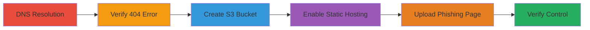

---
tags:
  - subdomain-takeover
  - aws-s3
  - dns-dangling
  - phishing
  - credential-harvesting
type: attack_chain
tools:
  - '[[tools/dig]]'
tactics:
  - '[[Initial Access]]'
  - '[[Execution]]'
verified: false
platforms:
  - Web
  - AWS
submitted: true
complexity: medium
created_at: '2024-10-01T00:00:00Z'
procedures:
  - '[[procedures/Resolve-DNS-for-Subdomain-Takeover-Detection]]'
  - '[[procedures/Verify-Unclaimed-S3-Bucket]]'
  - '[[procedures/Create-S3-Bucket-for-Takeover]]'
  - '[[procedures/Enable-Static-Website-Hosting-on-S3]]'
  - '[[procedures/Upload-Phishing-Content-to-S3]]'
  - '[[procedures/Verify-Subdomain-Takeover-Control]]'
step_count: 6
techniques:
  - '[[Exploit Public-Facing Application]]'
  - '[[Phishing]]'
updated_at: '2025-12-14T04:38:49.399Z'
description: >-
  A multi-stage attack exploiting a dangling DNS record pointing to an unclaimed
  AWS S3 bucket, allowing takeover of a subdomain to host phishing content and
  harvest credentials.
skill_level: intermediate
impact_level: high
id: 352e69b3-defd-4fb9-84f7-ab6b66530639
validated: true
mitre_tactics:
  - '[[Initial Access]]'
  - '[[Execution]]'
mitre_techniques:
  - '[[Exploit Public-Facing Application]]'
  - '[[Phishing]]'
---
# Subdomain Takeover via Dangling AWS S3 Bucket for Phishing

Multi-stage attack chain demonstrating a complete subdomain takeover workflow using a dangling DNS record to an unclaimed S3 bucket, culminating in phishing credential theft.

## Chain Metrics Dashboard

| Metric | Value |
|--------|-------|
| Chain Status | Unverified |
| Total Steps | 6 |
| Execution Time | ~15 minutes |
| Skill Level | Intermediate |
| Complexity | Medium |
| Impact Level | High |

## Attack Flow Visualization



## Prerequisites & Requirements

### Required Tools

- [[tools/dig]]

### Target Environment

- AWS S3 in US East (N. Virginia) region
- Dangling CNAME DNS record pointing to S3 website endpoint
- AWS account with permissions to create S3 buckets

### Initial Access Requirements

- No prior credentials needed for discovery
- AWS credentials for claiming the bucket
- Network access to resolve DNS and access S3

## Detailed Attack Procedures

### Step 1: DNS Resolution for Detection
procedure: [[procedures/Resolve-DNS-for-Subdomain-Takeover-Detection]]

**Objective**: Identify if the subdomain points to an S3 backend via DNS resolution.

**Instructions**: Use [[commands/dig-dns-a-record-lookup]] to query the A record:

```bash
dig A a2.bime.io @8.8.8.8
```

**Expected Output**: Reveals CNAME to bimeio.s3-website-us-east-1.amazonaws.com and A record IP 54.231.11.130, indicating S3.

**Success Indicators**:
- CNAME chain to S3 website endpoint detected
- S3 IP range confirmed

### Step 2: Verify Unclaimed Bucket
procedure: [[procedures/Verify-Unclaimed-S3-Bucket]]

**Objective**: Confirm the S3 bucket is deleted or unclaimed by accessing the URL.

**Instructions**: Open a web browser and navigate to the subdomain URL.

**Expected Output**: HTTP 404 error page from AWS stating the bucket does not exist.

**Success Indicators**:
- 404 error confirming unclaimed status
- No custom content served

### Step 3: Create S3 Bucket
procedure: [[procedures/Create-S3-Bucket-for-Takeover]]

**Objective**: Register the exact bucket name to claim control of the subdomain.

**Instructions**: Use the AWS Console or CLI to create a bucket named 'a2.bime.io' in US East 1 region.

**Expected Output**: Bucket creation success message.

**Success Indicators**:
- Bucket created without naming conflict
- Region matches DNS endpoint

### Step 4: Enable Static Hosting
procedure: [[procedures/Enable-Static-Website-Hosting-on-S3]]

**Objective**: Configure the bucket for public static website serving.

**Instructions**: In AWS Console, edit bucket properties to enable static website hosting and set index document to 'index.html'.

**Expected Output**: Hosting endpoint URL generated.

**Success Indicators**:
- Static hosting enabled
- Index document configured

### Step 5: Upload Phishing Content
procedure: [[procedures/Upload-Phishing-Content-to-S3]]

**Objective**: Deploy a fake login page to impersonate the legitimate site.

**Instructions**: Upload an index.html file with phishing form and set bucket policy for public read access.

**Expected Output**: File uploaded and accessible publicly.

**Success Indicators**:
- Phishing page visible at bucket endpoint
- Form captures and exfiltrates credentials

### Step 6: Verify Takeover
procedure: [[procedures/Verify-Subdomain-Takeover-Control]]

**Objective**: Confirm the subdomain now serves the attacker's content.

**Instructions**: Access http://a2.bime.io/ in a browser.

**Expected Output**: Fake login page loads, mimicking Bime's sign-in.

**Success Indicators**:
- Subdomain resolves to attacker's content
- Phishing page functional for credential harvest

## Attack Chain Summary

### Key Achievements

1. Detected dangling DNS to unclaimed S3
2. Claimed bucket and configured for hosting
3. Deployed phishing site on trusted subdomain
4. Enabled credential theft from users

## Technique & Tactic Coverage

### MITRE ATT&CK Techniques

- [[Exploit Public-Facing Application]]
- [[Phishing]]

### MITRE ATT&CK Tactics

- [[Initial Access]]
- [[Execution]]

---

*Last updated: 2024-10-01T00:00:00Z*
