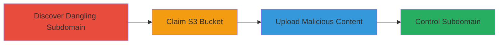

---
tags:
  - subdomain-takeover
  - aws-s3
  - dns-misconfiguration
  - cloud-hijacking
type: attack_chain
tools:
  - '[[tools/AWS-CLI]]'
tactics:
  - '[[Initial Access]]'
verified: false
platforms:
  - Web
  - AWS
submitted: true
complexity: medium
created_at: '2023-10-01T00:00:00Z'
procedures:
  - '[[procedures/Discover-Dangling-Subdomain-for-Takeover]]'
  - '[[procedures/Claim-Unclaimed-AWS-S3-Bucket]]'
  - '[[procedures/Upload-Content-to-Hijacked-S3-Bucket]]'
step_count: 3
techniques:
  - '[[Exploit Public-Facing Application]]'
updated_at: '2025-12-14T04:38:39.739Z'
description: >-
  A multi-stage attack exploiting a dangling DNS record pointing to an unclaimed
  AWS S3 bucket, allowing full control over a subdomain for hosting malicious
  content.
skill_level: intermediate
impact_level: high
id: 74945f85-95c8-4156-b445-c031a4b0052f
validated: true
mitre_tactics:
  - '[[Initial Access]]'
mitre_techniques:
  - '[[Exploit Public-Facing Application]]'
---
# Subdomain Takeover via Dangling AWS S3 Bucket

Multi-stage attack chain demonstrating a complete subdomain takeover workflow by exploiting a dangling DNS record to an unclaimed AWS S3 bucket. This allows an attacker to claim the bucket and host arbitrary content, potentially enabling phishing, defacement, or impersonation of the target service.

## Chain Metrics Dashboard

| Metric | Value |
|--------|-------|
| Chain Status | Unverified |
| Total Steps | 3 |
| Execution Time | ~10 minutes |
| Skill Level | Intermediate |
| Complexity | Medium |
| Impact Level | High |

## Attack Flow Visualization



## Prerequisites & Requirements

### Required Tools

- [[tools/AWS-CLI]]
- DNS resolution tools (e.g., dig)

### Target Environment

- AWS cloud environment with S3 services
- Public DNS records for the target domain
- No authentication required for discovery; AWS credentials needed for claiming bucket

### Initial Access Requirements

- Internet access for DNS queries
- AWS account credentials with S3 permissions
- No prior access to the target domain needed

## Detailed Attack Procedures

### Step 1: Discover Dangling Subdomain
procedure: [[procedures/Discover-Dangling-Subdomain-for-Takeover]]

**Objective**: Identify subdomains with dangling DNS records pointing to unclaimed cloud resources like AWS S3 endpoints.

**Instructions**: Use [[commands/dig-check-dns]] to query the DNS resolution of the target subdomain and verify if it points to an S3 endpoint without active content:

```bash
dig dev-admin.periscope.tv
```

Check the response for resolution to an S3 website endpoint like s3-website-us-west-2.amazonaws.com. If it resolves but serves no content (e.g., XML error or empty bucket message), it's dangling.

**Expected Output**: DNS response showing CNAME or alias to S3 endpoint, and HTTP access returning bucket not found or access denied.

**Success Indicators**:
- Subdomain resolves to S3 endpoint
- Accessing the URL returns no active website content

### Step 2: Claim the S3 Bucket
procedure: [[procedures/Claim-Unclaimed-AWS-S3-Bucket]]

**Objective**: Register the unclaimed S3 bucket name to gain ownership and control over the associated DNS record.

**Instructions**: Ensure AWS CLI is configured with credentials, then create the bucket matching the subdomain name in the correct region using [[commands/aws-create-bucket]]:

```bash
aws s3 mb s3://dev-admin.periscope.tv --region us-west-2
```

Verify creation with [[commands/aws-list-buckets]]:

```bash
aws s3 ls
```

**Expected Output**: Bucket created successfully; listed in S3 buckets.

**Success Indicators**:
- Bucket creation confirmation
- DNS now points to the attacker's controlled bucket

### Step 3: Upload Content to Hijack the Subdomain
procedure: [[procedures/Upload-Content-to-Hijacked-S3-Bucket]]

**Objective**: Upload custom content to the claimed bucket to serve it via the hijacked subdomain, enabling phishing or defacement.

**Instructions**: Create a simple index.html file with malicious content, then upload it to the bucket root using [[commands/aws-upload-file]]:

```bash
echo '<h1>Hijacked Page</h1><p>Arbitrary content hosted here.</p>' > index.html
aws s3 cp index.html s3://dev-admin.periscope.tv/ --region us-west-2
```

Enable static website hosting on the bucket if needed:

```bash
aws s3 website s3://dev-admin.periscope.tv/ --index-document index.html --region us-west-2
```

Access http://dev-admin.periscope.tv to verify.

**Expected Output**: Custom HTML served at the subdomain URL.

**Success Indicators**:
- Subdomain loads attacker-controlled content
- Potential for phishing or impersonation confirmed

## Attack Chain Summary

### Key Achievements

1. Identified and verified a dangling DNS record to an unclaimed S3 bucket
2. Successfully claimed ownership of the bucket using AWS credentials
3. Uploaded and served custom content, achieving full subdomain control

## Technique & Tactic Coverage

### MITRE ATT&CK Techniques

- [[Exploit Public-Facing Application]]

### MITRE ATT&CK Tactics

- [[Initial Access]]

---
*Last updated: 2023-10-01T00:00:00Z*
