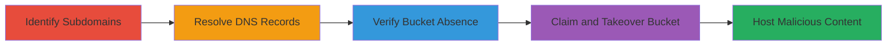

---
tags:
  - subdomain-takeover
  - aws-s3
  - dns-dangling
  - phishing
type: attack_chain
tools:
  - '[[tools/can-i-take-over-xyz]]'
tactics:
  - '[[Reconnaissance]]'
  - '[[Initial Access]]'
verified: false
platforms:
  - Web
  - AWS
submitted: true
complexity: medium
created_at: '2023-10-01T00:00:00Z'
procedures:
  - '[[procedures/Identify-Vulnerable-Event-Subdomains]]'
  - '[[procedures/Resolve-and-Analyze-DNS-Records]]'
  - '[[procedures/Verify-Non-Existent-S3-Buckets]]'
  - '[[procedures/Confirm-and-Execute-S3-Bucket-Takeover]]'
step_count: 4
techniques:
  - '[[Hardware]]'
  - '[[Exploit Public-Facing Application]]'
updated_at: '2025-12-14T04:51:10.842Z'
description: >-
  Multi-stage attack exploiting dangling DNS records pointing to deleted AWS S3
  buckets, enabling subdomain hijacking for phishing and spoofing on Khan
  Academy event sites.
skill_level: intermediate
impact_level: high
id: c4a59f79-a4cc-4fd6-bf61-b00edbe0d7a7
validated: true
mitre_tactics:
  - '[[Reconnaissance]]'
  - '[[Initial Access]]'
mitre_techniques:
  - '[[Hardware]]'
  - '[[Exploit Public-Facing Application]]'
---
# Subdomain Takeover via Dangling AWS S3 Buckets on Khan Academy Event Subdomains

Multi-stage attack chain demonstrating subdomain takeover by exploiting orphaned DNS CNAME records pointing to deleted AWS S3 buckets on Khan Academy's event subdomains, allowing attackers to hijack traffic and host phishing content.

## Chain Metrics Dashboard

| Metric | Value |
|--------|-------|
| Chain Status | Unverified |
| Total Steps | 4 |
| Execution Time | ~15 minutes |
| Skill Level | Intermediate |
| Complexity | Medium |
| Impact Level | High |

## Attack Flow Visualization



## Prerequisites & Requirements

### Required Tools

- [[tools/can-i-take-over-xyz]]
- DNS resolution tools like dig
- AWS CLI for bucket creation (if claiming)

### Target Environment

- Web platform with AWS S3 integration
- Exposed DNS records for subdomains
- No authentication required for initial reconnaissance

### Initial Access Requirements

- Public internet access to resolve DNS and query S3 endpoints
- No prior credentials needed; attacker can claim buckets anonymously if names are available

## Detailed Attack Procedures

### Step 1: Identify Vulnerable Event Subdomains
procedure: [[procedures/Identify-Vulnerable-Event-Subdomains]]

**Objective**: Locate subdomains associated with past or current events that may have dangling infrastructure.

**Instructions**: Research known event subdomains for the target, such as those used for hackathons or workshops. For Khan Academy, focus on healthyhackathon.khanacademy.org and hackweek.khanacademy.org, which hosted event information.

Use manual enumeration or tools to list potential subdomains:

```bash
# Example: Use dig to check known subdomains
 dig healthyhackathon.khanacademy.org
```

**Expected Output**: Confirmation that the subdomain exists in DNS.

**Success Indicators**:
- Subdomain resolves to an IP or CNAME
- Associated with event-related content

### Step 2: Resolve and Analyze DNS Records
procedure: [[procedures/Resolve-and-Analyze-DNS-Records]]

**Objective**: Uncover CNAME records pointing to cloud services like AWS S3.

**Instructions**: Perform DNS lookups to reveal the underlying infrastructure. For the identified subdomains:

```bash
# Resolve CNAME using dig
 dig +short CNAME healthyhackathon.khanacademy.org
# Expected: healthyhackathon.khanacademy.org.s3.amazonaws.com
```

Analyze the output to identify S3 endpoints.

**Expected Output**: CNAME record pointing to an S3 bucket endpoint.

**Success Indicators**:
- DNS points to a cloud provider endpoint
- Potential for service-specific takeover

### Step 3: Verify Non-Existent S3 Buckets
procedure: [[procedures/Verify-Non-Existent-S3-Buckets]]

**Objective**: Confirm the pointed-to S3 buckets have been deleted, leaving the DNS dangling.

**Instructions**: Attempt to access the S3 endpoint directly via HTTP to check for existence:

```bash
# Curl the S3 endpoint
 curl -I https://healthyhackathon.khanacademy.org.s3.amazonaws.com
# Expected: 404 NoSuchBucket error
```

Repeat for other subdomains like hackweek.khanacademy.org.s3.amazonaws.com.

**Expected Output**: AWS error indicating the bucket does not exist.

**Success Indicators**:
- 'NoSuchBucket' or similar error returned
- Bucket name is squattable (not in use)

### Step 4: Confirm and Execute S3 Bucket Takeover
procedure: [[procedures/Confirm-and-Execute-S3-Bucket-Takeover]]

**Objective**: Validate takeover feasibility and claim the orphaned bucket to control the subdomain.

**Instructions**: Reference known takeover guides like [[tools/can-i-take-over-xyz]] to confirm S3 techniques. Create a new S3 bucket with the exact name (e.g., healthyhackathon.khanacademy.org) via AWS console or CLI:

```bash
# Using AWS CLI to create bucket (requires AWS account)
 aws s3 mb s3://healthyhackathon.khanacademy.org --region us-east-1
```

Upload index.html with spoofed content to host phishing pages.

**Expected Output**: Subdomain now serves content from the attacker's bucket.

**Success Indicators**:
- DNS traffic routes to attacker's S3 content
- Ability to host fake event pages for phishing

## Attack Chain Summary

### Key Achievements

1. Identified dangling subdomains tied to deleted S3 buckets
2. Verified takeover vulnerability without updating DNS
3. Enabled spoofing of Khan Academy events for user data collection
4. Demonstrated high-impact phishing potential

## Technique & Tactic Coverage

### MITRE ATT&CK Techniques

- [[Hardware]] Gather Victim Host Information: Domains
- [[Exploit Public-Facing Application]] Exploit Public-Facing Application

### MITRE ATT&CK Tactics

- [[Reconnaissance]] Reconnaissance
- [[Initial Access]] Initial Access

---
*Last updated: 2023-10-01T00:00:00Z*
