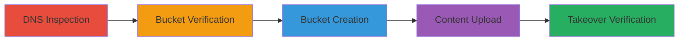

---
tags:
  - subdomain-takeover
  - aws-s3
  - dns-cname
  - dangling-record
type: attack_chain
tools:
  - '[[tools/aws-cli]]'
tactics:
  - '[[Initial Access]]'
commands:
  - '[[commands/dig-dns-lookup]]'
  - '[[commands/curl-access-s3-endpoint]]'
  - '[[commands/aws-s3-create-bucket]]'
  - '[[commands/aws-s3-upload-file]]'
  - '[[commands/curl-verify-subdomain]]'
platforms:
  - Web
  - AWS
complexity: medium
procedures:
  - '[[procedures/Inspect-DNS-for-Subdomain-Takeover]]'
  - '[[procedures/Verify-Non-Existent-S3-Bucket]]'
  - '[[procedures/Create-Malicious-AWS-S3-Bucket]]'
  - '[[procedures/Upload-POC-Content-to-S3-Bucket]]'
  - '[[procedures/Verify-Subdomain-Takeover-Success]]'
step_count: 5
techniques:
  - '[[Exploit Public-Facing Application]]'
description: >-
  A multi-step attack exploiting a dangling DNS CNAME record pointing to a
  non-existent AWS S3 bucket, allowing an attacker to register the bucket and
  serve arbitrary content on the subdomain.
skill_level: intermediate
impact_level: high
id: 1c3b0cba-74fa-419b-a599-f75b9829efad
created_at: '2025-12-14T05:32:31.149Z'
updated_at: '2025-12-14T05:32:31.149Z'
verified: false
validated: true
submitted: true
mitre_tactics:
  - '[[Initial Access]]'
mitre_techniques:
  - '[[Exploit Public-Facing Application]]'
---
# Subdomain Takeover via Dangling AWS S3 CNAME Record

## Overview

This attack chain demonstrates a subdomain takeover vulnerability where a dangling DNS CNAME record for gameday.websummit.net points to a non-existent AWS S3 bucket endpoint (gameday.websummit.net.s3-website-eu-west-1.amazonaws.com). The attacker discovers the misconfiguration, confirms the bucket's absence, registers a new bucket with the same name in the eu-west-1 region, uploads proof-of-concept content, and verifies control over the subdomain. This allows serving malicious content like phishing pages or defacement, impersonating the legitimate domain and potentially leading to user deception or further compromise.

## Chain Metrics Dashboard

| Metric | Value |
|--------|-------|
| Chain Status | Unverified |
| Total Steps | 5 |
| Execution Time | ~15 minutes |
| Skill Level | Intermediate |
| Complexity | Medium |
| Impact Level | High |

## Attack Flow Visualization



## Prerequisites & Requirements

### Required Tools

- [[tools/aws-cli]]

### Target Environment

- AWS S3 service in eu-west-1 region
- Public DNS resolution for the target domain
- AWS account with permissions to create S3 buckets

### Initial Access Requirements

- No prior credentials needed for the target
- Internet access for DNS queries and AWS operations
- AWS credentials for the attacker's account

## Detailed Attack Procedures

### Step 1: DNS Inspection
procedure: [[procedures/Inspect-DNS-for-Subdomain-Takeover]]

**Objective**: Identify subdomains and inspect their DNS records for potential takeover vectors like dangling CNAMEs pointing to cloud services.

**Instructions**: Use [[commands/dig-dns-lookup]] to query the DNS records of the target subdomain:

```bash
dig gameday.websummit.net +short
```

This reveals the CNAME pointing to gameday.websummit.net.s3-website-eu-west-1.amazonaws.com, indicating an S3-hosted static site configuration.

**Expected Output**: CNAME record output showing the S3 endpoint.

**Success Indicators**:
- CNAME resolves to an AWS S3 website endpoint
- Subdomain is publicly resolvable

### Step 2: Bucket Verification
procedure: [[procedures/Verify-Non-Existent-S3-Bucket]]

**Objective**: Confirm that the S3 bucket referenced by the CNAME does not exist, making it available for takeover.

**Instructions**: Attempt to access the S3 website endpoint using [[commands/curl-access-s3-endpoint]]:

```bash
curl -I http://gameday.websummit.net.s3-website-eu-west-1.amazonaws.com
```

An error response (e.g., 404 or NoSuchBucket) indicates the bucket is deleted or never existed.

**Expected Output**: HTTP error indicating bucket unavailability.

**Success Indicators**:
- Access attempt fails with bucket-related error
- No content is served from the endpoint

### Step 3: Bucket Creation
procedure: [[procedures/Create-Malicious-AWS-S3-Bucket]]

**Objective**: Register a new S3 bucket using the exact name from the dangling CNAME to gain control.

**Instructions**: Use AWS CLI with [[commands/aws-s3-create-bucket]] to create the bucket in the correct region:

```bash
aws s3 mb s3://gameday.websummit.net --region eu-west-1
```

Ensure the bucket name matches precisely, including the region eu-west-1 for website hosting compatibility.

**Expected Output**: Confirmation message like "make_bucket: gameday.websummit.net".

**Success Indicators**:
- Bucket creation succeeds without name conflict
- Bucket is listed in the attacker's AWS account

### Step 4: Content Upload
procedure: [[procedures/Upload-POC-Content-to-S3-Bucket]]

**Objective**: Upload arbitrary content to the controlled bucket and enable public access to demonstrate takeover.

**Instructions**: First, enable website hosting and public access via AWS console or CLI, then upload a POC file using [[commands/aws-s3-upload-file]]:

```bash
aws s3 cp poc.html s3://gameday.websummit.net/ --region eu-west-1 --acl public-read
```

The POC.html could contain a simple page like "<h1>Subdomain Taken Over</h1>" to prove control.

**Expected Output**: Upload confirmation and public URL accessibility.

**Success Indicators**:
- File uploads successfully
- Bucket policy allows public read access

### Step 5: Takeover Verification
procedure: [[procedures/Verify-Subdomain-Takeover-Success]]

**Objective**: Confirm that the subdomain now serves the attacker's uploaded content via the hijacked DNS resolution.

**Instructions**: Access the subdomain directly using [[commands/curl-verify-subdomain]]:

```bash
curl http://gameday.websummit.net
```

The response should display the uploaded POC content instead of an error.

**Expected Output**: HTML from the POC file served over the subdomain.

**Success Indicators**:
- Subdomain loads attacker's content
- No redirection or errors occur

## Attack Chain Summary

### Key Achievements

1. Identified and exploited a dangling DNS CNAME for subdomain takeover
2. Gained control over AWS S3 bucket to host malicious content
3. Demonstrated full subdomain hijacking for phishing or defacement

## Technique & Tactic Coverage

### MITRE ATT&CK Techniques

- [[Exploit Public-Facing Application]]

### MITRE ATT&CK Tactics

- [[Initial Access]]

---
*Last updated: 2023-10-01*
