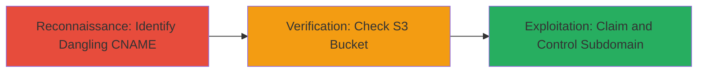

---
tags:
  - subdomain-takeover
  - aws-s3
  - dns
  - cname
type: attack_chain
tools:
  - '[[tools/MXToolbox]]'
tactics:
  - '[[Reconnaissance]]'
  - '[[Initial Access]]'
commands:
  - '[[commands/dig-cname-lookup]]'
  - '[[commands/curl-access-subdomain]]'
platforms:
  - Web
  - AWS
complexity: low
procedures:
  - '[[procedures/Identify-Dangling-CNAME-Records]]'
  - '[[procedures/Verify-S3-Bucket-Absence]]'
  - '[[procedures/Demonstrate-Subdomain-Takeover]]'
step_count: 3
techniques:
  - '[[Hardware]]'
  - '[[Exploit Public-Facing Application]]'
description: >-
  A multi-stage attack chain exploiting a subdomain takeover vulnerability where
  a dangling CNAME record points to a non-existent AWS S3 bucket, allowing an
  attacker to claim control of the subdomain and host malicious content.
skill_level: intermediate
impact_level: high
id: adfabc8a-6d00-4fcf-bace-85268a0a29ff
created_at: '2025-12-14T04:51:10.533Z'
updated_at: '2025-12-14T04:51:10.533Z'
verified: false
validated: true
submitted: true
mitre_tactics:
  - '[[Reconnaissance]]'
  - '[[Initial Access]]'
mitre_techniques:
  - '[[Hardware]]'
  - '[[Exploit Public-Facing Application]]'
---
# Subdomain Takeover via Dangling AWS S3 CNAME

Multi-stage attack chain demonstrating a complete workflow for identifying and exploiting a subdomain takeover vulnerability on a dangling AWS S3 CNAME record, as seen in the Ubiquiti assets.goubiquiti.com case.

## Chain Metrics Dashboard

| Metric | Value |
|--------|-------|
| Chain Status | Unverified |
| Total Steps | 3 |
| Execution Time | ~5 minutes |
| Skill Level | Intermediate |
| Complexity | Low |
| Impact Level | High |

## Attack Flow Visualization



## Prerequisites & Requirements

### Required Tools

- [[tools/MXToolbox]]
- AWS CLI (for PoC takeover)

### Target Environment

- Web platform with DNS records
- AWS S3 services
- No special ports required; standard HTTPS/HTTP

### Initial Access Requirements

- Public DNS resolution access
- AWS account for claiming the bucket (in PoC)
- No prior credentials on target

## Detailed Attack Procedures

### Step 1: Identify Dangling CNAME Records
procedure: [[procedures/Identify-Dangling-CNAME-Records]]

**Objective**: Discover subdomains with CNAME records pointing to cloud services like AWS S3 that may be unclaimed.

**Instructions**: Use [[commands/dig-cname-lookup]] to query DNS for the target subdomain:

```bash
dig CNAME assets.goubiquiti.com
```

This reveals the CNAME to uwn-images.s3-website-us-west-1.amazonaws.com. Cross-verify with [[tools/MXToolbox]] by visiting http://mxtoolbox.com/SuperTool.aspx?action=cname%3aassets.goubiquiti.com&run=toolpage.

**Expected Output**: CNAME record pointing to an S3 endpoint.

**Success Indicators**:
- CNAME resolved to AWS S3 format
- No immediate content served

### Step 2: Verify S3 Bucket Absence
procedure: [[procedures/Verify-S3-Bucket-Absence]]

**Objective**: Confirm the S3 bucket does not exist or is not configured, making it claimable.

**Instructions**: Access the subdomain URL using [[commands/curl-access-subdomain]] to check for errors:

```bash
curl -I https://assets.goubiquiti.com
```

Look for XML error responses like "NoSuchBucket" indicating the bucket is absent.

**Expected Output**: HTTP 404 or S3 error page stating no bucket configuration.

**Success Indicators**:
- Error message confirming unconfigured S3 endpoint
- Subdomain resolves but serves no content

### Step 3: Demonstrate Subdomain Takeover
procedure: [[procedures/Demonstrate-Subdomain-Takeover]]

**Objective**: Prove control by creating the S3 bucket and hosting content, simulating malicious use.

**Instructions**: In a test AWS account, create an S3 bucket named 'uwn-images' in us-west-1 region and enable static website hosting. Upload a simple HTML file (e.g., index.html with proof-of-concept text). The subdomain will now serve this content.

**Expected Output**: Subdomain loads the uploaded HTML, confirming takeover.

**Success Indicators**:
- Custom content appears on assets.goubiquiti.com
- DNS propagation shows controlled endpoint

## Attack Chain Summary

### Key Achievements

1. Identified vulnerable dangling CNAME to non-existent S3 bucket
2. Verified claimability without existing configuration
3. Demonstrated full subdomain control for potential phishing or reputation damage

## Technique & Tactic Coverage

### MITRE ATT&CK Techniques

- [[Hardware]]
- [[Exploit Public-Facing Application]]

### MITRE ATT&CK Tactics

- [[Reconnaissance]]
- [[Initial Access]]

---
*Last updated: 2023-10-01*
