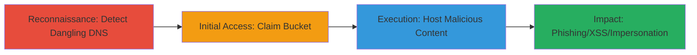

# Subdomain Takeover via Dangling AWS S3 DNS Record

Multi-stage attack chain demonstrating a complete subdomain takeover workflow on AWS S3, starting from detection of a dangling DNS record to hosting malicious content for phishing or XSS attacks.

## Chain Metrics Dashboard

| Metric | Value |
|--------|-------|
| Chain Status | Unverified |
| Total Steps | 3 |
| Execution Time | ~15 minutes |
| Skill Level | Intermediate |
| Complexity | Medium |
| Impact Level | High |

## Attack Flow Visualization



## Prerequisites & Requirements

### Required Tools

- [[commands/curl-check-subdomain]]

### Target Environment

- AWS Cloud platform
- S3 service in eu-west-1 region
- DNS records for target subdomains

### Initial Access Requirements

- Public internet access to query DNS and HTTP endpoints
- No credentials needed for detection; AWS account required for claiming bucket
- Knowledge of target domain (e.g., websummit.net)

## Detailed Attack Procedures

### Step 1: Detect Dangling S3 Bucket
procedure: [[procedures/Detect-Dangling-S3-Bucket-Via-DNS]]

**Objective**: Identify subdomains with DNS records pointing to non-existent or expired AWS S3 buckets, confirming vulnerability to takeover.

**Instructions**: Query the target subdomain using [[commands/curl-check-subdomain]] to access the URL and inspect the response for AWS error indicators.

```bash
curl -I http://s3.websummit.net/
```

Analyze the HTTP response headers and body for S3-specific errors.

**Expected Output**: 404 Not Found with XML body containing "Code: NoSuchBucket" and "Message: The specified bucket does not exist".

**Success Indicators**:
- AWS S3 error page returned instead of custom content
- Bucket name mentioned in error (e.g., s3.websummit.net)
- DNS resolves to an S3 endpoint like s3-website-eu-west-1.amazonaws.com

### Step 2: Claim Takeover of S3 Bucket
procedure: [[procedures/Claim-Takeover-of-S3-Bucket]]

**Objective**: Register the orphaned S3 bucket name under attacker control to gain ownership of the subdomain.

**Instructions**: Use the AWS CLI or console to create a new S3 bucket with the dangling name. First, verify availability via AWS API, then create it.

```bash
aws s3 mb s3://s3.websummit.net --region eu-west-1
```

Configure the bucket for static website hosting to match the original DNS CNAME.

**Expected Output**: Bucket created successfully; DNS propagation may take minutes.

**Success Indicators**:
- Bucket creation succeeds without conflict
- Accessing the subdomain now resolves to attacker's content
- No ownership errors from AWS

### Step 3: Host Malicious Content on Taken-Over Subdomain
procedure: [[procedures/Host-Malicious-Content-on-Taken-Over-Subdomain]]

**Objective**: Upload and serve arbitrary content to enable attacks like XSS, phishing, or clickjacking under the trusted domain.

**Instructions**: Upload HTML files with malicious payloads to the bucket using AWS CLI, enabling public read access.

```bash
aws s3 cp malicious.html s3://s3.websummit.net/ --acl public-read --region eu-west-1
echo '<script>alert("XSS via Takeover")</script>' > malicious.html
```

Set bucket policy for website hosting and verify by accessing the subdomain.

**Expected Output**: Malicious page loads when visiting http://s3.websummit.net/malicious.html.

**Success Indicators**:
- Content accessible via the subdomain URL
- Potential for user interaction leading to XSS or phishing
- Reputation damage if content impersonates the organization

## Attack Chain Summary

### Key Achievements

1. Detected dangling DNS record pointing to expired S3 bucket
2. Successfully claimed ownership of the subdomain via bucket creation
3. Hosted malicious content enabling phishing, XSS, or clickjacking attacks

## Technique & Tactic Coverage

### MITRE ATT&CK Techniques

- [[Hardware]] Gather Victim Host Information: Hardware (detect S3 config)
- [[Exploit Public-Facing Application]] Exploit Public-Facing Application (takeover via public DNS/S3)

### MITRE ATT&CK Tactics

- [[Reconnaissance]] Reconnaissance (subdomain scanning)
- [[Initial Access]] Initial Access (domain hijacking)

---
*Last updated: 2023-10-01T00:00:00Z*
