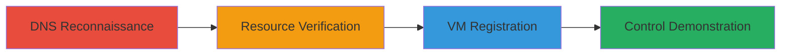

---
tags:
  - subdomain-takeover
  - dns
  - azure
  - cloud-misconfiguration
type: attack_chain
tools:
  - '[[tools/dig]]'
tactics:
  - '[[Reconnaissance]]'
  - '[[Initial Access]]'
verified: false
platforms:
  - Azure
  - Cloud
  - Web
submitted: true
complexity: medium
created_at: '2023-10-01T00:00:00Z'
procedures:
  - '[[procedures/Discover-Subdomain-DNS-Misconfiguration]]'
  - '[[procedures/Verify-Azure-Resource-Availability]]'
  - '[[procedures/Register-Unclaimed-Azure-VM]]'
  - '[[procedures/Demonstrate-Subdomain-Control-with-PoC]]'
step_count: 4
techniques:
  - '[[Active Scanning]]'
  - '[[Exploit Public-Facing Application]]'
updated_at: '2025-12-14T04:38:49.707Z'
description: >-
  A multi-stage attack exploiting a dangling CNAME record in Ford's DNS to claim
  an unclaimed Azure VM and gain control over the subdomain's traffic.
skill_level: intermediate
impact_level: high
id: 607b469b-4613-4c27-9a30-a88e2e683102
validated: true
mitre_tactics:
  - '[[Reconnaissance]]'
  - '[[Initial Access]]'
mitre_techniques:
  - '[[Active Scanning]]'
  - '[[Exploit Public-Facing Application]]'
---
# Subdomain Takeover via Dangling Azure CNAME Leading to Full Traffic Control

Multi-stage attack chain demonstrating a subdomain takeover on usclsapipma.cv.ford.com by exploiting a dangling CNAME to an unclaimed Azure VM, allowing full control over HTTP/HTTPS traffic, email, and OS access for potential malware distribution, phishing, and more.

## Chain Metrics Dashboard

| Metric | Value |
|--------|-------|
| Chain Status | Unverified |
| Total Steps | 4 |
| Execution Time | ~15 minutes |
| Skill Level | Intermediate |
| Complexity | Medium |
| Impact Level | High |

## Attack Flow Visualization



## Prerequisites & Requirements

### Required Tools

- [[tools/dig]]

### Target Environment

- Cloud platform: Azure
- Services: DNS, Azure Traffic Manager, Azure Cloud App Virtual Machine
- Tech stack: DNS resolution, Azure portal API

### Initial Access Requirements

- No prior credentials needed for reconnaissance
- Azure account for claiming resources (free tier sufficient)
- Network access to public DNS and Azure APIs

## Detailed Attack Procedures

### Step 1: Discover Subdomain DNS Misconfiguration
procedure: [[procedures/Discover-Subdomain-DNS-Misconfiguration]]

**Objective**: Identify the dangling CNAME record pointing to an unclaimed Azure resource.

**Instructions**: Use [[commands/dig-dns-lookup]] to query the subdomain's DNS records and confirm the CNAME chain to the Azure endpoint.

```bash
dig usclsapipma.cv.ford.com
```

Verify the resolution chains to feuscspma3fcvapi.eastus.cloudapp.azure.com and check for NXDOMAIN or unclaimed status.

**Expected Output**: CNAME record showing usclsapipma.cv.ford.com -> usclsapipma.trafficmanager.net -> feuscspma3fcvapi.eastus.cloudapp.azure.com, with potential NXDOMAIN for the final endpoint.

**Success Indicators**:
- CNAME chain identified
- Dangling record confirmed via NXDOMAIN response

### Step 2: Verify Azure Resource Availability
procedure: [[procedures/Verify-Azure-Resource-Availability]]

**Objective**: Confirm the Azure VM is unclaimed and available for registration.

**Instructions**: Access the Azure portal API to check the status of feuscspma3fcvapi.eastus.cloudapp.azure.com in the eastus region. Use Azure CLI or portal to query resource availability.

```bash
az vm list --resource-group <group> --query "[?name=='feuscspma3fcvapi']" --output table
```

(Adapt for Cloud App VM; direct API call via portal shows 'available: true'.)

**Expected Output**: API response indicating the resource is available and unclaimed.

**Success Indicators**:
- Availability confirmed as 'true'
- No existing ownership detected

### Step 3: Register Unclaimed Azure VM
procedure: [[procedures/Register-Unclaimed-Azure-VM]]

**Objective**: Claim the unclaimed VM to gain control over the subdomain's traffic routing.

**Instructions**: Log into the Azure portal with an account, navigate to the Cloud App Virtual Machines section, and register feuscspma3fcvapi.eastus.cloudapp.azure.com. Configure the VM OS and networking to intercept traffic.

No specific CLI command; use Azure portal UI for registration and VM setup.

**Expected Output**: Successful registration message; VM dashboard shows control over the resource.

**Success Indicators**:
- VM claimed and accessible in Azure dashboard
- Subdomain traffic now routes to controlled VM

### Step 4: Demonstrate Subdomain Control with PoC
procedure: [[procedures/Demonstrate-Subdomain-Control-with-PoC]]

**Objective**: Prove ownership by hosting a file or altering traffic on the subdomain.

**Instructions**: Once the VM is controlled, upload a PoC file to the web server on the VM and access it via the subdomain URL.

```bash
# On the VM, create and serve file
echo "PoC Content" > /var/www/html/BHJAed55oazeDAZ02dDZ.txt
# Restart web server if needed
systemctl restart apache2
```

Access http://usclsapipma.cv.ford.com/BHJAed55oazeDAZ02dDZ.txt to verify.

**Expected Output**: PoC file accessible via the Ford subdomain, confirming control.

**Success Indicators**:
- File loads from subdomain
- Traffic interception verified (e.g., via logs)

## Attack Chain Summary

### Key Achievements

1. Identified and exploited dangling DNS record
2. Claimed unclaimed Azure resource without authentication
3. Gained full OS and traffic control over corporate subdomain
4. Demonstrated potential for phishing, malware, and auth bypass

## Technique & Tactic Coverage

### MITRE ATT&CK Techniques

- [[Active Scanning]] Active Scanning
- [[Exploit Public-Facing Application]] Exploit Public-Facing Application

### MITRE ATT&CK Tactics

- [[Reconnaissance]] Reconnaissance
- [[Initial Access]] Initial Access

---
*Last updated: 2023-10-01T00:00:00Z*
