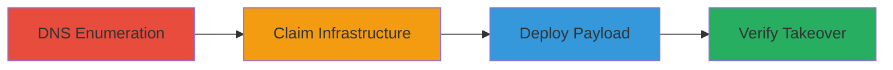

# Subdomain Takeover via Dangling Azure CNAME Record

Multi-stage attack chain demonstrating a subdomain takeover by exploiting a dangling CNAME record pointing to an unclaimed Azure Cloud Service, allowing an attacker to host malicious content on a trusted domain like starbucks.com.

## Chain Metrics Dashboard

| Metric | Value |
|--------|-------|
| Chain Status | Unverified |
| Total Steps | 4 |
| Execution Time | ~30 minutes |
| Skill Level | Intermediate |
| Complexity | Medium |
| Impact Level | High |

## Attack Flow Visualization



## Prerequisites & Requirements

### Required Tools

- [[tools/dig]]
- [[tools/Azure-Portal]]

### Target Environment

- Azure Cloud platform
- DNS resolution access
- Azure account with permissions to create Cloud Services

### Initial Access Requirements

- Public DNS access
- No credentials needed for enumeration
- Azure subscription for claiming service

## Detailed Attack Procedures

### Step 1: DNS Enumeration
procedure: [[procedures/DNS-Enumeration-to-Identify-Dangling-CNAME]]

**Objective**: Identify vulnerable subdomains with dangling CNAME records pointing to claimable cloud services.

**Instructions**: Use [[commands/dig-dns-lookup]] to query the target subdomain for resolution status and CNAME details:

```bash
dig d02-1-ag.productioncontroller.starbucks.com
```

**Expected Output**: NXDOMAIN response with CNAME record pointing to an unclaimed service like 3edbac0a-5c43-428a-b451-a5eb268f888b.cloudapp.net.

**Success Indicators**:
- NXDOMAIN status confirmed
- CNAME to .cloudapp.net identified as dangling

### Step 2: Claim Infrastructure
procedure: [[procedures/Claim-Azure-Cloud-Service-with-Dangling-Name]]

**Objective**: Register a new Azure Cloud Service using the dangling service name to gain control of the resolution.

**Instructions**: Log in to the [[tools/Azure-Portal]] at https://portal.azure.com, navigate to Cloud Services (classic), and create a new service with the exact name from the CNAME (e.g., 3edbac0a-5c43-428a-b451-a5eb268f888b). Follow Azure's creation wizard to deploy an empty package initially.

**Expected Output**: Successful creation of the Cloud Service, with DNS propagation taking a few minutes.

**Success Indicators**:
- Service created without errors
- DNS query now resolves to the new service

### Step 3: Deploy Payload
procedure: [[procedures/Deploy-Malicious-Website-to-Claimed-Service]]

**Objective**: Upload and deploy a proof-of-concept or malicious webpage to the claimed service.

**Instructions**: In the [[tools/Azure-Portal]], select the created Cloud Service, go to the Dashboard, and use the Upload wizard to deploy a package containing an HTML file with malicious content (e.g., a phishing page for cookie theft). Reference Microsoft's deployment guide for packaging (.cspkg) and configuration (.cscfg) files.

**Expected Output**: Deployment successful, service status shows running.

**Success Indicators**:
- Package uploaded and deployed
- No deployment errors in portal logs

### Step 4: Verify Takeover
procedure: [[procedures/Verify-Subdomain-Takeover-by-Accessing-Site]]

**Objective**: Confirm control by accessing the subdomain and viewing the hosted content.

**Instructions**: Open a web browser and navigate to http://d02-1-ag.productioncontroller.starbucks.com/. The page should load the uploaded POC site instead of NXDOMAIN.

**Expected Output**: The malicious or POC webpage displays on the Starbucks subdomain.

**Success Indicators**:
- Subdomain resolves to attacker-controlled content
- Potential for phishing or exfiltration confirmed

## Attack Chain Summary

### Key Achievements

1. Identified and exploited a dangling CNAME for subdomain takeover
2. Claimed Azure infrastructure to hijack trusted domain resolution
3. Deployed malicious content enabling phishing, cookie theft, and data exfiltration
4. Verified full control of the subdomain

## Technique & Tactic Coverage

### MITRE ATT&CK Techniques

- [[Vulnerability Scanning]] Vulnerability Scanning (DNS enumeration)
- [[Exploit Public-Facing Application]] Exploit Public-Facing Application (subdomain hijack)
- [[Virtual Private Server]] Acquire Infrastructure: Virtual Private Server (claiming cloud service)

### MITRE ATT&CK Tactics

- [[Reconnaissance]] Reconnaissance
- [[Initial Access]] Initial Access

---
*Last updated: 2023-10-01T00:00:00Z*
