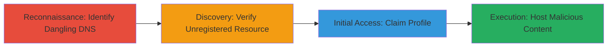

# Subdomain Takeover via Dangling Azure Traffic Manager CNAME

Multi-stage attack chain demonstrating a subdomain takeover on wfmnarptpc.starbucks.com by exploiting a dangling CNAME record to an unregistered Azure Traffic Manager profile, enabling full control for hosting malicious content such as phishing pages or malware.

## Chain Metrics Dashboard

| Metric | Value |
|--------|-------|
| Chain Status | Unverified |
| Total Steps | 4 |
| Execution Time | ~30 minutes |
| Skill Level | Intermediate |
| Complexity | Medium |
| Impact Level | High |

## Attack Flow Visualization



## Prerequisites & Requirements

### Required Tools

- DNS lookup tools (e.g., dig or nslookup)
- Web browser for Azure portal access

### Target Environment

- Target: Public DNS records for subdomains
- Required services/ports: DNS (port 53), Azure portal (HTTPS)
- Network access requirements: Internet access for DNS queries and Azure registration

### Initial Access Requirements

- No prior credentials needed for discovery
- Azure account required for claiming the profile
- Public network position

## Detailed Attack Procedures

### Step 1: Identify Vulnerable Subdomain
procedure: [[procedures/Identify-Vulnerable-Subdomain-via-DNS-Enumeration]]

**Objective**: Discover subdomains with dangling CNAME records pointing to unclaimed cloud resources.

**Instructions**: Enumerate subdomains and query their DNS records to identify CNAMEs targeting Azure Traffic Manager endpoints.

Use [[commands/dig-dns-lookup]] to check the CNAME for the target subdomain:

```bash
dig wfmnarptpc.starbucks.com CNAME
```

**Expected Output**: CNAME record showing wfmnarptpc.starbucks.com points to s00149tmppcrpt.trafficmanager.net.

**Success Indicators**:
- CNAME identified pointing to a cloud service endpoint
- Endpoint appears potentially unclaimed

### Step 2: Verify Unregistered Profile
procedure: [[procedures/Verify-Unregistered-Azure-Traffic-Manager-Profile]]

**Objective**: Confirm the Azure Traffic Manager profile is available for registration.

**Instructions**: Access the Azure portal or use Azure CLI to check the status of the Traffic Manager profile.

Navigate to the Azure portal and search for the profile name s00149tmppcrpt.trafficmanager.net to verify it's unregistered.

**Expected Output**: No existing profile found, indicating availability.

**Success Indicators**:
- Profile not registered in Azure
- Confirmation of dangling resource

### Step 3: Claim the Profile
procedure: [[procedures/Claim-Azure-Traffic-Manager-Profile-for-Takeover]]

**Objective**: Register the unclaimed Traffic Manager profile to gain control over the subdomain.

**Instructions**: Use an Azure account to create the Traffic Manager profile, which redirects the subdomain traffic.

In the Azure portal, create a new Traffic Manager profile with the name s00149tmppcrpt and configure endpoints to point to attacker-controlled resources.

**Expected Output**: Profile successfully created and associated with the subdomain.

**Success Indicators**:
- Azure confirms profile ownership
- DNS propagation begins routing to controlled profile

### Step 4: Demonstrate Control
procedure: [[procedures/Demonstrate-Control-with-Proof-of-Concept-Hosting]]

**Objective**: Host custom content on the subdomain to prove takeover.

**Instructions**: Configure the Traffic Manager to route to a PoC server and upload an HTML page.

Set up a simple web server (e.g., using Python) and configure Azure to forward traffic, then access http://wfmnarptpc.starbucks.com/poc.html.

**Expected Output**: Custom PoC page loads on the subdomain.

**Success Indicators**:
- Arbitrary content served from subdomain
- Potential for phishing or XSS confirmed

## Attack Chain Summary

### Key Achievements

1. Identified and verified a dangling Azure CNAME for subdomain takeover
2. Claimed control over the Traffic Manager profile without authentication to the target
3. Demonstrated full subdomain control for malicious use cases like phishing and SSL certificate issuance

## Technique & Tactic Coverage

### MITRE ATT&CK Techniques

- [[T1583.001]] Domains
- [[Exploit Public-Facing Application]] Exploit Public-Facing Application

### MITRE ATT&CK Tactics

- [[Reconnaissance]] Reconnaissance
- [[Initial Access]] Initial Access

---
*Last updated: 2023-10-01T12:00:00Z*
