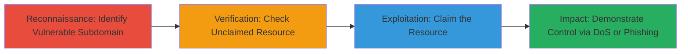

# Subdomain Takeover via Dangling CNAME Record on Firefox.com

Multi-stage attack chain demonstrating a complete subdomain takeover workflow on a trusted domain like firefox.com, exploiting a dangling CNAME to an unclaimed third-party resource.

## Chain Metrics Dashboard

| Metric | Value |
|--------|-------|
| Chain Status | Unverified |
| Total Steps | 4 |
| Execution Time | ~15 minutes |
| Skill Level | Intermediate |
| Complexity | Medium |
| Impact Level | High |

## Attack Flow Visualization



## Prerequisites & Requirements

### Required Tools

- None specialized; standard DNS tools like [[commands/dig-dns-lookup]]

### Target Environment

- DNS infrastructure with subdomains
- Third-party hosting service (e.g., redacted as ███████)
- No special ports; requires public DNS resolution

### Initial Access Requirements

- Public internet access
- No credentials needed initially
- Ability to register on third-party hosting service

## Detailed Attack Procedures

### Step 1: Identify Vulnerable Subdomain
procedure: [[procedures/Identify-Vulnerable-Subdomain-via-DNS-Enumeration]]

**Objective**: Discover subdomains with dangling CNAME records pointing to third-party services.

**Instructions**: Enumerate subdomains of the target domain and inspect DNS records for misconfigurations. Use [[commands/dig-dns-lookup]] to query CNAME records:

```bash
dig +short CNAME subdomain.firefox.com
```

Follow up by resolving the target to check if it's a known third-party service:

```bash
dig +short www.mozilla.org
```

**Expected Output**: CNAME record showing a pointer to an unmonitored third-party resource (e.g., ███████).

**Success Indicators**:
- CNAME points to third-party hosting
- No active ownership indicated in DNS

### Step 2: Verify Unclaimed Resource
procedure: [[procedures/Verify-Unclaimed-CNAME-Target]]

**Objective**: Confirm the CNAME target is unclaimed and exploitable.

**Instructions**: Access the third-party service dashboard or API to check resource status. Manually visit the potential URL or use [[commands/curl-http-check]] to probe:

```bash
curl -I http://target-resource.███████
```

If it returns a claimable or 404-like response, it's unclaimed.

**Expected Output**: Response indicating the resource is available for registration.

**Success Indicators**:
- No active site or ownership
- Service prompts for claiming the domain

### Step 3: Claim the Subdomain
procedure: [[procedures/Claim-Unclaimed-Hosting-Resource]]

**Objective**: Register the unclaimed resource to gain control over the subdomain.

**Instructions**: Log into the third-party service and claim the resource. No specific command; perform via web interface: Navigate to ███████ dashboard, search for the dangling resource, and register it under your account.

**Expected Output**: Confirmation of ownership; DNS propagation may take minutes.

**Success Indicators**:
- Subdomain resolves to your hosted content
- Control panel shows active resource

### Step 4: Demonstrate Proof-of-Concept
procedure: [[procedures/Demonstrate-Subdomain-Takeover-Impact]]

**Objective**: Showcase impact like DoS via large cookies or phishing setup.

**Instructions**: Upload content to the claimed subdomain, e.g., an HTML page setting large cookies. Host http://████/large-cookies.html with JavaScript to set 100KB cookies. Test by visiting via a tracking pixel or direct link, which interferes with www.firefox.com access.

```bash
# No command; use service's file upload to host:
# <script>document.cookie = 'large=...'; </script>
```

Verify by curling the page:

```bash
curl http://████/large-cookies.html
```

**Expected Output**: Cookies set, causing browser issues on legitimate sites; no SSL due to CAA records.

**Success Indicators**:
- Cookies block access to firefox.com
- Potential for phishing/malware hosting confirmed

## Attack Chain Summary

### Key Achievements

1. Identified and verified a dangling CNAME on firefox.com
2. Claimed control over the subdomain via third-party service
3. Demonstrated high-impact DoS and phishing potential

## Technique & Tactic Coverage

### MITRE ATT&CK Techniques

- [[Hardware]] Gather Victim Host Information: DNS
- [[Exploit Public-Facing Application]] Exploit Public-Facing Application

### MITRE ATT&CK Tactics

- [[Reconnaissance]] Reconnaissance
- [[Initial Access]] Initial Access

---
*Last updated: 2023-10-01T00:00:00Z*
