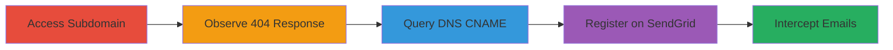

---
tags:
  - subdomain-takeover
  - dns
  - cname
  - sendgrid
  - email-interception
type: attack_chain
tools:
  - '[[tools/dig-DNS-Lookup]]'
tactics:
  - '[[Reconnaissance]]'
  - '[[Initial Access]]'
verified: false
platforms:
  - Web
  - DNS
submitted: true
complexity: medium
created_at: '2023-10-01T00:00:00Z'
procedures:
  - '[[procedures/Access-and-Observe-Subdomain-Response]]'
  - '[[procedures/Query-DNS-for-CNAME-Record]]'
  - '[[procedures/Register-Subdomain-on-Third-Party-Service]]'
  - '[[procedures/Intercept-or-Manipulate-Emails]]'
step_count: 4
techniques:
  - '[[Gather Victim Host Information]]'
  - '[[Exploit Public-Facing Application]]'
updated_at: '2025-12-14T04:38:39.388Z'
description: >-
  A multi-stage attack chain demonstrating the detection and exploitation of a
  dangling CNAME record leading to subdomain takeover on SendGrid, enabling
  potential email interception or phishing.
skill_level: intermediate
impact_level: medium
id: c50dee46-c045-41c2-aeb3-14b9307e1060
validated: true
mitre_tactics:
  - '[[Reconnaissance]]'
  - '[[Initial Access]]'
mitre_techniques:
  - '[[Gather Victim Host Information]]'
  - '[[Exploit Public-Facing Application]]'
---
# Subdomain Takeover via Dangling CNAME Record to SendGrid for Email Interception

Multi-stage attack chain demonstrating a complete attack workflow for detecting and exploiting a dangling CNAME record to takeover a subdomain and potentially intercept emails.

## Chain Metrics Dashboard

| Metric | Value |
|--------|-------|
| Chain Status | Unverified |
| Total Steps | 4 |
| Execution Time | ~5 minutes |
| Skill Level | Intermediate |
| Complexity | Medium |
| Impact Level | Medium |

## Attack Flow Visualization



## Prerequisites & Requirements

### Required Tools

- [[tools/dig-DNS-Lookup]]

### Target Environment

- Web browser for initial access
- DNS resolution enabled network
- Access to SendGrid account for takeover (attacker-controlled)

### Initial Access Requirements

- Public internet access to query DNS and access subdomains
- No prior credentials needed for detection phase

## Detailed Attack Procedures

### Step 1: Access and Observe Subdomain Response
procedure: [[procedures/Access-and-Observe-Subdomain-Response]]

**Objective**: Verify if the target subdomain is active or returns an error indicating potential misconfiguration.

**Instructions**: Open a web browser and navigate to the target subdomain, such as http://email.smule.com.

**Expected Output**: A 404 Not Found error page, suggesting the subdomain is not hosted but may have lingering DNS records.

**Success Indicators**:
- 404 error observed
- No active content loaded

### Step 2: Query DNS for CNAME Record
procedure: [[procedures/Query-DNS-for-CNAME-Record]]

**Objective**: Inspect DNS records to identify any dangling CNAME pointing to unused third-party services.

**Instructions**: Use the [[commands/dig-query-cname-record]] command to query the CNAME for the subdomain:

```bash
dig email.smule.com CNAME
```

**Expected Output**: Response showing CNAME record pointing to sendgrid.net, confirming the dangling reference.

**Success Indicators**:
- CNAME record to SendGrid confirmed
- No A/AAAA records resolving to active hosts

### Step 3: Register Subdomain on Third-Party Service
procedure: [[procedures/Register-Subdomain-on-Third-Party-Service]]

**Objective**: Claim ownership of the dangling subdomain on the third-party service to achieve takeover.

**Instructions**: Create a free SendGrid account if needed, then add the subdomain email.smule.com as a custom domain in SendGrid's dashboard, verifying via DNS (which will match the existing CNAME).

**Expected Output**: Successful domain verification in SendGrid, granting control over the subdomain.

**Success Indicators**:
- Domain added and verified in SendGrid
- Ability to configure email handling for the subdomain

### Step 4: Intercept or Manipulate Emails
procedure: [[procedures/Intercept-or-Manipulate-Emails]]

**Objective**: Use the taken-over subdomain to capture inbound emails or launch phishing campaigns.

**Instructions**: Configure SendGrid inbound parse or webhooks to route emails sent to the subdomain to an attacker-controlled endpoint, or set up forwarding to monitor traffic.

**Expected Output**: Inbound emails to @email.smule.com now processed by attacker's SendGrid setup, potentially exposing sensitive data.

**Success Indicators**:
- Test email sent and received/intercepted
- Potential for phishing or data exfiltration

## Attack Chain Summary

### Key Achievements

1. Detection of unused subdomain via 404 and DNS query
2. Confirmation of dangling CNAME to SendGrid
3. Successful subdomain registration and takeover
4. Enablement of email interception for further attacks

## Technique & Tactic Coverage

### MITRE ATT&CK Techniques

- [[Gather Victim Host Information]] Gather Victim Host Information
- [[Exploit Public-Facing Application]] Exploit Public-Facing Application

### MITRE ATT&CK Tactics

- [[Reconnaissance]] Reconnaissance
- [[Initial Access]] Initial Access

---
*Last updated: 2023-10-01T00:00:00Z*
