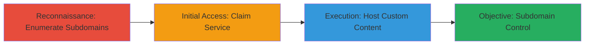

---
tags:
  - subdomain-takeover
  - dns
  - cname
  - dangling-records
type: attack_chain
tools: []
tactics:
  - '[[Reconnaissance]]'
  - '[[Initial Access]]'
commands: []
verified: false
platforms:
  - Web
  - DNS
submitted: true
complexity: medium
created_at: '2023-10-01T00:00:00Z'
procedures:
  - '[[procedures/Enumerate-Subdomains-for-Dangling-CNAMEs]]'
  - '[[procedures/Claim-Unclaimed-Service-via-Subdomain-Takeover]]'
  - '[[procedures/Demonstrate-Control-by-Hosting-Custom-Content]]'
step_count: 3
techniques:
  - '[[Hardware]]'
  - '[[Exploit Public-Facing Application]]'
updated_at: '2025-12-14T04:51:10.538Z'
description: >-
  Attack chain exploiting dangling DNS CNAME records to takeover subdomains and
  host arbitrary content, demonstrated on Uber's translate.uber.com,
  de.uber.com, and fr.uber.com.
skill_level: intermediate
impact_level: high
id: bbd963f9-d553-4bc1-ad3d-5589f5523442
validated: true
mitre_tactics:
  - '[[Reconnaissance]]'
  - '[[Initial Access]]'
mitre_techniques:
  - '[[Hardware]]'
  - '[[Exploit Public-Facing Application]]'
---
# Subdomain Takeover via Dangling CNAME Records

Multi-stage attack chain demonstrating a complete subdomain takeover workflow by exploiting dangling CNAME records pointing to unclaimed external services. This allows an attacker to gain control over legitimate subdomains like translate.uber.com, de.uber.com, and fr.uber.com, enabling defacement, phishing, or other malicious activities.

## Chain Metrics Dashboard

| Metric | Value |
|--------|-------|
| Chain Status | Unverified |
| Total Steps | 3 |
| Execution Time | ~30 minutes |
| Skill Level | Intermediate |
| Complexity | Medium |
| Impact Level | High |

## Attack Flow Visualization



## Prerequisites & Requirements

### Required Tools

- DNS enumeration tools (e.g., dig, nslookup)
- Web browser or service-specific registration tools

### Target Environment

- DNS infrastructure with public subdomains
- External services like Heroku, GitHub Pages, or AWS S3 that support custom domains
- No special ports required; standard DNS (port 53) and HTTP/HTTPS (ports 80/443)

### Initial Access Requirements

- Public access to target's DNS records
- Ability to register accounts on third-party services
- No prior credentials needed for the target

## Detailed Attack Procedures

### Step 1: Enumerate Subdomains for Dangling CNAMEs
procedure: [[procedures/Enumerate-Subdomains-for-Dangling-CNAMEs]]

**Objective**: Identify subdomains with CNAME records pointing to unclaimed or inactive external services.

**Instructions**: Start by enumerating subdomains using passive reconnaissance tools or manual queries. Then, resolve each subdomain's DNS records to check for CNAMEs. Use the following generic DNS query to inspect records:

```bash
dig translate.uber.com CNAME
```

Follow up by verifying if the target service (e.g., a Heroku app) is active by attempting to access it or checking service dashboards.

**Expected Output**: DNS response showing CNAME to an unclaimed host, e.g., "translate.uber.com is an alias for unclaimed-app.herokuapp.com."

**Success Indicators**:
- CNAME record points to a deleted or unclaimed service
- HTTP access to the CNAME target returns 404 or service not found

### Step 2: Claim Unclaimed Service via Subdomain Takeover
procedure: [[procedures/Claim-Unclaimed-Service-via-Subdomain-Takeover]]

**Objective**: Register and claim ownership of the dangling external service linked to the target's CNAME.

**Instructions**: Navigate to the third-party service provider (e.g., Heroku dashboard) and create a new account if needed. Register a new application or site that matches the dangling hostname. Update the service's DNS settings to point to your claimed resource. Verify by querying DNS again:

```bash
dig de.uber.com
```

**Expected Output**: DNS now resolves to your claimed service, confirming takeover.

**Success Indicators**:
- Successful registration of the dangling hostname
- Subdomain resolves to your controlled resource

### Step 3: Demonstrate Control by Hosting Custom Content
procedure: [[procedures/Demonstrate-Control-by-Hosting-Custom-Content]]

**Objective**: Upload and serve arbitrary content on the taken-over subdomain to prove control and potential for abuse.

**Instructions**: Once claimed, upload custom files (e.g., an HTML page with your blog) to the service. For example, on a platform like GitHub Pages, push content to the repository linked to the custom domain. Access the subdomain via browser to verify:

```bash
curl -I https://translate.uber.com
```

**Expected Output**: HTTP response serving your custom content, e.g., 200 OK with blog HTML.

**Success Indicators**:
- Custom content loads on the subdomain
- No redirection or errors from the target's DNS

## Attack Chain Summary

### Key Achievements

1. Discovered dangling CNAMEs on multiple Uber subdomains
2. Successfully claimed and controlled the subdomains
3. Hosted proof-of-concept content demonstrating full takeover

## Technique & Tactic Coverage

### MITRE ATT&CK Techniques

- [[Hardware]] Gather Victim Host Information: DNS
- [[Exploit Public-Facing Application]] Exploit Public-Facing Application

### MITRE ATT&CK Tactics

- [[Reconnaissance]] Reconnaissance
- [[Initial Access]] Initial Access

---
*Last updated: 2023-10-01T00:00:00Z*
