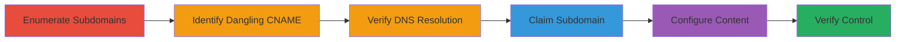

---
tags:
  - subdomain-takeover
  - dns
  - cname
  - feedpress
  - misconfiguration
type: attack_chain
tools:
  - '[[tools/dig]]'
  - '[[tools/curl]]'
  - '[[tools/Feed-Press]]'
tactics:
  - '[[Reconnaissance]]'
  - '[[Initial Access]]'
verified: false
platforms:
  - Web
  - DNS
submitted: true
complexity: medium
created_at: '2024-10-01T00:00:00Z'
procedures:
  - '[[procedures/Enumerate-Target-Subdomains]]'
  - '[[procedures/Identify-Dangling-CNAME-Records]]'
  - '[[procedures/Verify-DNS-Resolution]]'
  - '[[procedures/Claim-Subdomain-on-Feed-Press]]'
  - '[[procedures/Configure-Custom-Content-on-Takeover]]'
  - '[[procedures/Verify-Subdomain-Takeover-Control]]'
step_count: 6
techniques:
  - '[[Gather Victim Host Information]]'
  - '[[Exploit Public-Facing Application]]'
updated_at: '2025-12-14T04:51:10.746Z'
description: >-
  A multi-stage attack exploiting a dangling CNAME record on a third-party
  service to take over a subdomain and serve arbitrary content.
skill_level: intermediate
impact_level: high
id: 4dfbed7d-4645-451c-bcb5-f4aa808836a5
validated: true
mitre_tactics:
  - '[[Reconnaissance]]'
  - '[[Initial Access]]'
mitre_techniques:
  - '[[Gather Victim Host Information]]'
  - '[[Exploit Public-Facing Application]]'
---
# Subdomain Takeover via Dangling CNAME on Feed.Press

Multi-stage attack chain demonstrating a subdomain takeover by exploiting a dangling DNS CNAME record pointing to an unclaimed third-party service (Feed.Press), allowing full control over the subdomain to serve custom content like redirects.

## Chain Metrics Dashboard

| Metric | Value |
|--------|-------|
| Chain Status | Unverified |
| Total Steps | 6 |
| Execution Time | ~15 minutes |
| Skill Level | Intermediate |
| Complexity | Medium |
| Impact Level | High |

## Attack Flow Visualization



## Prerequisites & Requirements

### Required Tools

- [[tools/dig]]
- [[tools/curl]]
- [[tools/Feed-Press]]

### Target Environment

- DNS infrastructure with potential dangling records
- Third-party services like Feed.Press for podcast/RSS hosting
- Ports: 53 (DNS), 80 (HTTP)
- Network access to resolve DNS and access web services

### Initial Access Requirements

- No credentials needed initially; public DNS queries
- Ability to register accounts on third-party services
- No prior access to target domain required

## Detailed Attack Procedures

### Step 1: Enumerate Target Subdomains
procedure: [[procedures/Enumerate-Target-Subdomains]]

**Objective**: Identify subdomains of the target infrastructure to uncover potential attack surfaces.

**Instructions**: Manually investigate known domains like slack-core.com associated with Slack's call and podcast infrastructure, using reconnaissance techniques to list subdomains.

**Expected Output**: List of subdomains, including podcasts.slack-core.com.

**Success Indicators**:
- Subdomains discovered
- Infrastructure context noted (e.g., podcast services)

### Step 2: Identify Dangling CNAME Records
procedure: [[procedures/Identify-Dangling-CNAME-Records]]

**Objective**: Detect subdomains with CNAME records pointing to third-party services without active accounts.

**Instructions**: Review subdomain DNS records for CNAMEs to services like redirect.feedpress.me and check if they are unclaimed by querying the service.

**Expected Output**: Identification of podcasts.slack-core.com as dangling.

**Success Indicators**:
- CNAME to unclaimed service found
- No active account on Feed.Press

### Step 3: Verify DNS Resolution
procedure: [[procedures/Verify-DNS-Resolution]]

**Objective**: Confirm the DNS configuration of the vulnerable subdomain.

**Instructions**: Use [[commands/dig-dns-lookup]] to query the subdomain:

```bash
dig podcasts.slack-core.com
```

**Expected Output**: CNAME to redirect.feedpress.me and A record to 5.135.16.40.

**Success Indicators**:
- DNS query resolves to third-party IP
- Dangling status confirmed

### Step 4: Claim Subdomain on Third-Party Service
procedure: [[procedures/Claim-Subdomain-on-Feed-Press]]

**Objective**: Register and claim control of the subdomain on the third-party platform.

**Instructions**: Create a new account on Feed.Press and configure podcasts.slack-core.com as a custom domain, waiting for DNS propagation.

**Expected Output**: Successful domain verification and control handover.

**Success Indicators**:
- Domain claimed without errors
- Propagation complete (verifiable via DNS tools)

### Step 5: Configure Custom Content on Takeover
procedure: [[procedures/Configure-Custom-Content-on-Takeover]]

**Objective**: Set up arbitrary content, such as redirects, on the controlled subdomain.

**Instructions**: In the Feed.Press dashboard, configure a redirect from the root path (/) to a proof-of-concept URL like https://hackerone.com.

**Expected Output**: Custom redirect rule active.

**Success Indicators**:
- Configuration saved
- No validation errors from service

### Step 6: Verify Subdomain Takeover Control
procedure: [[procedures/Verify-Subdomain-Takeover-Control]]

**Objective**: Demonstrate full control by testing the custom configuration.

**Instructions**: Use [[commands/curl-verbose-http-request]] to access the subdomain:

```bash
curl -vv http://podcasts.slack-core.com
```

**Expected Output**: 301 redirect to https://hackerone.com with Location header, served by nginx on 5.135.16.40.

**Success Indicators**:
- Custom redirect executes
- Arbitrary content served

## Attack Chain Summary

### Key Achievements

1. Discovered and exploited a dangling CNAME for subdomain takeover
2. Gained control over podcasts.slack-core.com to serve custom redirects
3. Demonstrated potential for phishing or reputation damage via arbitrary content

## Technique & Tactic Coverage

### MITRE ATT&CK Techniques

- [[Gather Victim Host Information]] Gather Victim Host Information
- [[Exploit Public-Facing Application]] Exploit Public-Facing Application

### MITRE ATT&CK Tactics

- [[Reconnaissance]] Reconnaissance
- [[Initial Access]] Initial Access

---

*Last updated: 2024-10-01T00:00:00Z*
