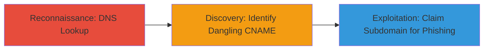

# Subdomain Takeover via Dangling CNAME on Odoo Staging Service

Multi-stage attack chain demonstrating a complete attack workflow.

## Chain Metrics Dashboard

| Metric | Value |
|--------|-------|
| Chain Status | Unverified |
| Total Steps | 1 |
| Execution Time | ~1 minute |
| Skill Level | Beginner |
| Complexity | Low |
| Impact Level | High |

## Attack Flow Visualization



## Prerequisites & Requirements

### Required Tools

- None (uses built-in system commands)

### Target Environment

- Target OS/Platform: Any system with DNS resolution capabilities
- Required services/ports: DNS (port 53)
- Network access requirements: Internet access for public DNS queries

### Initial Access Requirements

- Credential requirements: None
- Network position: External attacker position
- Prior access needed: None

## Detailed Attack Procedures

### Step 1: Reconnaissance and Discovery
procedure: [[procedures/Detect-Subdomain-Takeover-with-DNS-Lookup]]

**Objective**: Perform a DNS lookup on the target subdomain to identify if it has a dangling CNAME record pointing to an unused service, revealing potential for subdomain takeover.

**Instructions**: Execute a DNS lookup using the [[commands/host-dns-lookup-for-subdomain]] command to query the records for the subdomain:

```bash
host odoo-staging.exness.io
```

This command resolves the hostname and displays CNAME aliases, IP addresses, and MX records. Analyze the output for aliases pointing to third-party services like Odoo that may no longer be active.

**Expected Output**: 
odoo-staging.exness.io is an alias for exness-stg.odoo.com. exness-stg.odoo.com has address 141.95.172.222 exness-stg.odoo.com mail is handled by 10 eu123a.odoo.com.

**Success Indicators**:
- CNAME alias detected pointing to a third-party service (e.g., exness-stg.odoo.com)
- IP address returned but service appears unused or claimable
- Potential for takeover confirmed by checking if the aliased service is active

## Attack Chain Summary

### Key Achievements

1. Identified dangling CNAME record via simple DNS query
2. Uncovered subdomain takeover vulnerability on odoo-staging.exness.io
3. Highlighted risks of phishing and impersonation attacks

## Technique & Tactic Coverage

### MITRE ATT&CK Techniques

- [[Hardware]]

### MITRE ATT&CK Tactics

- [[Reconnaissance]]

---
*Last updated: 2024-10-01T00:00:00Z*
