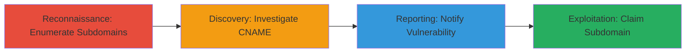

# Subdomain Takeover via Dangling CNAME on Roblox Discourse Instance

Multi-stage attack chain demonstrating the discovery and potential exploitation of a subdomain takeover vulnerability on creatorforum.roblox.com, where a dangling CNAME record points to an unclaimed Discourse instance, enabling attackers to host malicious content under the trusted .roblox.com domain.

## Chain Metrics Dashboard

| Metric | Value |
|--------|-------|
| Chain Status | Unverified |
| Total Steps | 4 |
| Execution Time | ~15 minutes |
| Skill Level | Intermediate |
| Complexity | Medium |
| Impact Level | High |

## Attack Flow Visualization

## Prerequisites & Requirements

### Required Tools

- Web browser for manual investigation
- DNS lookup tools (e.g., dig or nslookup)

### Target Environment

- Target: Roblox domains (.roblox.com)
- Required services/ports: DNS (port 53), HTTP/HTTPS (ports 80/443)
- Network access requirements: Internet access to query public DNS and visit subdomains

### Initial Access Requirements

- No credentials required for discovery
- For exploitation: A valid Discourse account
- Network position: External attacker with public internet access

## Detailed Attack Procedures

### Step 1: Enumerate Target Subdomains
procedure: [[procedures/Enumerate-Target-Subdomains]]

**Objective**: Identify potential vulnerable subdomains by enumerating all subdomains associated with the target domain.

**Instructions**: Manually review known or search for Roblox subdomains using public sources or tools. Focus on unusual or legacy subdomains that might indicate misconfigurations.

**Expected Output**: A list of subdomains, including creatorforum.roblox.com identified as unusual.

**Success Indicators**:
- List of subdomains generated
- Unusual subdomains flagged for further investigation

### Step 2: Investigate Subdomain CNAME
procedure: [[procedures/Investigate-Subdomain-CNAME]]

**Objective**: Verify if the subdomain has a dangling CNAME record pointing to an unclaimed service.

**Instructions**: Access the subdomain in a browser and perform DNS lookups to check the CNAME. Observe if it resolves to a nonexistent or claimable service like Discourse.

**Expected Output**: Confirmation that creatorforum.roblox.com points to an inactive Discourse setup via CNAME.

**Success Indicators**:
- Subdomain loads an error page or inactive service
- DNS query reveals dangling CNAME to Discourse

### Step 3: Report Dangling Subdomain
procedure: [[procedures/Report-Dangling-Subdomain]]

**Objective**: Responsibly disclose the vulnerability to the target organization.

**Instructions**: Send an initial email to security contacts, follow up, and submit a formal report via bug bounty platforms like HackerOne.

**Expected Output**: Acknowledgment from the organization and potential resolution.

**Success Indicators**:
- Report submitted and triaged
- Vulnerability fixed or mitigated

### Step 4: Claim Dangling Subdomain via Discourse
procedure: [[procedures/Claim-Dangling-Subdomain-via-Discourse]]

**Objective**: Gain control of the subdomain by claiming the linked Discourse instance for malicious purposes.

**Instructions**: Using a Discourse account, navigate to the Discourse hosting panel and claim the dangling pointer for creatorforum.roblox.com. Host arbitrary content to exploit the trusted domain.

**Expected Output**: Control over the subdomain, allowing hosting of phishing pages or malicious scripts.

**Success Indicators**:
- Subdomain now points to attacker-controlled content
- Ability to serve custom pages under .roblox.com

## Attack Chain Summary

### Key Achievements

1. Discovered dangling CNAME on creatorforum.roblox.com pointing to unclaimed Discourse.
2. Demonstrated potential for subdomain takeover enabling phishing and clickjacking.
3. Highlighted risks of shared domain cookies for session hijacking.
4. Responsible disclosure leading to vulnerability remediation.

## Technique & Tactic Coverage

### MITRE ATT&CK Techniques

- [[Hardware]] Gather Victim Host Information: Domains
- [[Exploit Public-Facing Application]] Exploit Public-Facing Application

### MITRE ATT&CK Tactics

- [[Reconnaissance]] Reconnaissance
- [[Initial Access]] Initial Access

---
*Last updated: 2023-10-01T00:00:00Z*
