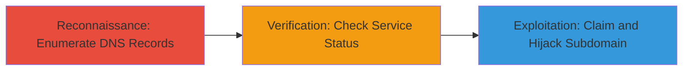

# Subdomain Takeover via Dangling CNAME to Abandoned Zendesk Instance

Multi-stage attack chain demonstrating reconnaissance and potential hijacking of a subdomain through a dangling CNAME record to an abandoned Zendesk service.

## Chain Metrics Dashboard

| Metric | Value |
|--------|-------|
| Chain Status | Unverified |
| Total Steps | 3 |
| Execution Time | ~15 minutes |
| Skill Level | Intermediate |
| Complexity | Medium |
| Impact Level | Medium |

## Attack Flow Visualization



## Prerequisites & Requirements

### Required Tools

- [[tools/dig]]
- [[tools/subfinder]]

### Target Environment

- DNS infrastructure with public records
- External services like Zendesk
- No special ports required beyond standard DNS (53)

### Initial Access Requirements

- Public internet access for DNS queries
- No credentials needed for reconnaissance phase
- Domain knowledge of target (e.g., easycontactnow.com)

## Detailed Attack Procedures

### Step 1: Enumerate Subdomains and Identify Dangling CNAME
procedure: [[procedures/Enumerate-Subdomains-and-Identify-Dangling-CNAME]]

**Objective**: Discover subdomains and identify misconfigured DNS records pointing to external services.

**Instructions**: Start by enumerating subdomains using [[tools/subfinder]] to generate a list of potential targets:

```bash
subfinder -d easycontactnow.com -o subdomains.txt
```

Then, query each subdomain for CNAME records using [[commands/dig-cname-query]]:

```bash
dig +short CNAME support.easycontactnow.com
```

**Expected Output**: A list of subdomains and their CNAME targets, such as "censored.herokuapp.com" indicating a potential dangling record.

**Success Indicators**:
- Subdomain list generated
- CNAME pointing to external service identified

### Step 2: Verify Service Abandonment for Takeover
procedure: [[procedures/Verify-Service-Abandonment-for-Takeover]]

**Objective**: Confirm that the pointed service (e.g., Zendesk) is unclaimed and available for takeover.

**Instructions**: Access the Zendesk signup page for the subdomain and check availability using a browser or [[commands/curl-check-status]]:

```bash
curl -I https://support.easycontactnow.com
```

Attempt to claim the instance by visiting the Zendesk dashboard creation URL.

**Expected Output**: HTTP response indicating the instance is unclaimed (e.g., 404 or redirect to signup).

**Success Indicators**:
- Service responds as abandoned
- Signup option available for the subdomain

### Step 3: Report and Exploit Subdomain Takeover
procedure: [[procedures/Report-and-Exploit-Subdomain-Takeover]]

**Objective**: Document the vulnerability and simulate hijacking impact, or report for responsible disclosure.

**Instructions**: If exploiting, claim the Zendesk instance and host a test page. For ethical reporting, submit via [[tools/hackerone]] with details:

```bash
# No direct command; use web interface
```

Document the CNAME and abandonment proof.

**Expected Output**: Confirmation of claim or triage acknowledgment from the vendor.

**Success Indicators**:
- Vulnerability reported and acknowledged
- DNS record deletion as resolution

## Attack Chain Summary

### Key Achievements

1. Identified dangling CNAME for support.easycontactnow.com
2. Verified Zendesk abandonment
3. Enabled potential hijacking for phishing or impersonation

## Technique & Tactic Coverage

### MITRE ATT&CK Techniques

- [[Gather Victim Host Information]] Gather Victim Host Information
- [[Exploit Public-Facing Application]] Exploit Public-Facing Application

### MITRE ATT&CK Tactics

- [[Reconnaissance]] Reconnaissance
- [[Initial Access]] Initial Access

---
*Last updated: 2023-10-01T00:00:00Z*
