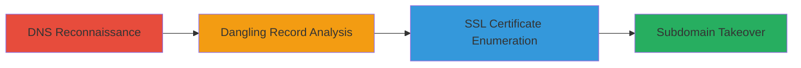

# Subdomain Takeover via Dangling CNAME to Terminated EC2 Instance

Multi-stage attack chain demonstrating a complete attack workflow exploiting DNS misconfigurations in AWS environments to achieve subdomain takeover.

## Chain Metrics Dashboard

| Metric | Value |
|--------|-------|
| Chain Status | Unverified |
| Total Steps | 3 |
| Execution Time | ~5 minutes |
| Skill Level | Intermediate |
| Complexity | Medium |
| Impact Level | High |

## Attack Flow Visualization



## Prerequisites & Requirements

### Required Tools

- [[tools/SSLEnum]]
- DNS resolver tool (e.g., dig or nslookup)

### Target Environment

- AWS Cloud platform
- EC2 service with public DNS exposure
- DNS services on port 53

### Initial Access Requirements

- Public internet access to query DNS records
- No authentication required for reconnaissance
- Ability to resolve public DNS queries

## Detailed Attack Procedures

### Step 1: DNS Reconnaissance
procedure: [[procedures/Query-DNS-Records-for-Subdomain-Reconnaissance]]

**Objective**: Query DNS records to identify the subdomain's resolution and uncover potential misconfigurations like CNAMEs pointing to transient resources.

**Instructions**: Use [[commands/dig-query-dns]] to query the A and CNAME records for the target subdomain:

```bash
dig @1.0.0.1 max1.liveplan.com A +short
```

Follow up with a CNAME-specific query:

```bash
dig @1.0.0.1 max1.liveplan.com CNAME +short
```

**Expected Output**: A record showing IP 54.68.121.128 and CNAME ec2-54-68-121-128.us-west-2.compute.amazonaws.com.

**Success Indicators**:
- CNAME record points to an EC2 public DNS name
- IP resolution to an AWS-hosted address

### Step 2: Dangling Record Analysis
procedure: [[procedures/Analyze-Dangling-DNS-Records-for-Takeover-Potential]]

**Objective**: Analyze the DNS configuration to detect dangling records caused by resource termination without DNS updates, assessing takeover risk.

**Instructions**: Review the queried records manually or script to check if the CNAME targets a transient EC2 public DNS. Infer termination by noting the format (ec2-*.compute.amazonaws.com) and lack of stable IP association:

No specific command, but validate with repeated [[commands/dig-query-dns]] over time to check for changes:

```bash
dig @1.0.0.1 max1.liveplan.com A +short
```

Cross-reference with AWS IP ranges using [[commands/curl-aws-ip-check]]:

```bash
curl -s https://ip-ranges.amazonaws.com/ip-ranges.json | jq '.prefixes[] | select(.ip_prefix=="54.68.121.128/32")'
```

**Expected Output**: Confirmation that the IP is from AWS us-west-2 region and likely released upon EC2 termination.

**Success Indicators**:
- CNAME unchanged after potential termination
- IP reassignment risk identified

### Step 3: SSL Certificate Enumeration
procedure: [[procedures/Enumerate-SSL-Certificates-to-Confirm-Subdomain-Takeover]]

**Objective**: Retrieve and analyze SSL certificate data to confirm the subdomain is dangling and vulnerable to takeover by mismatched certificate subjects.

**Instructions**: Use [[tools/SSLEnum]] to pull certificate details from the HTTPS endpoint:

```bash
go run main.go -d max1.liveplan.com
```

This retrieves the certificate chain, checking for common name (CN) mismatches.

**Expected Output**: Certificate showing CN *.test.tugo.com with alternative names like *.dev.tugo.com, and dangling: true flag.

**Success Indicators**:
- Certificate issued for unrelated domain
- Dangling status confirmed, indicating takeover potential

## Attack Chain Summary

### Key Achievements

1. Identified DNS misconfiguration via CNAME to transient EC2 DNS
2. Analyzed impact of instance termination leading to dangling record
3. Confirmed takeover vulnerability through SSL certificate mismatch

## Technique & Tactic Coverage

### MITRE ATT&CK Techniques

- [[Gather Victim Host Information]] Gather Victim Host Information
- [[Exploit Public-Facing Application]] Exploit Public-Facing Application

### MITRE ATT&CK Tactics

- [[Reconnaissance]] Reconnaissance
- [[Initial Access]] Initial Access

---
*Last updated: 2023-10-01T00:00:00Z*
