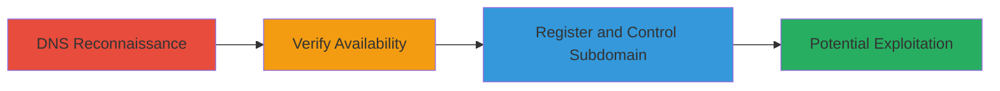

# Subdomain Takeover via Dangling CNAME to Tumblr Service

Multi-stage attack chain demonstrating a complete subdomain takeover workflow on ux.shopify.com by exploiting a dangling CNAME record pointing to Tumblr's domain service.

## Chain Metrics Dashboard

| Metric | Value |
|--------|-------|
| Chain Status | Unverified |
| Total Steps | 3 |
| Execution Time | ~10 minutes |
| Skill Level | Intermediate |
| Complexity | Medium |
| Impact Level | High |

## Attack Flow Visualization



## Prerequisites & Requirements

### Required Tools

- None (manual DNS queries and web browser sufficient)

### Target Environment

- DNS resolution access
- Internet connectivity for Tumblr registration
- Target domain with potential dangling records (e.g., shopify.com subdomains)

### Initial Access Requirements

- No credentials required
- Public DNS access
- Ability to register on Tumblr (free account)

## Detailed Attack Procedures

### Step 1: DNS Reconnaissance
procedure: [[procedures/Identify-Dangling-DNS-Records-for-Subdomain-Takeover]]

**Objective**: Query and identify dangling CNAME records that point to third-party services like Tumblr.

**Instructions**: Perform a DNS lookup on the target subdomain using [[commands/dig-dns-lookup]] to reveal CNAME records:

```bash
dig ux.shopify.com
```

Analyze the output for pointers to services like domains.tumblr.com.

**Expected Output**: DNS response showing "ux.shopify.com. 3600 IN CNAME domains.tumblr.com."

**Success Indicators**:
- CNAME record points to an external service
- Record is resolvable but subdomain appears unused

### Step 2: Verify Availability
procedure: [[procedures/Verify-Unused-Subdomain-on-Third-Party-Service]]

**Objective**: Confirm that the subdomain is not actively claimed on the third-party service.

**Instructions**: Access the subdomain URL in a browser or use [[commands/curl-http-check]] to check for an active site:

```bash
curl -I http://ux.shopify.com
```

If it redirects or shows no content, verify on Tumblr by attempting to access or search for the subdomain.

**Expected Output**: HTTP response indicating no active blog or a Tumblr claim page.

**Success Indicators**:
- No existing content or blog found
- Service allows registration for the subdomain

### Step 3: Register and Control Subdomain
procedure: [[procedures/Register-and-Control-Subdomain-via-Third-Party-Service]]

**Objective**: Register the subdomain on the third-party service to gain control and demonstrate takeover.

**Instructions**: Navigate to Tumblr's registration page and create a new blog using the subdomain (ux.shopify.com). Set a password for access control.

No specific command; perform manually via web interface.

**Expected Output**: Successful blog creation at http://ux.shopify.com with password protection (e.g., password: c7gBX6gELPFLhYOeYxQD).

**Success Indicators**:
- Blog is live and controlled by attacker
- Subdomain resolves to attacker's content

## Attack Chain Summary

### Key Achievements

1. Identified dangling CNAME enabling takeover
2. Verified and claimed unused subdomain on Tumblr
3. Demonstrated control for potential phishing or impersonation under Shopify's domain

## Technique & Tactic Coverage

### MITRE ATT&CK Techniques

- [[Hardware]] Gather Victim Host Information: Domains
- [[Exploit Public-Facing Application]] Exploit Public-Facing Application

### MITRE ATT&CK Tactics

- [[Reconnaissance]] Reconnaissance
- [[Initial Access]] Initial Access

---
*Last updated: 2023-10-01T00:00:00Z*
