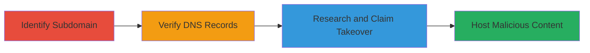

---
tags:
  - subdomain-takeover
  - dns
  - cname
  - phishing
  - impersonation
type: attack_chain
tools: []
tactics:
  - '[[Reconnaissance]]'
  - '[[Initial Access]]'
verified: false
platforms:
  - Web
  - DNS
submitted: true
complexity: medium
created_at: '2023-10-01T00:00:00Z'
procedures:
  - '[[procedures/Identify-Vulnerable-Subdomain]]'
  - '[[procedures/Verify-DNS-CNAME-Record]]'
  - '[[procedures/Research-and-Attempt-Unbounce-Takeover]]'
step_count: 3
techniques:
  - '[[Hardware]]'
  - '[[Exploit Public-Facing Application]]'
updated_at: '2025-12-14T04:38:49.367Z'
description: >-
  Attack chain exploiting a dangling CNAME record on a subdomain to perform a
  takeover on the Unbounce service, enabling phishing and impersonation.
skill_level: intermediate
impact_level: high
id: b015e828-1b91-45c4-9b4e-6331bbde250b
validated: true
mitre_tactics:
  - '[[Reconnaissance]]'
  - '[[Initial Access]]'
mitre_techniques:
  - '[[Hardware]]'
  - '[[Exploit Public-Facing Application]]'
---
# Subdomain Takeover via Dangling CNAME to Unbounce Service

Multi-stage attack chain demonstrating a subdomain takeover vulnerability where a dangling CNAME record allows an attacker to claim control of a subdomain on a third-party service like Unbounce, enabling hosting of malicious content for phishing or reputation damage.

## Chain Metrics Dashboard

| Metric | Value |
|--------|-------|
| Chain Status | Unverified |
| Total Steps | 3 |
| Execution Time | ~15 minutes |
| Skill Level | Intermediate |
| Complexity | Medium |
| Impact Level | High |

## Attack Flow Visualization



## Prerequisites & Requirements

### Required Tools

- DNS resolution tools like [[dig]]

### Target Environment

- Public DNS infrastructure
- Third-party service (e.g., Unbounce) with inactive configurations
- Internet access for subdomain enumeration and verification

### Initial Access Requirements

- No credentials required
- Public network access to query DNS
- No prior access needed

## Detailed Attack Procedures

### Step 1: Identify Vulnerable Subdomain
procedure: [[procedures/Identify-Vulnerable-Subdomain]]

**Objective**: Discover subdomains that may be vulnerable to takeover by identifying inactive or misconfigured entries.

**Instructions**: Manually or via reconnaissance tools, list subdomains associated with the target domain (e.g., greenhouse.io) and flag those appearing inactive.

**Expected Output**: A list of potential subdomains like demo.greenhouse.io marked as configured but inactive.

**Success Indicators**:
- Subdomain identified with signs of inactivity (e.g., no response or error pages)
- Initial recon notes vulnerability potential

### Step 2: Verify DNS Records
procedure: [[procedures/Verify-DNS-CNAME-Record]]

**Objective**: Confirm the presence of a dangling CNAME record pointing to a third-party service.

**Instructions**: Use DNS lookup tools to query the subdomain's records. For example, execute [[commands/dig-cname-lookup]] to check for CNAME entries:

```bash
dig CNAME demo.greenhouse.io
```

Review the output for pointers to services like unbouncepages.com.

**Expected Output**: DNS response showing CNAME: demo.greenhouse.io -> unbouncepages.com.

**Success Indicators**:
- CNAME record found pointing to an external service
- No active resolution to legitimate content

### Step 3: Research and Attempt Takeover
procedure: [[procedures/Research-and-Attempt-Unbounce-Takeover]]

**Objective**: Investigate the third-party service for takeover feasibility and claim the subdomain if possible.

**Instructions**: Research the service (Unbounce) documentation to understand takeover conditions. Verify if the associated page is deleted by attempting to access it. If eligible, create an account and configure a new page with the dangling CNAME. Note: Full execution may require a subscription.

**Expected Output**: Confirmation that the subdomain can be claimed, with potential to host custom content.

**Success Indicators**:
- Service research confirms deletion of original page
- Ability to register and point the subdomain to attacker-controlled content

## Attack Chain Summary

### Key Achievements

1. Identified and verified a dangling CNAME vulnerability
2. Researched third-party service for takeover mechanics
3. Enabled potential phishing via subdomain impersonation

## Technique & Tactic Coverage

### MITRE ATT&CK Techniques

- [[Hardware]] Gather Victim Host Information: DNS
- [[Exploit Public-Facing Application]] Exploit Public-Facing Application

### MITRE ATT&CK Tactics

- [[Reconnaissance]] Reconnaissance
- [[Initial Access]] Initial Access

---
*Last updated: 2023-10-01T00:00:00Z*
