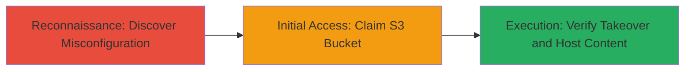

---
tags:
  - subdomain-takeover
  - dns-misconfiguration
  - aws-s3
  - dangling-cname
type: attack_chain
tools:
  - '[[tools/AWS-CLI]]'
tactics:
  - '[[Reconnaissance]]'
  - '[[Initial Access]]'
commands:
  - '[[commands/dig-check-cname]]'
  - '[[commands/aws-s3-create-bucket]]'
  - '[[commands/aws-s3-upload-file]]'
  - '[[commands/curl-access-url]]'
platforms:
  - Web
  - AWS
complexity: medium
procedures:
  - '[[procedures/Discover-Dangling-Subdomain-CNAME]]'
  - '[[procedures/Claim-Subdomain-via-AWS-S3-Bucket-Creation]]'
  - '[[procedures/Verify-Subdomain-Takeover-with-POC]]'
step_count: 3
techniques:
  - '[[Hardware]]'
  - '[[Exploit Public-Facing Application]]'
description: >-
  Attack chain exploiting a misconfigured dangling CNAME record on a subdomain
  pointing to an unclaimed AWS S3 bucket, allowing takeover and hosting of
  malicious content under a trusted domain.
skill_level: intermediate
impact_level: high
id: 65d927a6-b9ae-4d89-875a-bfb4b2903ebd
created_at: '2025-12-14T04:51:26.425Z'
updated_at: '2025-12-14T04:51:26.425Z'
verified: false
validated: true
submitted: true
mitre_tactics:
  - '[[Reconnaissance]]'
  - '[[Initial Access]]'
mitre_techniques:
  - '[[Hardware]]'
  - '[[Exploit Public-Facing Application]]'
---
# Subdomain Takeover via Dangling CNAME to Unclaimed AWS S3 Bucket

Multi-stage attack chain demonstrating a complete subdomain takeover workflow on blog.gnipcentral.com, where a dangling CNAME record points to an unclaimed AWS S3 resource, allowing an attacker to claim control and host arbitrary content for phishing or defacement under Twitter's domain.

## Chain Metrics Dashboard

| Metric | Value |
|--------|-------|
| Chain Status | Unverified |
| Total Steps | 3 |
| Execution Time | ~15 minutes |
| Skill Level | Intermediate |
| Complexity | Medium |
| Impact Level | High |

## Attack Flow Visualization



## Prerequisites & Requirements

### Required Tools

- [[tools/AWS-CLI]]
- Standard DNS tools like dig

### Target Environment

- Web platform with DNS records
- AWS S3 services
- No special ports required; DNS queries over port 53

### Initial Access Requirements

- AWS account credentials for claiming the bucket
- Network access to resolve DNS and interact with AWS
- No prior access to the target domain needed

## Detailed Attack Procedures

### Step 1: Discover Dangling Subdomain CNAME
procedure: [[procedures/Discover-Dangling-Subdomain-CNAME]]

**Objective**: Identify subdomains with misconfigured DNS records pointing to unclaimed cloud resources.

**Instructions**: Use [[commands/dig-check-cname]] to query the DNS for the target subdomain and inspect the CNAME record:

```bash
dig blog.gnipcentral.com
```

Look for a CNAME pointing to an AWS S3 endpoint that does not resolve to active content, indicating a dangling record.

**Expected Output**: DNS response showing CNAME to an S3 bucket like testcloudfrontbug.s3-us-west-2.amazonaws.com with no further resolution.

**Success Indicators**:
- CNAME record points to unclaimed AWS S3 resource
- HTTP access to the subdomain returns 404 or no content

### Step 2: Claim Subdomain via AWS S3 Bucket Creation
procedure: [[procedures/Claim-Subdomain-via-AWS-S3-Bucket-Creation]]

**Objective**: Take control of the subdomain by creating the matching unclaimed S3 bucket and configuring it to serve content.

**Instructions**: First, create the S3 bucket matching the dangling CNAME using [[commands/aws-s3-create-bucket]]:

```bash
aws s3 mb s3://testcloudfrontbug --region us-west-2
```

Then, enable static website hosting on the bucket and upload a test file using [[commands/aws-s3-upload-file]]:

```bash
aws s3 website s3://testcloudfrontbug --index-document index.html
aws s3 cp index.html s3://testcloudfrontbug/asd/index.html
```

**Expected Output**: Bucket created successfully, and file uploaded without errors.

**Success Indicators**:
- Bucket creation succeeds (unclaimed)
- Website hosting enabled

### Step 3: Verify Subdomain Takeover with POC
procedure: [[procedures/Verify-Subdomain-Takeover-with-POC]]

**Objective**: Confirm control by accessing the subdomain and observing the redirect to the attacker's hosted content.

**Instructions**: Access the subdomain URL using [[commands/curl-access-url]] to verify the takeover:

```bash
curl -L http://blog.gnipcentral.com/
```

The request should redirect to the attacker's S3 content at http://testcloudfrontbug.s3-us-west-2.amazonaws.com/asd/index.html.

**Expected Output**: Redirect response leading to the hosted index.html file, proving subdomain control.

**Success Indicators**:
- Subdomain resolves to attacker's S3 content
- Arbitrary content (e.g., redirect to phishing page) is served

## Attack Chain Summary

### Key Achievements

1. Identified and exploited a dangling CNAME misconfiguration on blog.gnipcentral.com
2. Claimed the unclaimed AWS S3 bucket to gain subdomain control
3. Demonstrated potential for phishing or defacement under a trusted domain

## Technique & Tactic Coverage

### MITRE ATT&CK Techniques

- [[Hardware]]
- [[Exploit Public-Facing Application]]

### MITRE ATT&CK Tactics

- [[Reconnaissance]]
- [[Initial Access]]

---
*Last updated: 2023-10-01T00:00:00Z*
