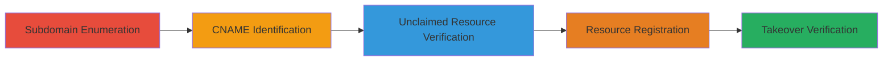

---
tags:
  - subdomain-takeover
  - dns
  - cname
  - azure
  - dangling-record
type: attack_chain
tools: []
tactics:
  - '[[Initial Access]]'
  - '[[Reconnaissance]]'
verified: false
platforms:
  - Web
  - Cloud (Azure)
submitted: true
complexity: medium
created_at: '2023-10-01T00:00:00Z'
procedures:
  - '[[procedures/Enumerate-Subdomains-of-Target-Domain]]'
  - '[[procedures/Check-CNAME-Records-for-Azure-Services]]'
  - '[[procedures/Verify-Unclaimed-Azure-App-Service-via-DNS]]'
  - '[[procedures/Register-Unclaimed-Azure-App-Service]]'
  - '[[procedures/Verify-Subdomain-Takeover-and-Control]]'
step_count: 5
techniques:
  - '[[Exploit Public-Facing Application]]'
  - '[[Email Accounts]]'
updated_at: '2025-12-14T04:39:02.030Z'
description: >-
  A multi-stage attack exploiting a dangling CNAME record pointing to an
  unclaimed Azure App Service, allowing full control over a subdomain for
  serving malicious content.
skill_level: intermediate
impact_level: high
id: c0d7c0f1-b76d-4bc9-8a60-a2150f28d78a
validated: true
mitre_tactics:
  - '[[Initial Access]]'
  - '[[Reconnaissance]]'
mitre_techniques:
  - '[[Exploit Public-Facing Application]]'
  - '[[Email Accounts]]'
---
# Subdomain Takeover via Dangling CNAME to Unclaimed Azure App Service

Multi-stage attack chain demonstrating a complete subdomain takeover workflow by exploiting a dangling DNS CNAME record pointing to an unclaimed Azure resource.

## Chain Metrics Dashboard

| Metric | Value |
|--------|-------|
| Chain Status | Unverified |
| Total Steps | 5 |
| Execution Time | ~30 minutes |
| Skill Level | Intermediate |
| Complexity | Medium |
| Impact Level | High |

## Attack Flow Visualization

## Prerequisites & Requirements

### Required Tools

- DNS enumeration tools (e.g., [[tools/dig]] or [[tools/subfinder]])
- Azure CLI for resource registration

### Target Environment

- Public DNS resolution for the target domain (e.g., starbucks.com)
- Access to Azure portal or CLI for registering App Services
- No authentication required for enumeration and verification steps

### Initial Access Requirements

- Internet access for DNS queries
- Azure account (free tier sufficient) for claiming the resource
- No prior access to the target domain needed

## Detailed Attack Procedures

### Step 1: Subdomain Enumeration
procedure: [[procedures/Enumerate-Subdomains-of-Target-Domain]]

**Objective**: Identify all subdomains associated with the target domain to expand the attack surface.

**Instructions**: Use a DNS enumeration tool to discover subdomains of the target, such as starbucks.com. This step reveals potential entry points like datacafe-cert.starbucks.com.

**Expected Output**: A list of subdomains, e.g., datacafe-cert.starbucks.com among others.

**Success Indicators**:
- At least one subdomain identified
- List exported for further analysis

### Step 2: Check CNAME Records for Azure Services
procedure: [[procedures/Check-CNAME-Records-for-Azure-Services]]

**Objective**: Scan enumerated subdomains for CNAME records pointing to cloud services like Azure Websites, indicating potential dangling pointers.

**Instructions**: Query DNS for CNAME records on each subdomain and filter for those resolving to azurewebsites.net. For example, datacafe-cert.starbucks.com points to s00397nasv101-datacafe-cert.azurewebsites.net.

**Expected Output**: Subdomains with matching CNAME targets, such as the dangling Azure pointer.

**Success Indicators**:
- CNAME record found pointing to azurewebsites.net
- Target noted for verification

### Step 3: Verify Unclaimed Azure App Service via DNS
procedure: [[procedures/Verify-Unclaimed-Azure-App-Service-via-DNS]]

**Objective**: Confirm if the CNAME target is an unclaimed resource by checking its DNS resolution status.

**Instructions**: Perform a DNS lookup on the CNAME target (e.g., s00397nasv101-datacafe-cert.azurewebsites.net) to check for NXDOMAIN response, indicating it's unregistered and available.

**Expected Output**: NXDOMAIN error, confirming the resource is unclaimed.

**Success Indicators**:
- NXDOMAIN response received
- Resource confirmed as takeover candidate

### Step 4: Register Unclaimed Azure App Service
procedure: [[procedures/Register-Unclaimed-Azure-App-Service]]

**Objective**: Claim control over the unclaimed Azure resource by registering it under your Azure account.

**Instructions**: Use the Azure portal or CLI to create a new Web App with the exact name of the dangling resource, such as s00397nasv101-datacafe-cert.

**Expected Output**: Successful creation of the App Service, now under your control.

**Success Indicators**:
- App Service deployed without errors
- DNS now resolves to your instance

### Step 5: Verify Subdomain Takeover and Control
procedure: [[procedures/Verify-Subdomain-Takeover-and-Control]]

**Objective**: Confirm full control over the subdomain by serving and accessing custom content.

**Instructions**: Deploy arbitrary content to the claimed App Service and access the subdomain URLs (http://datacafe-cert.starbucks.com/ and https://datacafe-cert.starbucks.com/) to verify resolution and content serving.

**Expected Output**: Custom content loads on the subdomain, bypassing SOP for potential XSS or phishing.

**Success Indicators**:
- Subdomain resolves to your content
- Ability to serve malicious payloads confirmed

## Attack Chain Summary

### Key Achievements

1. Discovered and exploited a dangling CNAME for subdomain takeover
2. Gained control over datacafe-cert.starbucks.com
3. Enabled potential impacts like XSS, phishing, and session hijacking

## Technique & Tactic Coverage

### MITRE ATT&CK Techniques

- [[Exploit Public-Facing Application]] Exploit Public-Facing Application
- [[Email Accounts]] External Service Provider

### MITRE ATT&CK Tactics

- [[Initial Access]] Initial Access
- [[Reconnaissance]] Reconnaissance

---
*Last updated: 2023-10-01T00:00:00Z*
