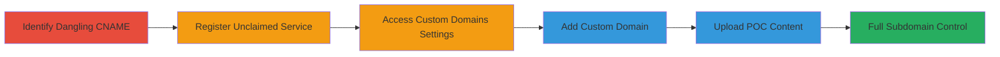

---
tags:
  - subdomain-takeover
  - dns
  - cname
  - cloud-service
  - phishing
  - malware
type: attack_chain
tools: []
tactics:
  - '[[Initial Access]]'
verified: false
platforms:
  - Web
  - DNS
submitted: true
complexity: low
created_at: '2023-10-01T00:00:00Z'
procedures:
  - '[[procedures/Register-Unclaimed-Cloud-Webservice]]'
  - '[[procedures/Access-Custom-Domains-Settings]]'
  - '[[procedures/Add-Custom-Domain-to-Service]]'
  - '[[procedures/Upload-POC-to-Taken-Over-Subdomain]]'
step_count: 4
techniques:
  - '[[Exploit Public-Facing Application]]'
updated_at: '2025-12-14T05:32:23.570Z'
description: >-
  A multi-stage attack exploiting a dangling CNAME record on a DoD subdomain to
  register an unclaimed cloud webservice, claim the custom domain, and gain full
  control for potential phishing or malware distribution.
skill_level: intermediate
impact_level: high
id: 8517df74-01ae-49f5-a5b7-3d19991aaaac
validated: true
mitre_tactics:
  - '[[Initial Access]]'
mitre_techniques:
  - '[[Exploit Public-Facing Application]]'
---
# Subdomain Takeover via Dangling CNAME to Unclaimed Cloud Webservice

Multi-stage attack chain demonstrating a complete subdomain takeover workflow on a DoD domain by exploiting a dangling CNAME record pointing to an unclaimed webservice on a cloud platform.

## Chain Metrics Dashboard

| Metric | Value |
|--------|-------|
| Chain Status | Unverified |
| Total Steps | 4 |
| Execution Time | ~10 minutes |
| Skill Level | Intermediate |
| Complexity | Low |
| Impact Level | High |

## Attack Flow Visualization

## Prerequisites & Requirements

### Required Tools

- Web browser for manual registration and configuration

### Target Environment

- DNS records with CNAME entries
- Access to a cloud webservice platform (e.g., Heroku-like service)
- No special ports required; operates over standard HTTPS

### Initial Access Requirements

- Public access to the cloud platform's marketplace
- Knowledge of the dangling subdomain (e.g., via DNS enumeration)
- No prior credentials needed for the target domain

## Detailed Attack Procedures

### Step 1: Register Unclaimed Cloud Webservice
procedure: [[procedures/Register-Unclaimed-Cloud-Webservice]]

**Objective**: Create a new instance of the cloud webservice using the exact name referenced by the dangling CNAME to prepare for domain claiming.

**Instructions**: Navigate to the cloud platform's website and sign up for a new account if needed. Then, create a new web app instance matching the service name from the CNAME record.

**Expected Output**: Confirmation of new web app creation with the specified service name.

**Success Indicators**:
- Web app registered successfully
- Service name matches the dangling CNAME target

### Step 2: Access Custom Domains Settings
procedure: [[procedures/Access-Custom-Domains-Settings]]

**Objective**: Locate the domain configuration feature within the newly registered service to enable custom domain binding.

**Instructions**: After registration, log into the service dashboard and navigate to the settings or configuration section to find the Custom Domains option.

**Expected Output**: Access to the Custom Domains interface.

**Success Indicators**:
- Settings page loaded
- Custom Domains feature visible and accessible

### Step 3: Add Custom Domain to Service
procedure: [[procedures/Add-Custom-Domain-to-Service]]

**Objective**: Bind the vulnerable subdomain to the registered service, effectively taking control of the DNS resolution.

**Instructions**: In the Custom Domains section, enter the full vulnerable subdomain (e.g., affected-subdomain.dod.gov) and submit to claim it. The platform will verify and associate the domain.

**Expected Output**: Domain added successfully, with DNS propagation starting.

**Success Indicators**:
- Domain claim confirmed
- Subdomain now resolves to the attacker's service

### Step 4: Upload POC to Taken-Over Subdomain
procedure: [[procedures/Upload-POC-to-Taken-Over-Subdomain]]

**Objective**: Deploy content to the controlled subdomain to demonstrate takeover, enabling further exploitation like phishing or XSS.

**Instructions**: Use the service's file upload or deployment feature to add a simple HTML or script file, then access it via the subdomain URL to verify control.

**Expected Output**: Content accessible at http://affected-subdomain.dod.gov/poc.html.

**Success Indicators**:
- POC file uploaded and visible
- Subdomain fully under attacker control

## Attack Chain Summary

### Key Achievements

1. Identified and exploited a dangling CNAME for subdomain takeover
2. Gained full control of a DoD subdomain without authentication
3. Enabled potential impacts including malware distribution, phishing, or XSS attacks

## Technique & Tactic Coverage

### MITRE ATT&CK Techniques

- [[Exploit Public-Facing Application]]

### MITRE ATT&CK Tactics

- [[Initial Access]]

---
*Last updated: 2023-10-01T00:00:00Z*
