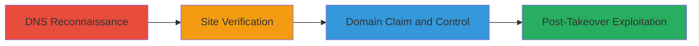

# Subdomain Takeover via Dangling CNAME to Unclaimed Wix Site

Multi-stage attack chain demonstrating a complete attack workflow for identifying and exploiting a subdomain takeover vulnerability caused by a dangling CNAME record to an unclaimed Wix site on the main domain sifchain.finance.

## Chain Metrics Dashboard

| Metric | Value |
|--------|-------|
| Chain Status | Unverified |
| Total Steps | 3 |
| Execution Time | ~5 minutes |
| Skill Level | Beginner |
| Complexity | Low |
| Impact Level | High |

## Attack Flow Visualization



## Prerequisites & Requirements

### Required Tools

- Web browser or [[commands/curl-http-visit]]
- DNS lookup tool like dig

### Target Environment

- Web platform with DNS resolution
- Access to public internet
- No special privileges required

### Initial Access Requirements

- No credentials needed for discovery
- Public network access
- Wix premium account for exploitation

## Detailed Attack Procedures

### Step 1: DNS Reconnaissance
procedure: [[procedures/Detect-Dangling-CNAME-for-Subdomain-Takeover]]

**Objective**: Identify if the target domain has a dangling CNAME record pointing to a third-party service like Wix.com.

**Instructions**: Perform a DNS lookup to check the CNAME record for the target domain using [[commands/dig-cname-lookup]]:

```bash
dig CNAME sifchain.finance
```

Review the output for a CNAME pointing to a Wix-related subdomain without active resolution.

**Expected Output**: Response showing CNAME to a Wix.com endpoint, such as "sifchain.finance CNAME xxx.wixdns.net".

**Success Indicators**:
- CNAME record points to Wix.com
- No active site resolution

### Step 2: Site Verification
procedure: [[procedures/Verify-Unclaimed-Wix-Site]]

**Objective**: Confirm the subdomain is unclaimed by accessing the domain and observing the error page.

**Instructions**: Visit the HTTP version of the domain using [[commands/curl-http-visit]] or a browser:

```bash
curl -i http://sifchain.finance/
```

Look for Wix's unclaimed subdomain error page in the response.

**Expected Output**: HTML response containing Wix error message like "This site can't be reached" or unclaimed subdomain indicator.

**Success Indicators**:
- Wix error page displayed
- Indication of unclaimed status

### Step 3: Domain Claim and Control
procedure: [[procedures/Claim-and-Control-Takeover-Domain]]

**Objective**: Claim the unclaimed Wix site to gain control of the domain for malicious purposes.

**Instructions**: Log in to a Wix premium account, search for the available site (sifchain.finance), and claim it. Once claimed, configure the site to host phishing pages, malware, or exploit scripts.

**Expected Output**: Successful site creation and control panel access for the domain.

**Success Indicators**:
- Domain claimed in Wix dashboard
- Custom content live on the domain

## Attack Chain Summary

### Key Achievements

1. Identified dangling CNAME misconfiguration
2. Verified unclaimed status for takeover eligibility
3. Demonstrated potential for full domain control leading to phishing or XSS

## Technique & Tactic Coverage

### MITRE ATT&CK Techniques

- [[Exploit Public-Facing Application]] Exploit Public-Facing Application
- [[Email Accounts]] External Service Provider

### MITRE ATT&CK Tactics

- [[Initial Access]] Initial Access

---
*Last updated: 2023-10-01T00:00:00Z*
