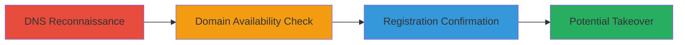

---
tags:
  - subdomain-takeover
  - dns-recon
  - dangling-cname
  - domain-hijacking
type: attack_chain
tools:
  - '[[tools/dig]]'
  - '[[tools/whois]]'
tactics:
  - '[[Reconnaissance]]'
  - '[[Initial Access]]'
verified: false
platforms:
  - DNS
  - Web
submitted: true
complexity: low
created_at: '2023-10-01T00:00:00Z'
procedures:
  - '[[procedures/Perform-DNS-Lookup-for-Subdomain-CNAME]]'
  - '[[procedures/Check-Domain-Availability-on-Registrar]]'
  - '[[procedures/Query-WHOIS-for-Domain-Registration-Status]]'
step_count: 3
techniques:
  - '[[Hardware]]'
  - '[[Exploit Public-Facing Application]]'
updated_at: '2025-12-14T04:38:39.861Z'
description: >-
  A multi-step reconnaissance and exploitation chain to identify and potentially
  take over a subdomain by exploiting a dangling CNAME record pointing to an
  unregistered domain, allowing control over the subdomain for malicious
  purposes.
skill_level: intermediate
impact_level: high
id: d8cdddcb-1778-474b-bfaa-f261e8dcb48a
validated: true
mitre_tactics:
  - '[[Reconnaissance]]'
  - '[[Initial Access]]'
mitre_techniques:
  - '[[Hardware]]'
  - '[[Exploit Public-Facing Application]]'
---
# Subdomain Takeover via Dangling CNAME to Unregistered Domain

Multi-stage attack chain demonstrating a complete workflow for identifying and exploiting a subdomain takeover vulnerability through a dangling CNAME record pointing to an unregistered domain. This technique was used to discover a vulnerable DoD subdomain, allowing potential control over traffic, emails, and content hosted under it.

## Chain Metrics Dashboard

| Metric | Value |
|--------|-------|
| Chain Status | Unverified |
| Total Steps | 3 |
| Execution Time | ~5 minutes |
| Skill Level | Intermediate |
| Complexity | Low |
| Impact Level | High |

## Attack Flow Visualization



## Prerequisites & Requirements

### Required Tools

- [[tools/dig]]
- [[tools/whois]]
- Web browser (e.g., for registrar search)

### Target Environment

- Access to DNS resolution (internet-connected host)
- No special privileges required
- Target: Publicly resolvable subdomains

### Initial Access Requirements

- No credentials needed
- Public network access
- No prior access to target

## Detailed Attack Procedures

### Step 1: DNS Reconnaissance
procedure: [[procedures/Perform-DNS-Lookup-for-Subdomain-CNAME]]

**Objective**: Identify if the target subdomain has a dangling CNAME record pointing to an external, potentially unregistered domain.

**Instructions**: Use [[commands/dig-dns-lookup]] to query the subdomain's DNS records:

```bash
dig example-subdomain.mil
```

**Expected Output**: Response showing a CNAME record, e.g., "example-subdomain.mil. 3600 IN CNAME peosol-lg.example-domain.us."

**Success Indicators**:
- CNAME record points to a non-owned or external domain
- No corresponding A record resolution for the target

### Step 2: Domain Availability Check
procedure: [[procedures/Check-Domain-Availability-on-Registrar]]

**Objective**: Verify if the domain referenced in the CNAME is available for registration.

**Instructions**: Open a web browser and navigate to a domain registrar like GoDaddy. Search for the dangling domain (e.g., "example-domain.us").

No command-line tool is used here; perform a manual search in the browser.

**Expected Output**: Registrar page indicates the domain is available for purchase, with pricing options displayed.

**Success Indicators**:
- Domain shows as unregistered and purchasable
- No ownership details listed

### Step 3: Registration Confirmation
procedure: [[procedures/Query-WHOIS-for-Domain-Registration-Status]]

**Objective**: Confirm the domain's unregistered status via WHOIS query to rule out any hidden registration.

**Instructions**: Execute [[commands/whois-domain-query]] on the dangling domain:

```bash
whois example-domain.us
```

**Expected Output**: WHOIS response showing IANA details for .us TLD and "No Data Found" from nic.us, indicating no registration.

**Success Indicators**:
- No registrant information
- Confirmation of availability

## Attack Chain Summary

### Key Achievements

1. Discovered dangling CNAME in DoD subdomain DNS records
2. Confirmed target domain availability for takeover
3. Validated lack of registration, enabling potential subdomain control for phishing, XSS, or email interception

## Technique & Tactic Coverage

### MITRE ATT&CK Techniques

- [[Hardware]] Gather Victim Host Information: Domains
- [[Exploit Public-Facing Application]] Exploit Public-Facing Application

### MITRE ATT&CK Tactics

- [[Reconnaissance]] Reconnaissance
- [[Initial Access]] Initial Access

---
*Last updated: 2023-10-01T00:00:00Z*
