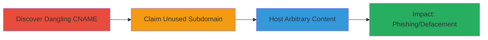

---
tags:
  - subdomain-takeover
  - dns
  - cname
  - zendesk
type: attack_chain
tools: []
tactics:
  - '[[Initial Access]]'
verified: false
platforms:
  - Web
  - DNS
submitted: true
complexity: low
created_at: '2024-10-01T00:00:00Z'
procedures:
  - '[[procedures/Discover-Dangling-CNAME-Records]]'
  - '[[procedures/Claim-Abandoned-Third-Party-Subdomain]]'
  - '[[procedures/Host-Arbitrary-Content-on-Taken-Over-Subdomain]]'
step_count: 3
techniques:
  - '[[Exploit Public-Facing Application]]'
updated_at: '2025-12-14T04:51:10.460Z'
description: >-
  A multi-stage attack exploiting a dangling DNS CNAME record pointing to an
  abandoned Zendesk subdomain, allowing takeover of a trusted Snapchat subdomain
  for potential phishing or defacement.
skill_level: intermediate
impact_level: high
id: b1627f80-3927-49de-8e9f-293ee36a9967
validated: true
mitre_tactics:
  - '[[Initial Access]]'
mitre_techniques:
  - '[[Exploit Public-Facing Application]]'
---
# Subdomain Takeover via Dangling CNAME to Unused Zendesk Instance

Multi-stage attack chain demonstrating a complete subdomain takeover workflow by exploiting a dangling CNAME record to an unused third-party service.

## Chain Metrics Dashboard

| Metric | Value |
|--------|-------|
| Chain Status | Unverified |
| Total Steps | 3 |
| Execution Time | ~10 minutes |
| Skill Level | Intermediate |
| Complexity | Low |
| Impact Level | High |

## Attack Flow Visualization



## Prerequisites & Requirements

### Required Tools

- None specific; standard DNS query tools like [[commands/query-dns-cname]]

### Target Environment

- Public DNS resolution
- Access to third-party service (e.g., Zendesk signup)
- No special ports required beyond standard DNS (port 53)

### Initial Access Requirements

- Public internet access for DNS queries
- No credentials needed initially
- Ability to register on the third-party platform (e.g., Zendesk)

## Detailed Attack Procedures

### Step 1: Discover Dangling CNAME Record
procedure: [[procedures/Discover-Dangling-CNAME-Records]]

**Objective**: Identify misconfigured DNS records pointing to unused third-party services.

**Instructions**: Query the DNS for the target subdomain to reveal the CNAME record. Use [[commands/query-dns-cname]] to check the resolution:

```bash
dig support.scan.me CNAME
```

Verify if the pointed-to subdomain (e.g., scan.zendesk.com) is inactive by attempting to access it or checking service status.

**Expected Output**: DNS response showing CNAME to an unused host, e.g., "support.scan.me. 3600 IN CNAME scan.zendesk.com."

**Success Indicators**:
- CNAME points to a third-party service
- Target subdomain returns errors or is unregistered

### Step 2: Claim the Unused Subdomain
procedure: [[procedures/Claim-Abandoned-Third-Party-Subdomain]]

**Objective**: Register and take control of the abandoned subdomain on the third-party platform.

**Instructions**: Navigate to the third-party service (Zendesk) and attempt to claim or create an instance for the dangling subdomain (scan.zendesk.com). This typically involves signing up and configuring the subdomain in their dashboard.

**Expected Output**: Successful registration confirmation and control over the subdomain.

**Success Indicators**:
- Subdomain claimed without conflicts
- Custom content can be uploaded to the instance

### Step 3: Demonstrate Takeover by Hosting Content
procedure: [[procedures/Host-Arbitrary-Content-on-Taken-Over-Subdomain]]

**Objective**: Host malicious or proof-of-concept content to demonstrate control over the original subdomain.

**Instructions**: Once claimed, upload arbitrary HTML or content via the Zendesk admin panel to the instance. Verify accessibility by resolving the original subdomain (support.scan.me), which now serves the hosted content.

**Expected Output**: Arbitrary content visible when accessing support.scan.me.

**Success Indicators**:
- Original subdomain resolves to attacker-controlled content
- Potential for phishing pages or defacement confirmed

## Attack Chain Summary

### Key Achievements

1. Identified and exploited a dangling CNAME for subdomain takeover
2. Gained control of a trusted Snapchat subdomain via Zendesk
3. Demonstrated impact through arbitrary content hosting, enabling phishing or defacement

## Technique & Tactic Coverage

### MITRE ATT&CK Techniques

- [[Exploit Public-Facing Application]]

### MITRE ATT&CK Tactics

- [[Initial Access]]

---
*Last updated: 2024-10-01T00:00:00Z*
