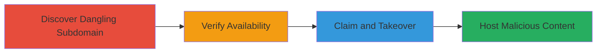

# Subdomain Takeover via Dangling CNAME to UptimeRobot

Multi-stage attack chain demonstrating a complete subdomain takeover workflow by exploiting a dangling DNS record pointing to an unused third-party service.

## Chain Metrics Dashboard

| Metric | Value |
|--------|-------|
| Chain Status | Unverified |
| Total Steps | 3 |
| Execution Time | ~15 minutes |
| Skill Level | Intermediate |
| Complexity | Medium |
| Impact Level | High |

## Attack Flow Visualization



## Prerequisites & Requirements

### Required Tools

- DNS lookup tools like [[tools/dig]] or online DNS inspectors
- Web browser for service verification

### Target Environment

- Public DNS resolution
- Access to third-party service (UptimeRobot)
- No special privileges required beyond public internet access

### Initial Access Requirements

- None; purely external reconnaissance and exploitation
- Ability to create a free account on UptimeRobot

## Detailed Attack Procedures

### Step 1: Discover Dangling Subdomain
procedure: [[procedures/Discover-Dangling-Subdomains-via-DNS-Enumeration]]

**Objective**: Identify subdomains with misconfigured DNS records pointing to unused third-party services.

**Instructions**: Enumerate the target's DNS records to find CNAMEs that resolve but lack active hosting. Use a DNS lookup tool to query the subdomain:

```bash
dig status0.stripo.email CNAME
```

This reveals the CNAME pointing to stats.uptimerobot.com. Cross-check resolution without active content by attempting to access the subdomain URL, which should fail or show no service.

**Expected Output**: DNS response showing the dangling CNAME record.

**Success Indicators**:
- CNAME record points to a third-party service like UptimeRobot
- Subdomain resolves but hosts no content

### Step 2: Verify Availability
procedure: [[procedures/Verify-Subdomain-Availability-on-UptimeRobot]]

**Objective**: Confirm the subdomain is unclaimed on the third-party service, allowing takeover.

**Instructions**: Visit the UptimeRobot dashboard or service page and search for the pointed hostname (e.g., stats.uptimerobot.com). Check if the specific subdomain is registered or in use. No direct command; use the web interface to inspect availability.

**Expected Output**: No active monitor or page associated with the subdomain on UptimeRobot.

**Success Indicators**:
- Subdomain appears available for claiming
- No existing account controls it

### Step 3: Claim and Takeover
procedure: [[procedures/Claim-and-Takeover-Subdomain-on-UptimeRobot]]

**Objective**: Gain control of the subdomain by registering it on the third-party service.

**Instructions**: Create a free account on UptimeRobot, then add a new monitor using the dangling subdomain (status0.stripo.email) as the hostname. Configure it to point to stats.uptimerobot.com, effectively claiming it. Once claimed, upload or configure arbitrary content, such as a test page or phishing site.

**Expected Output**: Successful monitor creation with the subdomain now resolving to attacker-controlled content on UptimeRobot.

**Success Indicators**:
- Subdomain resolves to attacker-hosted page
- Ability to serve custom HTML/JS on the subdomain

## Attack Chain Summary

### Key Achievements

1. Identified a dangling CNAME for subdomain takeover
2. Verified and claimed the subdomain without authentication
3. Demonstrated control by hosting arbitrary content, enabling phishing or misinformation

## Technique & Tactic Coverage

### MITRE ATT&CK Techniques

- [[Gather Victim Host Information]] Gather Victim Host Information
- [[Exploit Public-Facing Application]] Exploit Public-Facing Application

### MITRE ATT&CK Tactics

- [[Reconnaissance]] Reconnaissance
- [[Initial Access]] Initial Access

---
*Last updated: 2023-10-01T00:00:00Z*
